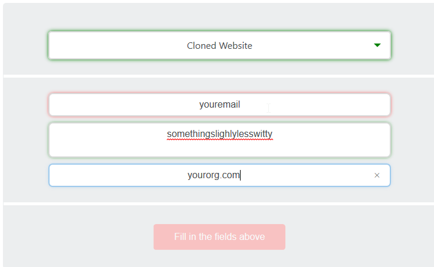
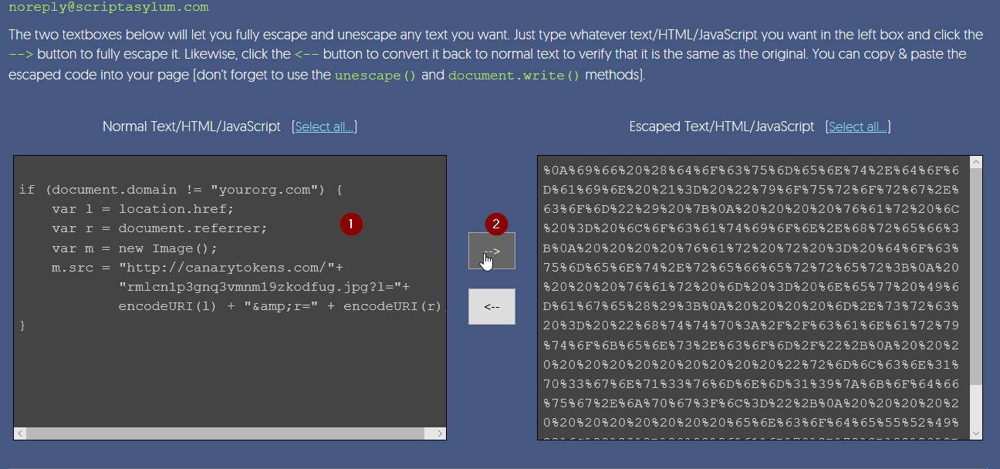

 

# Canarytokens 

First, we will need to navigate to the canarytokens server from a system with Microsoft Word on it: 

https://www.canarytokens.org/generate# 

Now, let's create a token Word Document: 

  

  

Then select Create Token. 

  

When you get the next screen, select Download your MS Word File.  

  

Then, download it and open it. 

  

 

  

Notice that it is just an empty Word document. You can add whatever you want in it. 

  

Now, check your email. 

  

You should have gotten an alert: 

  

 

  

Now, let's play with the site cloner: 

  

Please select New Token in the upper right corner. 

  

 

  

Then, select Cloned Website from the dropdown: 

  

 

  

Next, fill in the appropriate fields: 

  

 

  

Now, select Create my Canarytoken. 

  

Now we will need to copy the JavaScript and put it somewhere so it triggers: 

  

 

  

Now, let's surf to https://scriptasylum.com/tutorials/encode-decode.html 

  

Then, simply paste your JavaScript into the first two boxes as you scroll down then click the right arrow to encode: 

  

 

  

In a few moments you should get an email alert: 

  

 

***                                                                 
<b><i>Continuing the course?  [Next Lab](/IntroClassFiles/Tools/IntroClass/ADHD/GoPhish.md)</i></b>

<b><i>Want to go back?  [Previous Lab](/IntroClassFiles/Tools/IntroClass/ADHD/FakeNet-NG.md)</i></b>

<b><i>Looking for a different lab?  [Lab Directory](/IntroClassFiles/navigation.md)</i></b>

***Finished with the Labs?***

Please be sure to destroy the lab environment!

[Click here for instructions on how to destroy the Lab Environment](/IntroClassFiles/Tools/IntroClass/LabDestruction/labdestruction.md)

---

  

  

  

 

 

