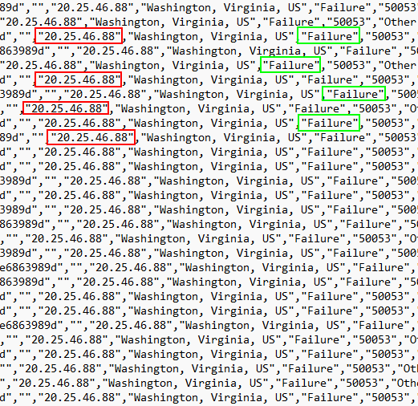
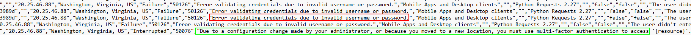
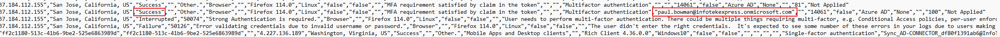

# Azure login activity logs

[*Download the log file to follow along*](./logs/InteractiveSignIns_Domain_spray_logs.csv)

In this walkthrough we will be taking a look at a log file that was pulled from Azure.

[Azure](https://azure.microsoft.com/en-us) is a service provided by Microsoft to move a Domain into the cloud. While we know the Domain Controller records logins if the user used Azure, we need to pull logs to see the failed, attempted and successful logins.

Our goal is to find how attackers may have initially accessed our domain network.

When we first crack open our log file in notepad, we notice a few things. First, this log file contains IP addresses. This is useful for us trying to identify which systems are logging into which account. This logging supplies the time stamp, the account attempting to be accessed, as well as the method of being accessed. With this in mind let’s continue our investigation.

After scrolling down for a bit, the first thing we should notice is the number of logins all within seconds of each other. The chances of every employee attempting to login at the same exact time is nearly impossible. This could be an indication that someone is trying to brute force login credentials.

Let's look closer at the remote IP addresses. If they're all the same IP that can give us an indication that either one person is trying to login to all of these accounts or that all the employees are logging in from the same network (possible, not probable).

All of these logins that are within a few seconds of each other come from the same exact IP, and if you look closer, you can see that almost all attempts failed.

This is not good; someone was doing a [brute force spray attack](https://owasp.org/www-community/attacks/Password_Spraying_Attack) at our domain. But there's nothing to worry about as long as no user got compromised right?

So, let's go through the logs and make sure all attempts are failed before we escalate this incident.

It looks like Paul Bowman’s password was discovered by an attacker during this domain spray. But did the attacker realize that the password was correct and log in? Let's look above all the attempted logins for any activity from Paul Bowman.

It looks like the attacker found his way into the domain through Paul Bowman. We can see the success message from a login attempt to the domain.
