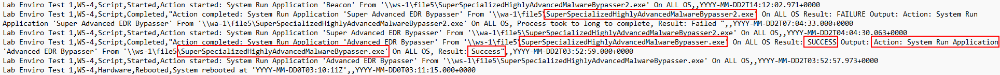

# What has the attacker done with RMM access?

[*Download the log file to follow along*](./logs/Activities-rmm.csv)

At this point in our investigation, it is becoming clear that the attacker didn't just compromise one machine but may have compromised the entire domain.

An RMM is a tool that is used to remote manage and monitor workstations. Most RMMs have the capability to access the CLI of a workstation and push automated scripts to assist an IT admin help push updates en mass.

Let's crack open the log and confirm our worst fears and suspicions.

It is worth noting the lack of logs here, since these RMM logs are mainly recording its own activity. It is not logging the data from the computer it's connected to, and we see that a script has recently been run.

It looks like the attacker has pushed a script to execute malware on every machine with the RMM tool running on it, including the domain controller.

It is safe to assume that every single machine on the network is compromised, which is not good.

This small breach has just become a huge disaster and will need escalation and Incident Response.
