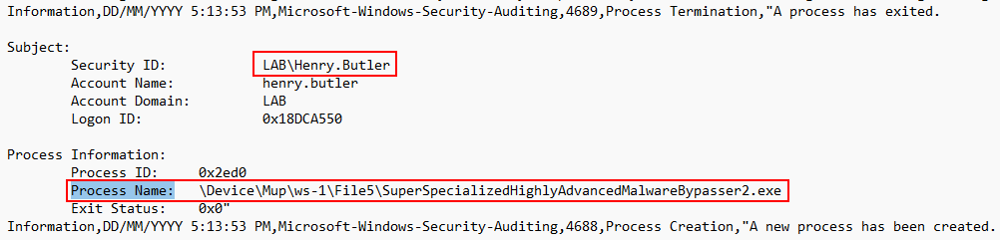

# Suspicious Executables and Workstations

[*Download the log file to follow along*](./logs/ws-3-security.csv)

After the discovery of the compromised user (Paul Bowman) we decided to go through the security logs of each workstation to look for any suspicious files being run or used by other users.

The compromised user may try to pivot to other computers and try to gain access to other systems. [Pivoting](https://www.geeksforgeeks.org/pivoting-moving-inside-a-network/) is a technique used by an attacker to try to compromise additional systems and try to escalate there privileges from a regular user to an administrator. So, where do we start? Workstation 3 has suspicious activity in its security log files we should take a look at.

Open the log file in notepad and press `ctrl + f` and type "Process Name:" and hit Enter then tab to every executable that has run on the workstation, we are looking for anything out of the ordinary. We are starting on Process names because it is the most likely attack vendor. If any malicious files were ran it may be in the audit logs. As a way to confirm strange behavior we should also look to see if the user running the file is anyone other than Paul Bowman. This can help us understand if the attacker tried to spread through our network.

After tabbing through the log file and carefully looking over executables we should take note of this...

At first it may not be totally obvious, but the name seems ***slightly*** suspicious and is not a normal system file like mmc or event viewer. It looks like the file was served through a file share on Workstation 1, which was the machine that Paul Bowman was using. It is also important to take notice of the username, the attacker has moved from Paul into a new user. This means the attacker was pivoting in this environment.
