# Domain Log Review

In this lab we are going to look at some logs that are generated in a domain password spray attack.

We will start by using DeepBlueCLI, then move into looking directly at the event logs themselves.

First, we will need to extract the event logs for a domain attack.  To do this, simply navigate to 
the C:\IntroLabs directory:

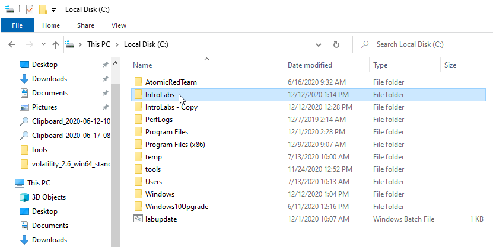

Right Click on The EntLogs directory and select 7-Zip > Extract Files

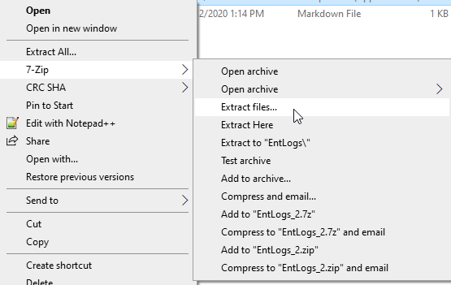

Then put `C:\tools\DeepBlueCLI-master` in the Extract To: field

It should look like this:

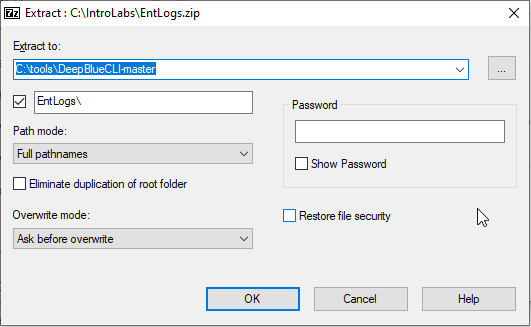

Now, click OK

Now, we are going to use DeepBlueCLI to see if there are any odd logon patterns in the domain logs.

Let's start by opening a Terminal as Administrator:

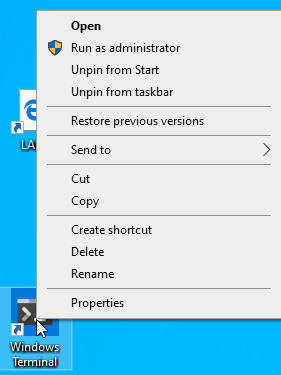

Then, navigate to the \tools\DeepBlueCLI-master directory

C:\> `cd C:\tools\DeepBlueCLI-master\`

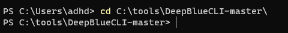

Now, let's start looking at the DC2 Password spray file:

PS C:\> `.\DeepBlue.ps1 .\EntLogs\DC2-secLogs-3-26-DomainPasswordSpray.evtx`

When the warning pops up, press R.  This will start the script by running it:

When this runs, there is an alert that catches our attention right away:

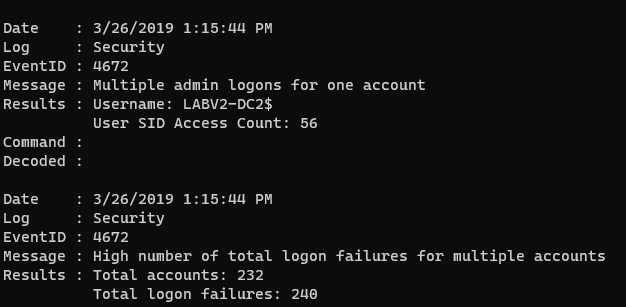

We have 240 logon failures.  That...  is a lot for this small org.

Lets dig into the actual logs and see if we can see a pattern.

To do this, open File Explorer and navigate to the C:\tools\DeepBlueCLI-master\EntLogs directory:

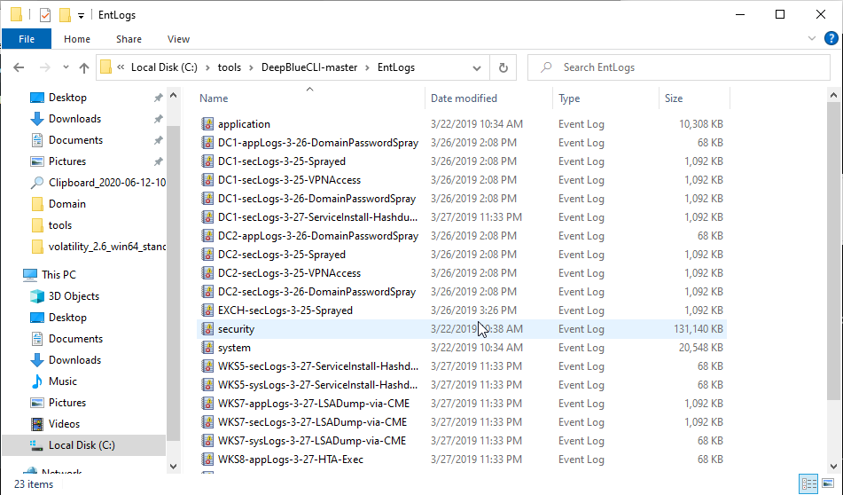

Once in this directory, double click on DC2-secLogs-3-26-DomainPasswordSpray.evtx:

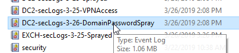

This will open Windows Event Viewer.  Note, it will open in Sysmon Operational.  This is not what we want.  Please scroll down to the DC2-secLogs-3-26-DomainPasswordSpray.evtx file under Saved Logs:

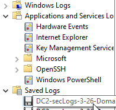

Then click it.  

It will open the DC logs with the attack.

Now, please click on the header column called Event ID.  This will sort the logs by ID number we are doing this because we want to quickly get to the event IDs of 4776:

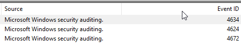

Now, scroll all the way to the bottom:

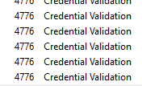

Specifically, we are looking for Event ID 4776.  This is the Credential Validation Event log.

Select one, then press the up arrow key a bunch of times.  Watch the Logon Account Name in the General tab:

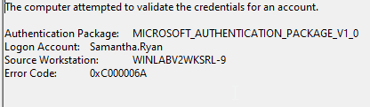

Notice the large number of login attempts from a single system:

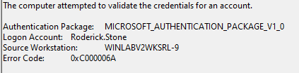

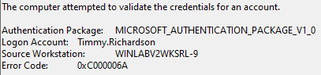

Also, notice at the bottom of the General tab, these are predominantly Audit Failures:

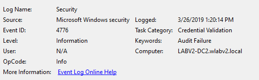

We now know that the workstation WINLABV2WKSRL-9 was attempting to authenticate to a large number of Logon Accounts in a very short period of time.

