# Domain Log Review

In this lab we are going to look at some logs that are generated in a domain password spray attack.

We will start by using **DeepBlueCLI**, then move into looking directly at the event logs themselves.

We are going to use **DeepBlueCLI** to see if there are any odd logon patterns in the domain logs.

Let's start by opening **Windows Powershell**:

Then, navigate to the \IntroLabs\DeepBlueCLI-master directory

<pre>cd \IntroLabs\DeepBlueCLI-master\</pre>

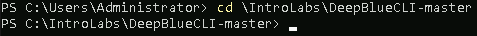

Now, let's start looking at the **DC2 Password spray** file:

<pre>.\DeepBlue.ps1 .\EntLogs\DC2-secLogs-3-26-DomainPasswordSpray.evtx</pre>

If a warning pops up, press **"R"**.  This will start the script by running it:
When this runs, there is an alert that catches our attention right away:

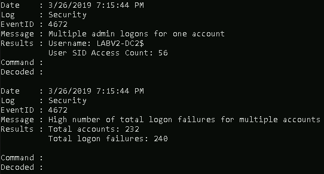

We have **240** logon failures.  That is a lot for this small org.

Lets dig into the actual logs and see if we can see a pattern.

To do this, open File Explorer and navigate to the C:\IntroLabs\DeepBlueCLI-master\EntLogs directory:

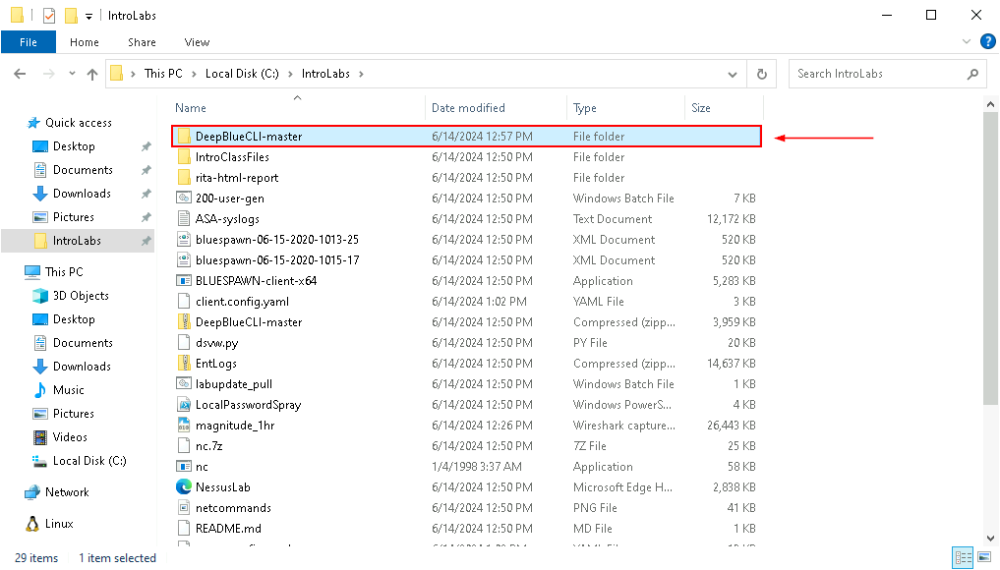

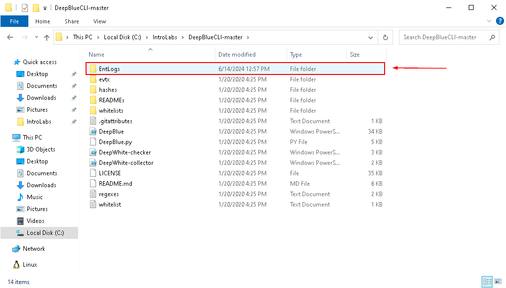

Once in this directory, double click on **DC2-secLogs-3-26-DomainPasswordSpray.evtx**:

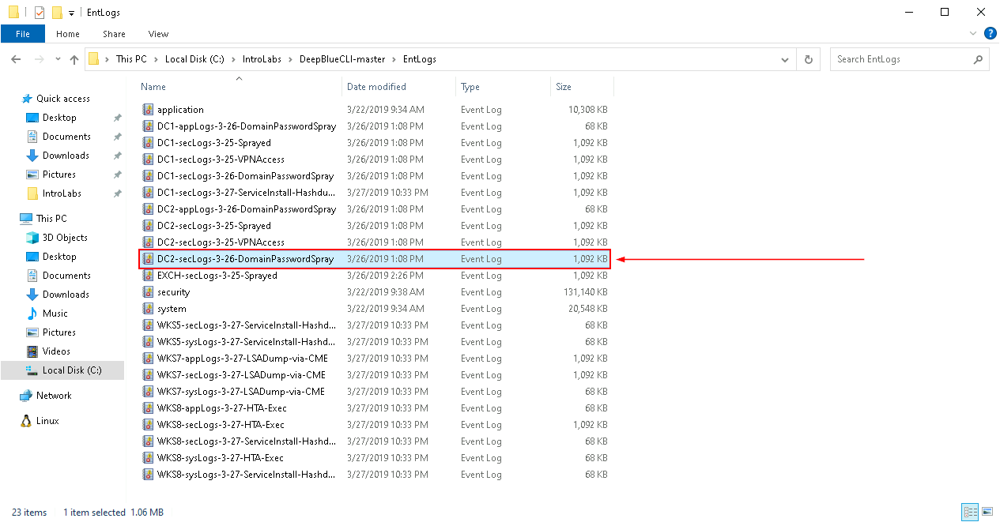

This will open Windows Event Viewer.  Note, it will open in **Sysmon Operational**.  This is not what we want.  Please scroll down to the **DC2-secLogs-3-26-DomainPasswordSpray.evtx** file under Saved Logs (all the way at the bottom):

Then click it.  

It will open the **DC logs** with the attack.

Click on the header column called **"Event ID"**.  This will sort the logs by **"ID number"**. 

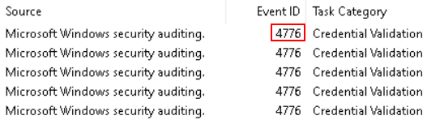

Specifically, we are looking for **Event ID 4776**.  This is the Credential Validation Event log.

Select one, then use the arrow keys to cycle through the entries.  Watch the Logon Account Name in the General tab:

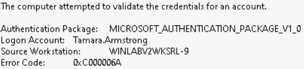

Notice the large number of login attempts from a single system:

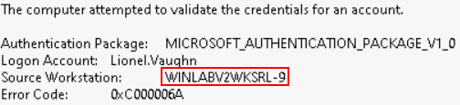

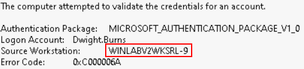

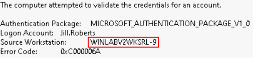

We now know that the workstation **WINLABV2WKSRL-9** was attempting to authenticate to a large number of **Logon Accounts** in a very short period of time.

Also, notice at the bottom of the General tab, these are predominantly **Audit Failures**:

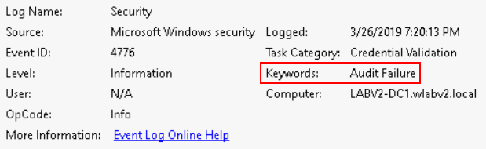

***

[Back to Navigation Menu](/IntroClassFiles/navigation.md)
