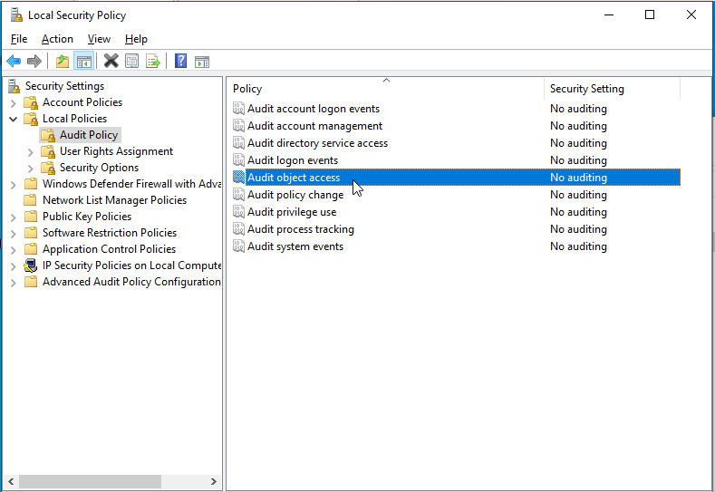
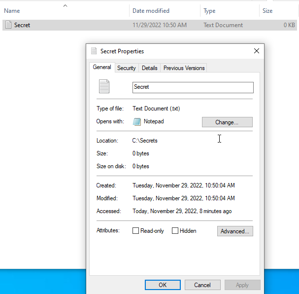
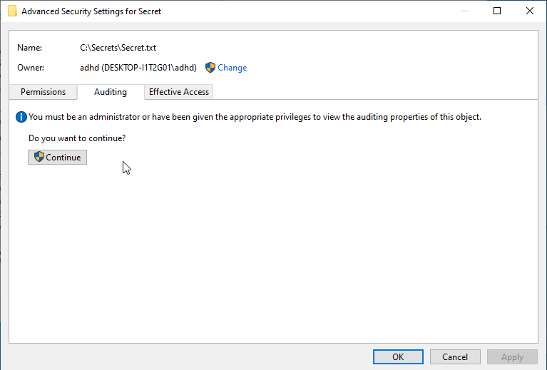

In this lab we will be creating an audit policy that watches for access to a specific file.  This can also apply to folders.  The thought process for this is that we create a honeyfile and want to set of triggers when the file is accessed on our internal network.  This is different from creating a CanaryToken.  With a CanaryToken we want a trigger when the file is opened.  CanaryTokens are also limited to documents and files that can trigger the token.  

It should be noted that this is not an "either/or" situation.  Internal auditing and a callback from a token should be used together. 

Also, please note that we are creating the logging policy on the local system.  As usual, you should be looking into ways to get the logs of the systems or file servers to your SIEM where an alert can be generated.  Logging policies like this are useless if there is no centralized logging for the alerts to trigger.

First, we will need to create the file.  From File Explorer, please navigate to the C drive on the class VM and create a folder called 'Secrets'.

This can be done by navigating to the top-level directory of the C drive, right-clicking in the empty space then selecting New > Folder.

Now enter the Secrets folder and create a new file called Secrets.txt.  

This can be done by right-clicking in the white space then selecting New > Text Document

It should look like this:

Now we will need to enable the audit policy.

Please hit the Windows Key on your keyboard an type Local Security Policy.  When the system finds the program, please open it.

Next select Local Policies > Audit Policies > Audit object access

When the Audit object access Properties window opens, please select Success and Failure.  When done click Apply, OK.

Next, go back to our Secrets.txt file in File Explorer and right-click on it and select Properties

Once in Properties, select the Security tab then select Advanced

Next select the Auditing tab in the window that opens:

When this tab opens, please select Continue

Next, we will ne to add a Principal.  This is the user or group the policy applies to.

Next we will nee to click on Select a principal in the Auditing Entry for Secret window.

In the Select USer or Group window please type "Everyone" then select OK.

Back at the Auditing Entry for Secret window, please select the Type to All and the Basic permissions to the settings below:

Next select OK or Apply then OK for all Audit windows to close them.

Next, we will need to open the Secrets.txt file.  Just open it, type something, then save and close it.

Now let's open Event Viewer.  To do this, press the Windows key, then type Event.  When the system finds Event Viewer Select it.

Next, select Windows Logs, then Security.

Once it opens the security log scroll down for the File System logs, then select the one that has Secret.txt in it.  You may have to scroll down a bit.

