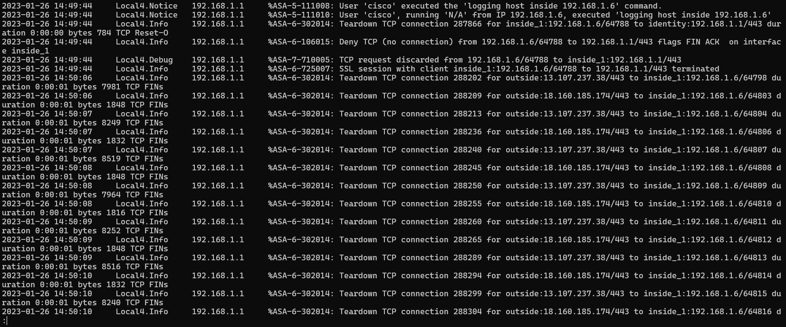
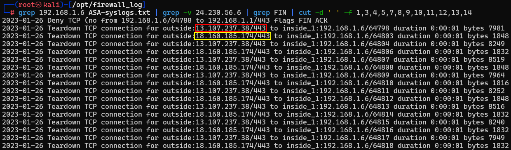
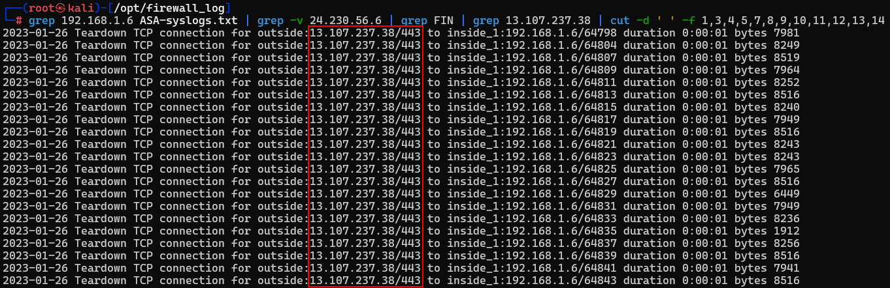
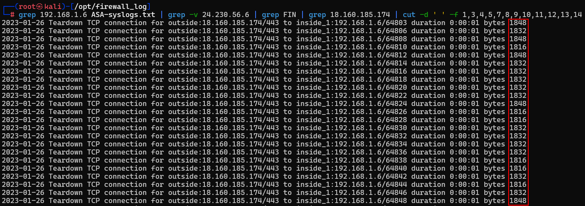
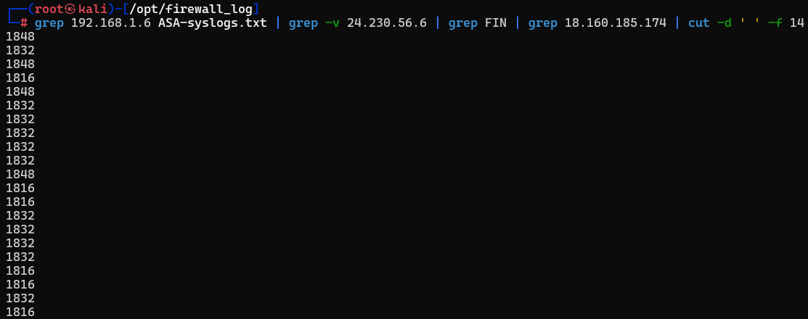
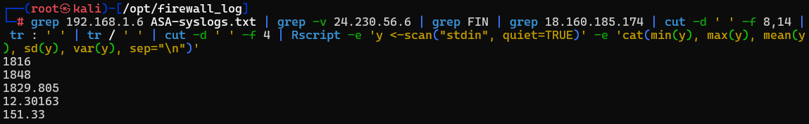

# Firewall Log Review

In this lab we will be looking at a log from an **ASA firewall** from Cisco.

**And wow....  They are bad to work with.**

However, with the power of **Bash scripting** we can get some useful information.

Let’s get started by opening a **Kali** Instance.

Alternatively, you can click on the **Kali Logo** in the taskbar.

Let's start by gaining root access by running the following:

`sudo su -`

Next, we can run the following:

`sudo apt install r-base-core`

Next, let's get your **Linux** system to do some math!

First, we need to navigate to the correct directory with the following command:

`cd /opt/firewall_log`

Now, let's look into the logs.  The logs file is quite extensive, so in order to narrow our scope, we will use **"grep".**

`grep 192.168.1.6 ASA-syslogs.txt | grep -v 24.230.56.6 | less`

**==That is a nightmare....==**

Not only is there a ton of information here, you might now feel like you are stuck in your terminal window.

No worries though, just hit **"q"** to return to your terminal.

Let's refine the output a little more by running the following command:

`grep 192.168.1.6 ASA-syslogs.txt | grep -v 24.230.56.6 | grep FIN | cut -d ' ' -f 1,3,4,5,7,8,9,10,11,12,13,14`

This command focuses on the closed connections **(FIN)** and pull just specific fields out of the data to clean it up.   We use cut with the **"-d"** switch to specify the delimiter, which is a space.  Then, we tell it what fields, or columns of the output, we are interested in. 

When put together, our output looks something like this:

It's looking a lot better, but I think we can do better. But how?

If you look at our previous output, you may notice that outside connections are being made to two different addresses:
`13.107.237.38` and `18.160.185.174`

So why don't we look at just the connections made to `13.107.237.38` by running the following command:

`grep 192.168.1.6 ASA-syslogs.txt | grep -v 24.230.56.6 | grep FIN | grep 13.107.237.38 | cut -d ' ' -f 1,3,4,5,7,8,9,10,11,12,13,14`

This output shows us all of the data coming from `13.107.237.38`

Don't forget, there were also a lot of connections from `18.160.185.174`.  Here, let's zoom in on that IP as well:

`grep 192.168.1.6 ASA-syslogs.txt | grep -v 24.230.56.6 | grep FIN | grep 18.160.185.174 | cut -d ' ' -f 1,3,4,5,7,8,9,10,11,12,13,14`

Look at the last field.  See a pattern?  Is there one?  Let's see just that field!

`grep 192.168.1.6 ASA-syslogs.txt | grep -v 24.230.56.6 | grep FIN | grep 18.160.185.174 | cut -d ' ' -f 14`

All we should see now is this:

Now let's do some math in that field!

`grep 192.168.1.6 ASA-syslogs.txt | grep -v 24.230.56.6 | grep FIN | grep 18.160.185.174 | cut -d ' ' -f 8,14 | tr : ' ' | tr / ' '  | cut -d ' ' -f 4 | Rscript -e 'y <-scan("stdin", quiet=TRUE)' -e 'cat(min(y), max(y), mean(y), sd(y), var(y), sep="\n")'`
 
Your output should look something like this:

There are a lot of commands you can use to alter your view of the logs.  