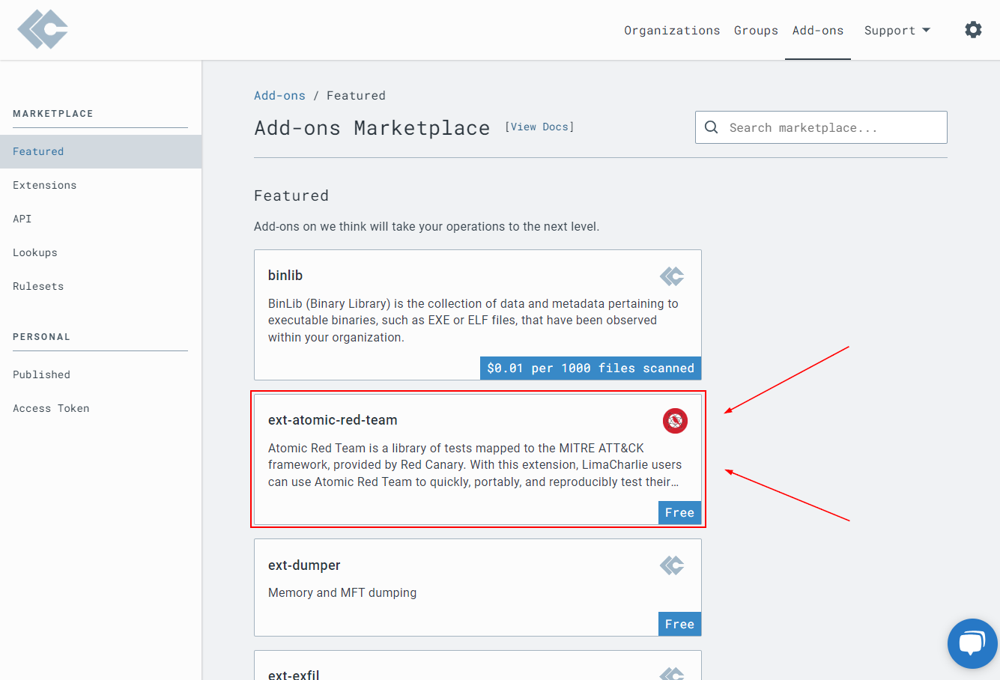
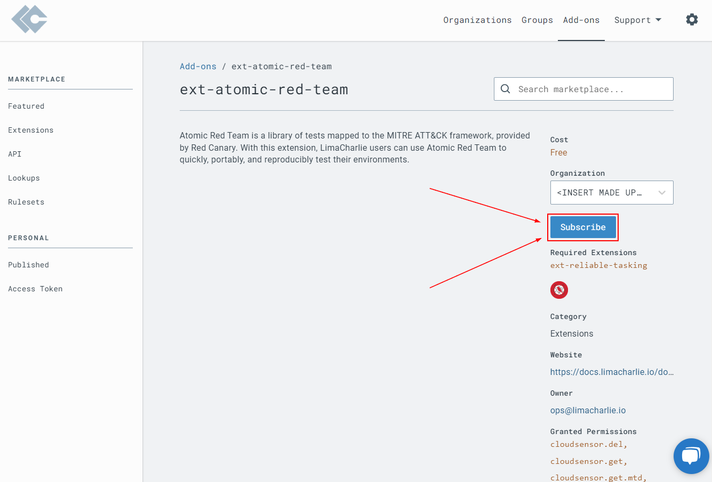
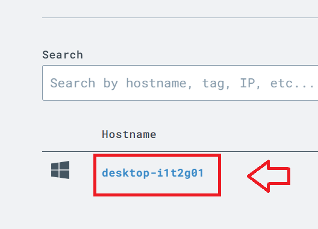
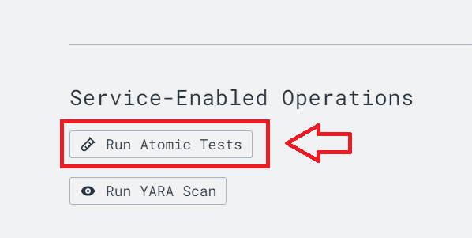
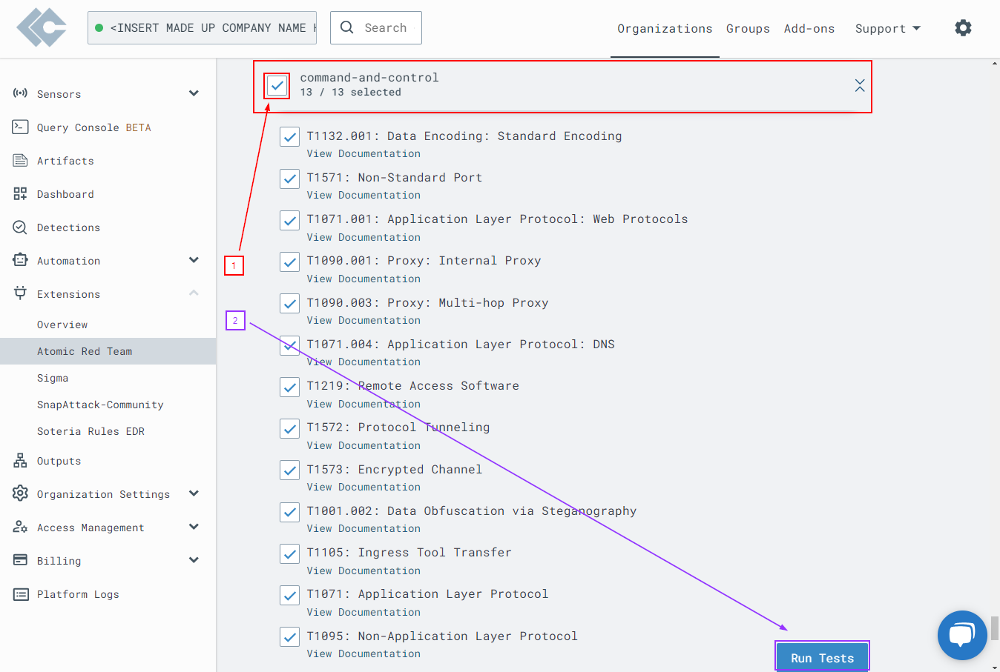
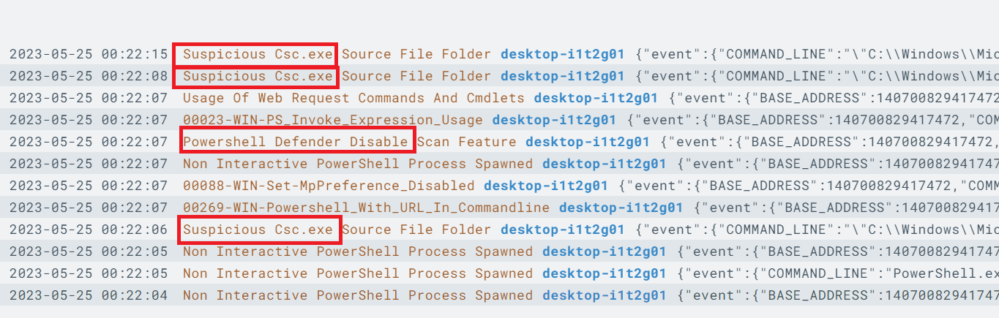

# Lima Charlie meets Atomic Red

This is part 2 of a 2 part series. Please complete <a href="https://github.com/strandjs/IntroLabs/blob/master/IntroClassFiles/Tools/IntroClass/limacharlie/limacharlie.md">Part 1</a> of this lab first

part 2/2

In this lab we will be creating a controlled and fake cyber attack with Atomic Red, we will then use Lima Charlie to see what is logged and to see how a real world attack may set off bells and whistles for us to look at.

Let's pick up where we left off in part 1, in the browser logged into our Lima Charlie web interface.

We need to install the plugin for Atomic Red that Lima Charlie offers.

Start by navigating to the "Add-ons" tab in the top right of the web page.

Scroll down until you see the Atomic Red plugin. Click the Atomic Red plugin.

Take a minute to look at the different plugins and see the full capabillities and features Lima Charlie has to offer.

Then locate the subscribe button on the right side of the page, and click "Subscribe"

After Atomic Red finishes installing return back to your organization and click on your machine.

Scroll down and you will see a few options, yara and atomic red. Click "Run atomic tests"

Go to the command and control and click "(1)Select Category" then click "(2)Run Tests"

Then move over to the "Detections" tab on the left and start going through event logs

There will be a lot of events, everytime the page is refreshed more attacks will appear.

Looking through all of the logs and note the cmd.exe or powershell invokes are taking place. These are (usually) indications of something malicious occuring and needs to be examined further.

Lima Charlie is an amazing tool because of its versatillity. With an easy to look at interface that if need be, allows a user to dig deeper to see whats happening before, during, and after an attack. Its abillity to be used on small and large scale is a great feature. 

Many plugins allow for different uses large and small, and automating the difficult tasks.
