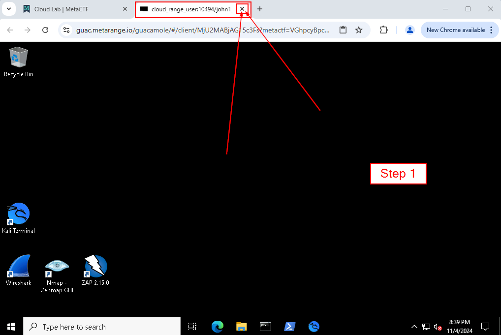
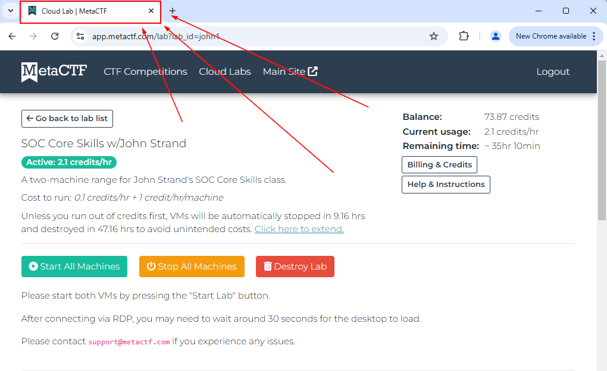
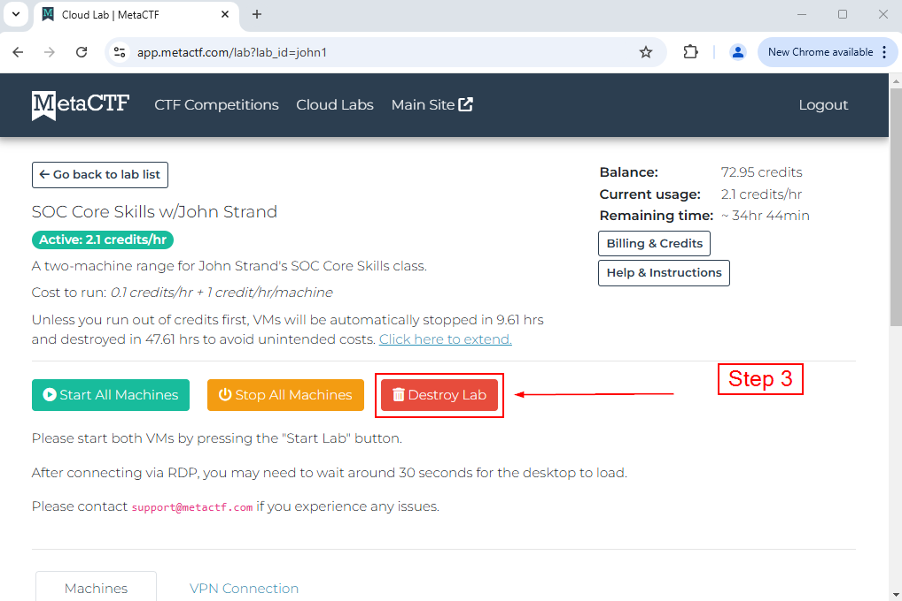

# Destroying the Lab Environment

When you are finished working on the Lab Environment, it is important that you destroy the working environment to ensure that any changes you make are wiped!

This creates a fresh instance of the lab environment for the next use!

To destroy the Labs, follow the following steps!

First, close the VM window:

Second,  navigate to the MetaCTF Cloud Lab page:

Finally, click the red "Destroy Lab" button!

Congratulations! You have successfully destroyed the lab environment!