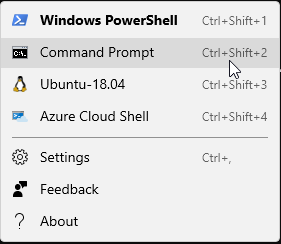
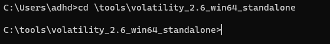
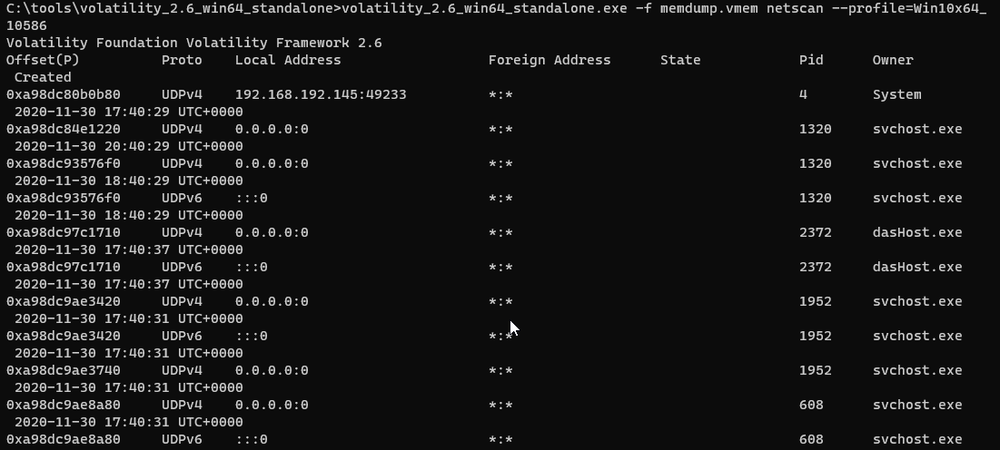
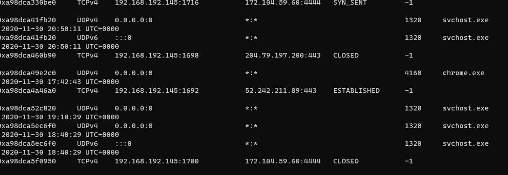
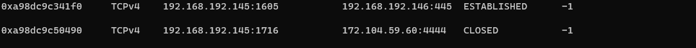
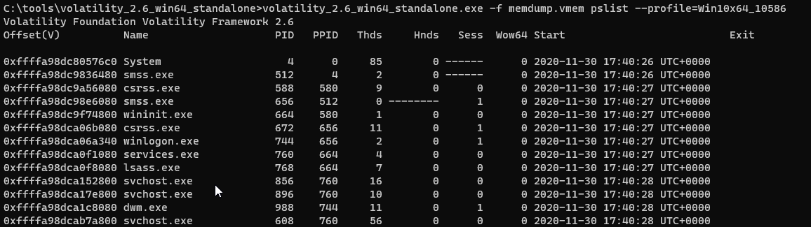
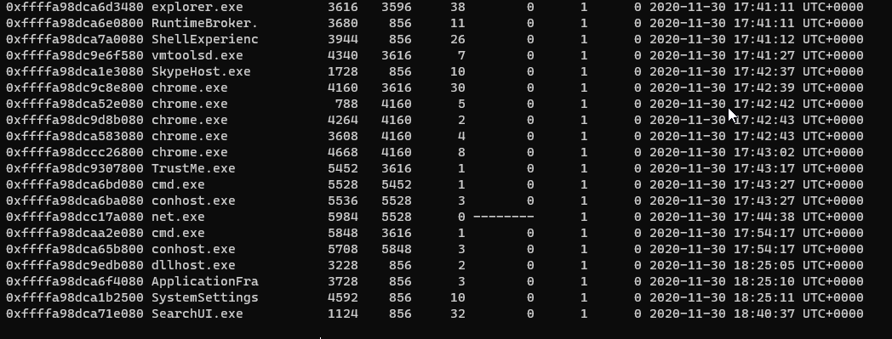
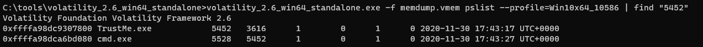
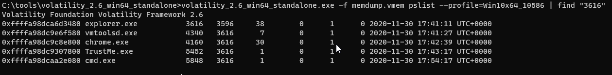
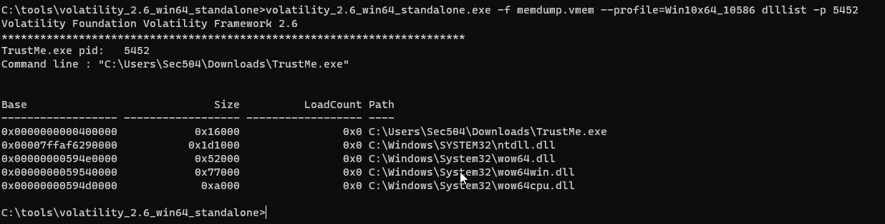

# Memory Analysis

MITRE Shield
------------

Applicable MITRE Shield techniques:
* [DTE0021](https://shield.mitre.org/techniques/DTE0021) - Hunting

Instructions
------------

In this lab we will be looking at a memory dump of a compromised system.  We will first need to decompress it and then use Volatility to look at the network connections and process information for the malware.

Please keep in mind that we are using a free tool for this lab.  While Volatility is great, it does have some limitations.  Specifically in the area of network PIDs.  So, while we are using Volatility, the same concepts can also be applied to any commercial tools you may be using in your environment as well.

To get started, we first need to extract the memory dump using 7zip.

To do this, first open file explorer and navigate to the memory dump and extract it.

First, click on the file explorer icon:

Next, select the tools folder:

Now, select the volatility_2.6_win64_standalone directory:

Next, right click on the memdump file and then select 7-Zip and then Extract Here:

Now we have it extracted!  Let's open a command prompt and look at it with Volatility!

To start, we will be working with the Command Prompt in Windows Terminal.   This is on your desktop and can be opened by right-clicking it and selecting Run as administrator:

When you get the pop up select Yes.

Next, to open a Command Prompt Window, select the Down Carrot  and then select Command Prompt.

Now, we will need to navigate to the cd \tools\volatility_2.6_win64_standalone directory

C:\>`cd \tools\volatility_2.6_win64_standalone`

Let's start by looking at the network connections:

C:\>`volatility_2.6_win64_standalone.exe -f memdump.vmem netscan --profile=Win10x64_10586`

Unfortunately, any non-OS level connection gets a pid of -1 and we do not get the process name.

But! We can see there are some connections that are established and have SYN_Sent and closed:

In the above screenshot we are seeing the Close and SYN_Sent because of the beaconing nature of the connection

The above screenshot is...  Concerning.  We would want to look further into this because it is a SMB (port 445) connection to another computer.  We know it is compromised (because it is a lab) but any time a "suspect" computer has another open connection to an internal system is, without question, a cause for concern.

Now, let's look at the processes on this system:

C:\> `volatility_2.6_win64_standalone.exe -f memdump.vmem pslist --profile=Win10x64_10586`

The cmd.exe should catch your attention.  Generally, users and day to day usage of a system does not spawn a cmd.exe session.  We may see it briefly as part of some sysadmin scripts.  However, it is not seen all that often in normal day-to-day user interactions.

C:\>`volatility_2.6_win64_standalone.exe -f memdump.vmem pslist --profile=Win10x64_10586 | find "5452"`

Here you can see that we traced back the parent process for one of the cmd.exe files back to TrustMe.exe.  When hunting down these processes it helps to track the parent processes. It can help create a sort of timeline for the actions on the system.

We can even go back to the parent process of the TrustMe process.

C:\>`volatility_2.6_win64_standalone.exe -f memdump.vmem pslist --profile=Win10x64_10586 | find "3616"`

In the above example we can see that the parent process for TrustMe was Explorer.exe.  This means it was invoked by the user on the system, as Explorer.exe is the GUI process for Windows 10.

Let's now dive into the TrustMe.exe process a bit further with dlllist:

C:\>`volatility_2.6_win64_standalone.exe -f memdump.vmem --profile=Win10x64_10586 dlllist -p 5452`

Here you can see the dll's associated with the TrustMe process.

We can also see the command line invocation of this process.  This is great as it tells us any flags used to start the process and it can tell us where on the system it was executed from.

