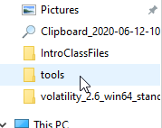
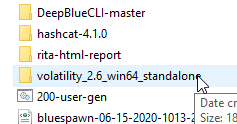
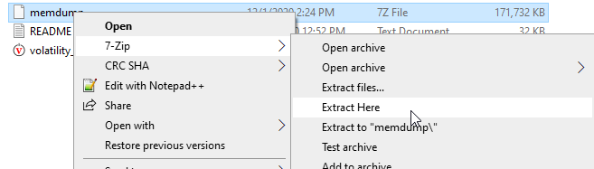

# Memory Analysis

In this lab we will be looking at a memory dump of a compromised system.  We will first need to decompress it and then use Volatility to look at the network connections and process information for the malware.

Please keep in mind that we are using a free tool for this lab.  While Volatility is great, it does have some limitations.  Specifically in the area of network PIDs.  So, while we are using Volatility, the same concepts can also be applied to any commercial tools you may be using in your environment as well.

To get started, we first need to extract the memory dump using 7zip.

To do this, first open file explorer and navigate to the memory dump and extract it.

First, click on the file explorer icon:

Next, select the tools folder:

Now, select the volatility_2.6_win64_standalone directory:

Next, right click on the memdump file and then select 7-Zip and then Extract Here.  Please note that the file name does not end with 7z on the left display column.  However, on the far right column you can see it is a 7Z file.:

Now we have it extracted!  Let's open a command prompt and look at it with Volatility!

Please note this memory dump was created from VMWare snapshot feature. There are multiple tools like winpmem and FTK Imager that can also create memory dumps.

To start, we will be working with the Ubuntu-18.04 Prompt in Windows Terminal.   This is on your desktop and can be opened by right-clicking it and selecting Run as administrator then selecting Ubuntu-18.04 from the down carrot menu:

Now we need to extract Volatility:

<pre>
cd /mnt/c/IntroLabs/
tar xvfz ./volatility3-1.0.0.tar.gz
cd volatility3-1.0.0/
</pre>

Let's start by looking at the network connections:

<pre>
python3 vol.py -f /mnt/c/tools/volatility_2.6_win64_standalone/memdump.vmem windows.netscan
</pre>

<pre>
0xa98dc9c341f0  TCPv4   192.168.192.145 1605    192.168.192.146 445     ESTABLISHED     4       System  2020-11-30 17:44:38.000000
0xa98dc9c50490  TCPv4   192.168.192.145 1716    172.104.59.60   4444    CLOSED  5452    TrustMe.exe     2020-11-30 20:46:30.000000
0xa98dc9cbd5c0  TCPv4   0.0.0.0 47001   0.0.0.0 0       LISTENING       4       System  2020-11-30 17:42:35.000000
</pre>

The above screenshot is... Concerning. We would want to look further into this because it is a SMB (port 445) connection to another computer. We know it is compromised (because it is a lab) but any time a "suspect" computer has another open connection to an internal system is, without question, a cause for concern.

Now, let's look at the processes on this system:

<pre>
python3 vol.py -f /mnt/c/tools/volatility_2.6_win64_standalone/memdump.vmem windows.pslist
</pre>
<pre>
PID     PPID    ImageFileName   Offset(V)       Threads Handles SessionId       Wow64   CreateTime      ExitTime        File output

4       0       System  0xa98dc80576c0  85      -       N/A     False   2020-11-30 17:40:26.000000      N/A     Disabled
512     4       smss.exe        0xa98dc9836480  2       -       N/A     False   2020-11-30 17:40:26.000000      N/A     Disabled
588     580     csrss.exe       0xa98dc9a56080  9       -       0       False   2020-11-30 17:40:27.000000      N/A     Disabled
656     512     smss.exe        0xa98dc98e6080  0       -       1       False   2020-11-30 17:40:27.000000      2020-11-30 17:40:27.000000      Disabled
664     580     wininit.exe     0xa98dc9f74800  1       -       0       False   2020-11-30 17:40:27.000000      N/A     Disabled
672     656     csrss.exe       0xa98dca06b080  11      -       1       False   2020-11-30 17:40:27.000000      N/A     Disabled
744     656     winlogon.exe    0xa98dca06a340  2       -       1       False   2020-11-30 17:40:27.000000      N/A     Disabled
760     664     services.exe    0xa98dca0f1080  4       -       0       False   2020-11-30 17:40:27.000000      N/A     Disabled
............SNIP..........
788     4160    chrome.exe      0xa98dca52e080  5       -       1       False   2020-11-30 17:42:42.000000      N/A     Disabled
4264    4160    chrome.exe      0xa98dc9d8b080  2       -       1       False   2020-11-30 17:42:43.000000      N/A     Disabled
3608    4160    chrome.exe      0xa98dca583080  4       -       1       False   2020-11-30 17:42:43.000000      N/A     Disabled
4668    4160    chrome.exe      0xa98dccc26800  8       -       1       False   2020-11-30 17:43:02.000000      N/A     Disabled
5452    3616    TrustMe.exe     0xa98dc9307800  1       -       1       True    2020-11-30 17:43:17.000000      N/A     Disabled
5528    5452    cmd.exe 0xa98dca6bd080  1       -       1       True    2020-11-30 17:43:27.000000      N/A     Disabled
5536    5528    conhost.exe     0xa98dca6ba080  3       -       1       False   2020-11-30 17:43:27.000000      N/A     Disabled
5984    5528    net.exe 0xa98dcc17a080  0       -       1       True    2020-11-30 17:44:38.000000      2020-11-30 17:44:38.000000      Disabled
5848    3616    cmd.exe 0xa98dcaa2e080  1       -       1       False   2020-11-30 17:54:17.000000      N/A     Disabled
</pre>
The cmd.exe should catch your attention. Generally, users and day to day usage of a system does not spawn a cmd.exe session. We may see it briefly as part of some sysadmin scripts. However, it is not seen all that often in normal day-to-day user interactions.

Let's look at pstree to see a bit more detail on what spawned what.

<pre>
python3 vol.py -f /mnt/c/tools/volatility_2.6_win64_standalone/memdump.vmem windows.pstree
</pre>

<pre>

***** 3616      3596    explorer.exe    0xa98dca71e080  38      -       1       False   2020-11-30 17:41:11.000000      N/A
****** 4160     3616    chrome.exe      0xa98dca71e080  30      -       1       False   2020-11-30 17:42:39.000000      N/A
******* 4264    4160    chrome.exe      0xa98dca71e080  2       -       1       False   2020-11-30 17:42:43.000000      N/A
******* 3608    4160    chrome.exe      0xa98dca71e080  4       -       1       False   2020-11-30 17:42:43.000000      N/A
******* 788     4160    chrome.exe      0xa98dca71e080  5       -       1       False   2020-11-30 17:42:42.000000      N/A
******* 4668    4160    chrome.exe      0xa98dca71e080  8       -       1       False   2020-11-30 17:43:02.000000      N/A
****** 5848     3616    cmd.exe 0xa98dca71e080  1       -       1       False   2020-11-30 17:54:17.000000      N/A
******* 5708    5848    conhost.exe     0xa98dca71e080  3       -       1       False   2020-11-30 17:54:17.000000      N/A
****** 4340     3616    vmtoolsd.exe    0xa98dca71e080  7       -       1       False   2020-11-30 17:41:27.000000      N/A
****** 5452     3616    TrustMe.exe     0xa98dca71e080  1       -       1       True    2020-11-30 17:43:17.000000      N/A
******* 5528    5452    cmd.exe 0xa98dca71e080  1       -       1       True    2020-11-30 17:43:27.000000      N/A
******** 5536   5528    conhost.exe     0xa98dca71e080  3       -       1       False   2020-11-30 17:43:27.000000      N/A
******** 5984   5528    net.exe 0xa98dca71e080  0       -       1       True    2020-11-30 17:44:38.000000      2020-11-30 17:44:38.000000
</pre>

Here you can see that we traced back the parent process for one of the cmd.exe files back to TrustMe.exe. When hunting down these processes it helps to track the parent processes. It can help create a sort of timeline for the actions on the system.

In the above example we can also see that the parent process for TrustMe was Explorer.exe. This means it was invoked by the user on the system, as Explorer.exe is the GUI process for Windows 10.

Let's now dive into the TrustMe.exe process a bit further with dlllist:

<pre>
python3 vol.py -f /mnt/c/tools/volatility_2.6_win64_standalone/memdump.vmem dlllist --pid 5452
</pre>

<pre>
Volatility 3 Framework 1.0.0
Progress:  100.00               PDB scanning finished
PID     Process Base    Size    Name    Path    LoadTime        File output

5452    TrustMe.exe     0x400000        0x16000 TrustMe.exe     C:\Users\Sec504\Downloads\TrustMe.exe   2020-11-30 17:43:17.000000      Disabled
5452    TrustMe.exe     0x7ffaf6290000  0x1d1000        -       -       2020-11-30 17:43:17.000000      Disabled
5452    TrustMe.exe     0x594e0000      0x52000 wow64.dll       C:\Windows\System32\wow64.dll   2020-11-30 17:43:17.000000      Disabled
5452    TrustMe.exe     0x59540000      0x77000 wow64win.dll    C:\Windows\System32\wow64win.dll        2020-11-30 17:43:17.000000      Disabled
5452    TrustMe.exe     0x594d0000      0xa000  wow64cpu.dll    C:\Windows\System32\wow64cpu.dll        2020-11-30 17:43:17.000000      Disabled
</pre>

Here you can see the dll's associated with the TrustMe process.

We can also see the command line invocation of this process. This is great as it tells us any flags used to start the process and it can tell us where on the system it was executed from.

Finally, let’s look at the easy button with malfind.  This module will look at the processes for any suspicious activities. 

<pre>
python3 vol.py -f /mnt/c/tools/volatility_2.6_win64_standalone/memdump.vmem windows.malfind.Malfind
</pre>
<pre>
Volatility 3 Framework 1.0.0
Progress:  100.00               PDB scanning finished
PID     Process Start VPN       End VPN Tag     Protection      CommitCharge    PrivateMemory   File output     Hexdump Disasm

5452    TrustMe.exe     0x450000        0x480fff        VadS    PAGE_EXECUTE_READWRITE  49      1       Disabled
4d 5a e8 00 00 00 00 5b MZ.....[
52 45 55 89 e5 81 c3 93 REU.....
45 00 00 ff d3 81 c3 66 E......f
62 02 00 89 3b 53 6a 04 b...;Sj.
50 ff d0 00 00 00 00 00 P.......
00 00 00 00 00 00 00 00 ........
00 00 00 00 00 00 00 00 ........
00 00 00 00 f8 00 00 00 ........        4d 5a e8 00 00 00 00 5b 52 45 55 89 e5 81 c3 93 45 00 00 ff d3 81 c3 66 62 02 00 89 3b 53 6a 04 50 ff d0 00 00 00 00 00 00 00 00 00 00 00 00 00 00 00 00 00 00 00 00 00 00 00 00 00 f8 00 00 00
5452    TrustMe.exe     0x510000        0x56efff        VadS    PAGE_EXECUTE_READWRITE  95      1       Disabled

</pre>

