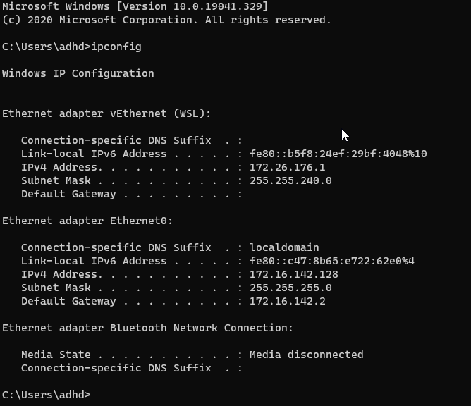
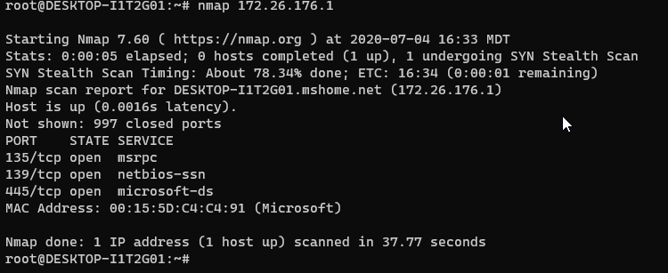
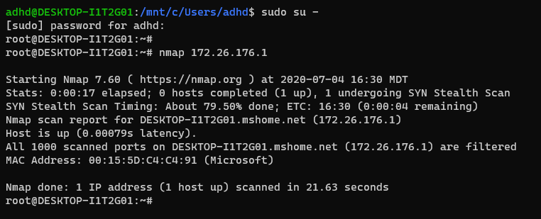

# Nmap

In this lab we will be scanning your Windows system from your Linux terminal with the firewall both on and off. 

The goal is to show you how a system is very different to the network with a firewall enabled. 

Remember, treat your internal network as hostile, because it is.

Let's get started by opening a Terminal as Administrator:

Now, let's open a command Prompt:

From the command prompt we need to get the IP address of your Windows system:

C:\Users\adhd>`ipconfig`

Please note your IP for your WSL address.  Mine is 172.26.176.1.  Yours will be different.

Now, let’s try and scan your Windows system from Ubuntu.  To do this open a Ubuntu command prompt:

Next, let’s become root:

adhd@DESKTOP-I1T2G01:/mnt/c/Users/adhd$ `sudo su -`

Then, we will scan your Windows system:

root@DESKTOP-I1T2G01:~# `nmap 172.26.176.1`

You can hit the spacebar to get status.

It should look like this:

Please note the open ports. These are ports and services that an attacker could use to authenticate to your system.  Or, attack if an exploit is available. 

Now, let’s go back to the Windows command prompt, by selecting the Administrator: Command Prompt tab.

Now, let’s enable the Windows firewall:

Now turn it back on and rerun.

C:\Users\adhd>`netsh advfirewall set allprofiles state on`

Now, let’s rescan from Linux.  Please select the Ubuntu tab:

Then, rerun the scan

root@DESKTOP-I1T2G01:~# `nmap 172.26.176.1`

Please note, you can just hit the up arrow key.

Once again, you can hit the spacebar to see status.

It should look like this:

Now, let’s disable the Windows firewall to go back to the base state:

C:\Users\adhd>`netsh advfirewall set allprofiles state off`

