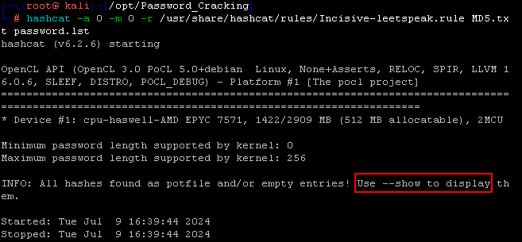
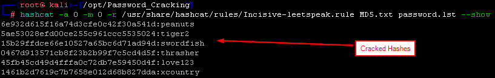
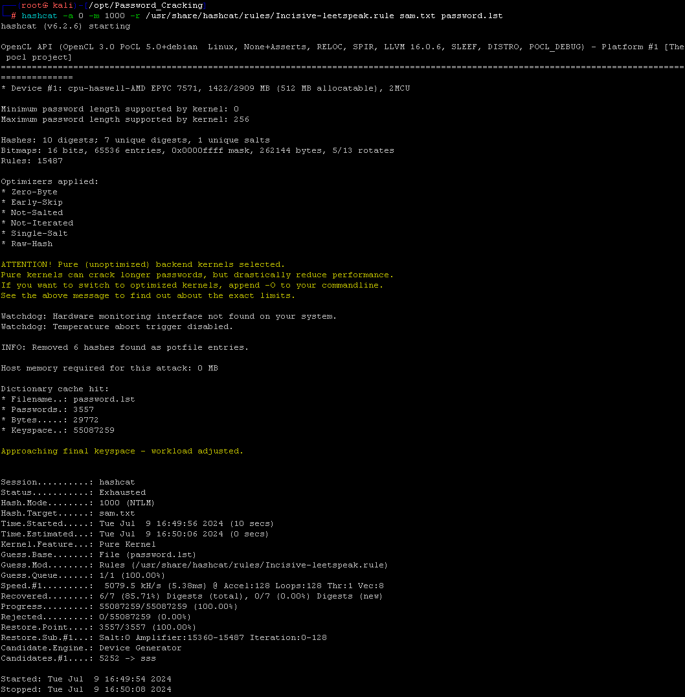
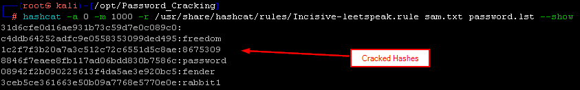

# Password Cracking

In this lab we will be getting started with the fundamentals of password cracking.  We will be using Hashcat to do this.

First, let’s disable Defender. Simply run the following from an Administrator PowerShell prompt. Open PowerShell and run the following command:

<pre>Set-MpPreference -DisableRealtimeMonitoring $true</pre>

This will disable Defender for this session.

If you get angry red errors, that is Ok, it means Defender is not running.

To start, we need to launch a Kali terminal. Click the Kali icon in the taskbar.

When the terminal opens, we need to gain root access by running the following:

<pre>sudo su -</pre>

Next, we need to navigate to the appropriate directory. Run the following:

<pre>cd /opt/Password_Cracking</pre>

Lets begin by attempting to crack some MD5 hashes. 

Run the following command:

<pre>hashcat -a 0 -m 0 -r /usr/share/hashcat/rules/Incisive-leetspeak.rule MD5.txt password.lst</pre>

The result will look like this:

Running this command will not show us the cracked hashes. As seen above, in order to see cracked hashes, we need to run our command again and add the `--show` option onto the end.

After running the command again with the `--show` option, you should see something like this:

Now, lets crack some NT hashes.  These are the hashes that almost all modern Windows systems store these days.  Older systems may store LANMAN, but that is very rare.

Lets run the following command:

<pre>hashcat -a 0 -m 1000 -r/usr/share/hashcat/rules/Incisive-leetspeak.rule sam.txt password.lst</pre>

When done it should look like this:

Once again, we will not see the cracked hashes unless we append `--show` onto the end of the command. Lets do that, then run it again to see the cracked hashes:

