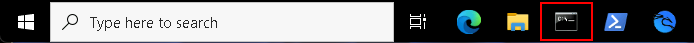
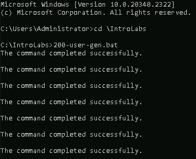
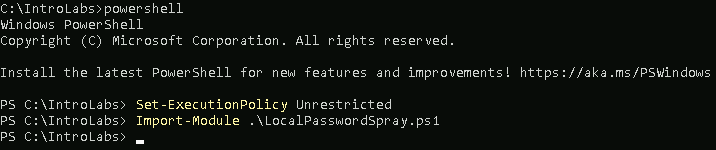
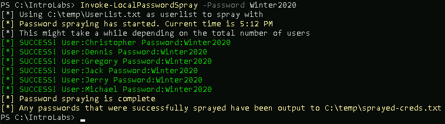
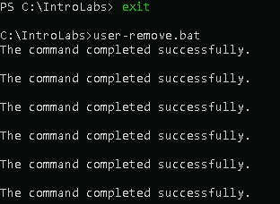

# Password Spray

First things first, disable **Defender**. Open an instance of **Windows PowerShell** by clicking on the icon in the taskbar. Then run the following:


```Set-MpPreference -DisableRealtimeMonitoring $true```

This will disable **Defender** for this session.

If you get angry red errors, that is Ok, it means **Defender** is not running.

Let's get started by opening a **Command Prompt** terminal by clicking on the icon in the taskbar.



Once the terminal opens, navigate into the appropriate directory by running the following command:

```cd \IntroLabs```

We need to run the batch file named **200-user-gen** 

Do so by typing the name of the batch file and hitting enter:

```200-user-gen.bat```

It should look like this:



We will need to start **PowerShell** to run **"LocalPasswordSpray"**

Launch it by typing the following and hitting enter:

```powershell```

Run the following two commands:

```Set-ExecutionPolicy Unrestricted```

```Import-Module .\LocalPasswordSpray.ps1```

It should look like this:



Let’s try some password spraying against the local system!

```Invoke-LocalPasswordSpray -Password Winter2020```

It should look like this:



We need to clean up and make sure the system is ready for the rest of the labs.

Run the following two commands:

```exit```

```user-remove.bat```

