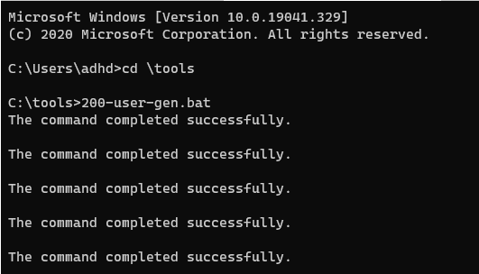
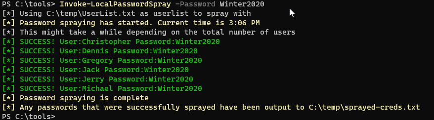
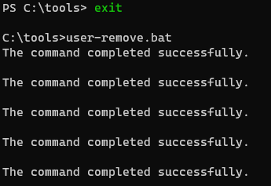

# Password Spray

First, let’s disable Defender. Simply run the following from an Administrator PowerShell prompt:

`Set-MpPreference -DisableRealtimeMonitoring $true`

This will disable Defender for this session.

If you get angry red errors, that is Ok, it means Defender is not running.

Let's get started by opening a Terminal as Administrator

Now, let's open a command Prompt:

####NOTE##### 

If you are having trouble with Windows Terminal, you can simply start each of the three shells, we use by starting them directly from the Windows Start button. 

 

Simply click the Windows Start button in the lower left of your screen and type: 

 

`Powershell` 

or 

`Ubuntu`

or 

`Command Prompt` 

 

For PowerShell and Command Prompt, please right click on them and select Run As Administrator 

###END NOTE###

C:\Windows\system32> `cd \tools`

C:\Tools> `200-user-gen.bat`

It should look like this:

Now, we will need to start PowerShell to run LocalPasswordSpray

C:\Tools> `powershell`

PS C:\Tools> `Set-ExecutionPolicy Unrestricted`

PS C:\Tools> `Import-Module .\LocalPasswordSpray.ps1`

It should look like this:

Now, let’s try some password spraying against the local system!

PS C:\Tools> `Invoke-LocalPasswordSpray -Password Winter2020`

It should look like this:

Now we need to clean up and make sure the system is ready for the rest of the labs:

PS C:\Tools> `exit`

C:\Tools> `user-remove.bat`

