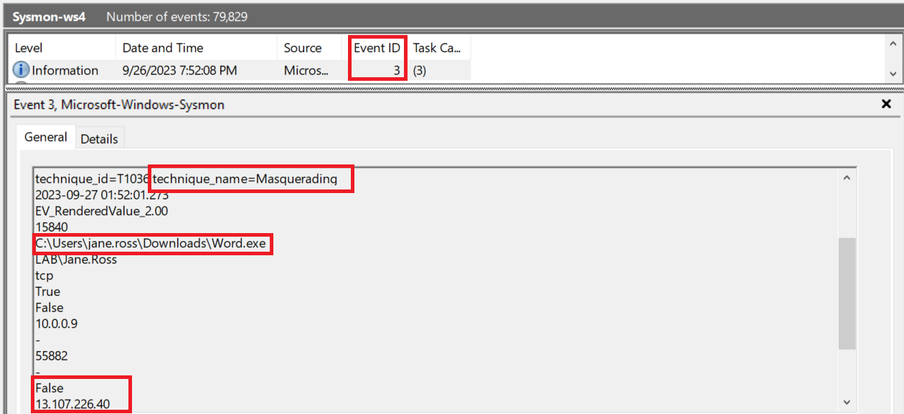
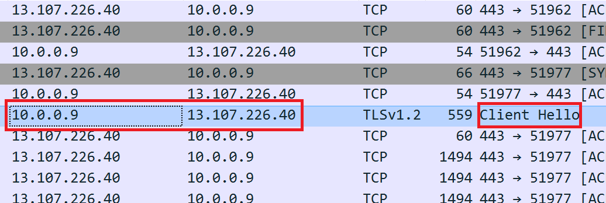
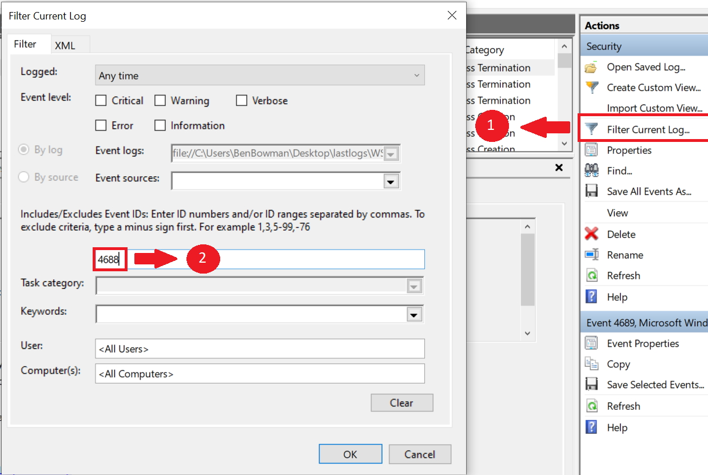
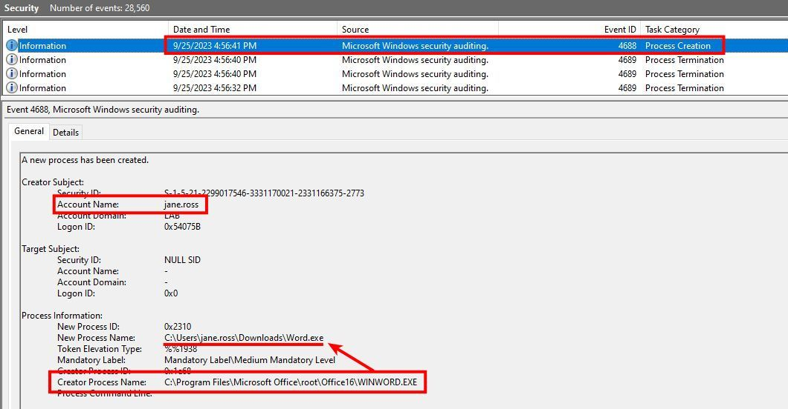
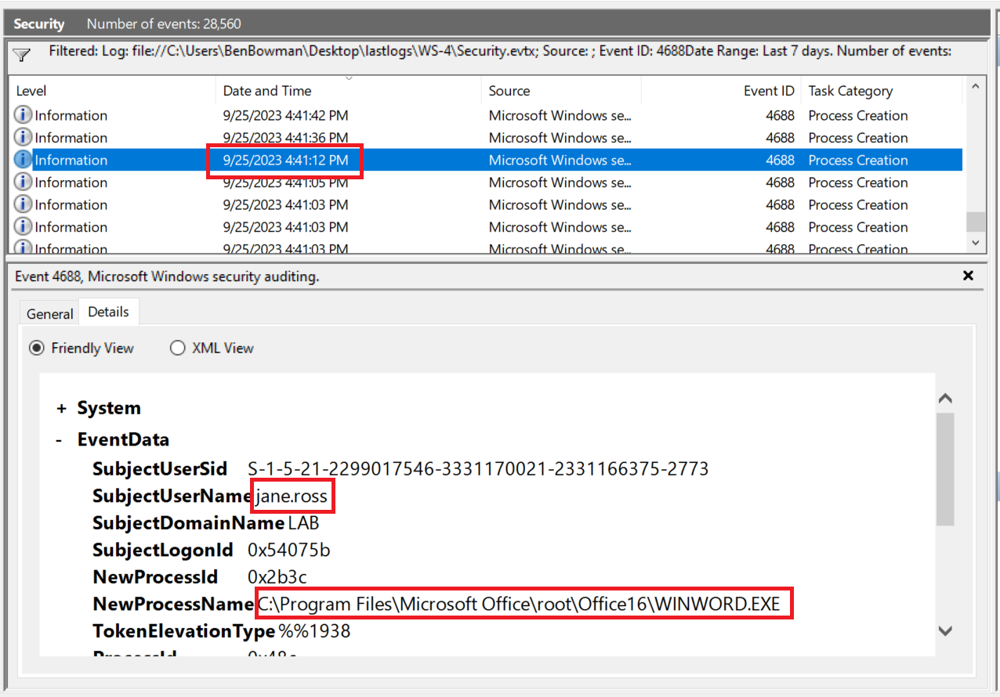

# A Concerning Report

*This lab will require the WS-4 Sysmon, Security Log, and the ws-4_activity to follow along.*

In this walkthrough, we will examine log files extracted from Jane Ross's workstation following her submission of a ticket concerning suspicious behavior on her computer.

Our objective is to uncover any suspicious activity and identify potentially malicious executables that have been run on her workstation in the past seven days, coinciding with the onset of the workstation's unusual behavior. We are looking for any abnormal file executions that may have taken place.

*Upon reviewing the Sysmon log file, we've identified that an executable named *Word.exe* has recently initiated connections to an external IP address from Jane's workstation.  [Event ID 3](https://www.blackhillsinfosec.com/a-sysmon-event-id-breakdown/) is a Sysmon Event ID that indicates a network connection originating from 10.0.0.9 and connecting to an external ip at 13.107.226.40. There is also a note that states the event is masquerading, a sign of deception.*

Jane denies any knowledge of installing a program called Word.exe but claimed she uses "word" all the time. If Jane is unaware of this software installation, it suggests that someone or something else may have downloaded and executed it. But what could be an alternative method for an executable to be downloaded and ran?

Before the investigation takes a turn for the worse, let's inspect some network traffic from Jane's workstation to see if there is any evidence to support the idea that Word.exe is a malicious file. Malicious files often times have different motives. Malicious files often beacon out to a *C2* or *Command and Control* server so that an attacker can have remote access to a network in order to further aforementioned motives. This will create network traffic that we can capture and review.

*There is a substantial amount of traffic originating from 10.0.0.9 to 13.107.226.40. there is a consistant network connection and communication taking place. This is a concerning situation as there appears to be no justifiable reason for prolonged communication with this source address and destination address.*

Lets look at Jane's workstation security logs to see if we can see any commands being issued and recorded in events. 

First, filter for new process creations.

Click "OK" at the bottom right and continue.
Now we should see new processes being created, filter through these and look for anything of interest.
After digging through files you will find Word.exe and when it executed, take note of the time stamp.

To gain more insight into Jane's activities before Word.exe was executed, lets move backwards from here, and look for any programs that were open.

We can see that Jane was using Microsoft Word before the Word executable ran. This helps us infer that whatever Microsoft Word did somehow contributed to the files download and execution. Sometimes attackers will stick malicious code into Word documents to run programs that the user would not suspect. We will inspect Janes sharepoint logs to see what has been happening in the word documents within her Sharepoint. If something malicious has occured we should be able to track down the cause within Sharepoint Logs. Jane said she downloaded a file called "HRcomplaint something..." before the werid things started happening.
