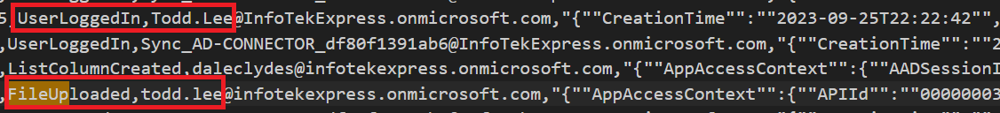
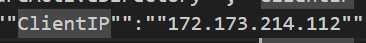
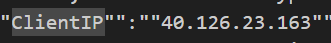
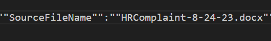

# There's Something in the Water

*This lab will require the audit.log file to follow along.*

In the last lab, we found a suspicious file on Jane's workstation. During our investigation, we noticed that Jane had opened Microsoft Word shortly before Word.exe ran. When we asked Jane if she had recently downloaded or opened any Word documents, she mentioned that she had opened a Word file from her [SharePoint](https://www.microsoft.com/en-us/microsoft-365/sharepoint/collaboration).

As investigators, we have a couple of options. We can either analyze the Word document she opened to understand its content better, or we can examine audit logs to track the activities of users in SharePoint.

Because of the wider view that logs give us, we will look at the Sharepoint audit logs.

We can see that one of the most recent changes was made by Todd Lee. Todd logged in and then edited the file for an unknown reason. At first glance this is normal behavior, SharePoint was built for collaboration. 

After closer examination, we can see that the IP address responsible for the login and the one used to upload the file are different. However both events occured within a two-minute time frame, Todd logged in from two different locations, and while possible was not probable.

Jane has disclosed that the file she downloaded was an HR complaint that needed to be updated and signed. 

The file uploaded from Todd's compromised account was an HR complaint document. An attacker may have found a [Macro](https://support.microsoft.com/en-us/office/protect-yourself-from-macro-viruses-a3f3576a-bfef-4d25-84dc-70d18bde5903) in the Word document and replaced it. When Jane downloaded the seemingly previously trusted document, malicious code inserted by the threat actor in Todd's account was run, effectively poisoning the well. Anyone that downloaded and opened the file has also likely been compromised.

The attacker also got access to Jane's account and the network by poisoning the well. As investigators, we know that an attacker will not stop at compromising one host. A threat actor's kill chain will include trying to gain more access and privilege than they currently have. Our next step is to search for evidence of privilege escalation within the domain.
