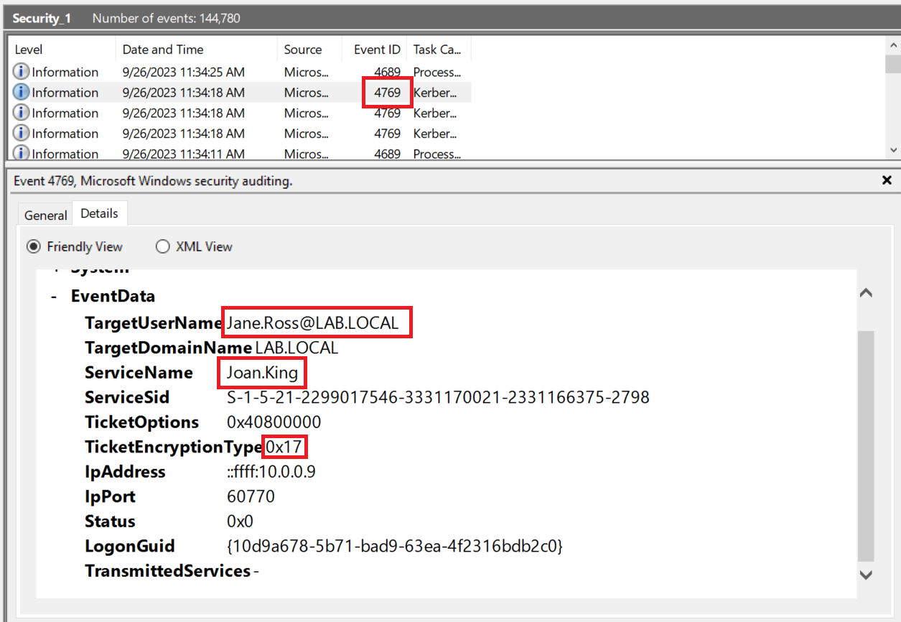

# Kerberoasting

*This lab will require the DC-1 Sysmon and Security Logs to follow along.*

When an attack occurs, there are [phases to most attacks](https://www.lockheedmartin.com/en-us/capabilities/cyber/cyber-kill-chain.html) that usually happen. We saw the attacker gained entry into a workstation by using a Word Macro. The next route the attacker will utilize is privilege escalation.

We received reports of some unexpected [Kerberos ticket](https://learn.microsoft.com/en-us/windows-server/security/kerberos/kerberos-authentication-overview) requests originating from Jane Ross to an [SPN](https://learn.microsoft.com/en-us/windows/win32/ad/service-principal-names) admin account.
Let's open our Domain Controller security log and Sysmon log to see if we can find some unexpected Kerberoast ticket requests.

There's an important event in the security log to note.

Jane's account obtained a Kerberoast Service Ticket from Joan King, who as an admin, had created a service principal, most likely by installing software somewhere on the domain. Now, there was no legitimate reason for Jane to request a ticket, and this likely confirmed that the attacker successfully Kerberoasted and has potentially escalated privileges to a higher-level account.

The use of encryption type [0x17](https://redsiege.com/tools-techniques/2020/10/detecting-kerberoasting/) is noteworthy. This encryption type is often easier to crack, serving as another sign of a potential Kerberoasting attack. While this detail alone may not definitively indicate an attack, when combined with other pieces of evidence, it helps us build a more comprehensive picture.

To confirm this, we can cross reference Sysmon logs to see any network requests for SPN accounts in Active Directory. However, there were no significant logs within Sysmon that indicated any malicious activity. Overall, It is always important to verify suspicions by cross-referencing multiple logs and sources.
