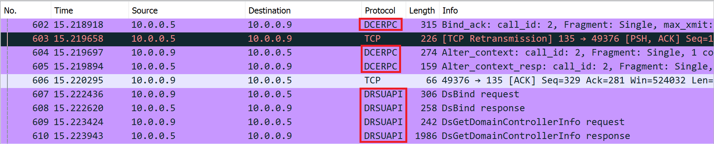

# DC Sync

*This lab will require the DC-1 dc-1_incident PCAP to follow along*

We've received reports suggesting a potential [DC Sync attack](https://blog.blacklanternsecurity.com/p/detecting-dcsync) on our Active Directory. It's been confirmed that the attacker has managed to access an admin account, likely via Kerberoasting. With the occurrence of an unplanned DC Sync, it's highly likely that the attacker has successfully cracked this hash. Joan has informed us that her password was "Summer2023!" - an easily crackable password.

It's plausible that the attacker used the compromised admin account to initiate a DC Sync, thereby gaining access to all user accounts and their corresponding NTLM hashes within our Active Directory. However, before we conclude this, let's conduct thorough investigation by reviewing the PCAP capture and the Domain Controller Logs to discover the full extent of the breach.

When searching logs for a DC Sync, Event ID 4662 can help you filter down logs. DC Sync accesses Directory service objects, which are logged under Event ID 4662. But there is a problem, these event logs are extremely generic and don't reveal much information. The bulk of the important information will be in a network capture.

Looking at wireshark we can see a few things that hint at a DC Sync.

The information on the right side of the Wireshark window provides an overview of the network traffic. Healthy traffic typically shows a consistent, pulsing rhythm, resembling a zebra stripe pattern with small variations. In this particular PCAP file, a significant network event occurred. Let's investigate this further.

The protcol that has caused us some concern is [DCE/RPC](https://en.wikipedia.org/wiki/DCE/RPC). This protocol indicates something is happening with the Domain Controller and it is likely that a [DCSync attack](https://blog.nviso.eu/2021/11/15/detecting-dcsync-and-dcshadow-network-traffic/) is taking place.

The DSBind request followed by a DSGetNCChanges response can be a legitimate network event, as it is part of the normal operation of a Windows Domain Controller. The danger level of these requests largely depends on whether they are part of a planned and authorized action or if they occur unexpectedly.

If the IT team planned and executed a DC Sync for a legitimate  purpose, then there is no threat, and it does not necessarily indicate a compromise. Examples of legitimate use cases include administrative tasks, migrations, or routine maintenance.

If the DSBind request and DSGetNCChanges response occur unexpectedly and without authorization, it could indicate a security incident and Active Directory breach.

The results are grim, IT has informed us that there was no scheduled DC Sync. It looks like our attacker has taken control of the entire domain.
