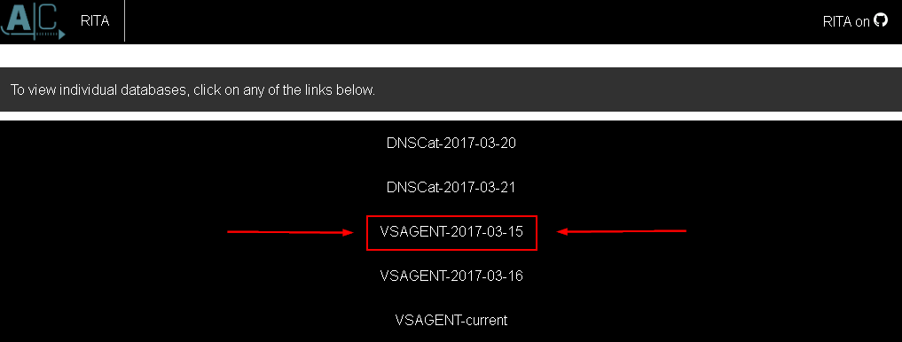
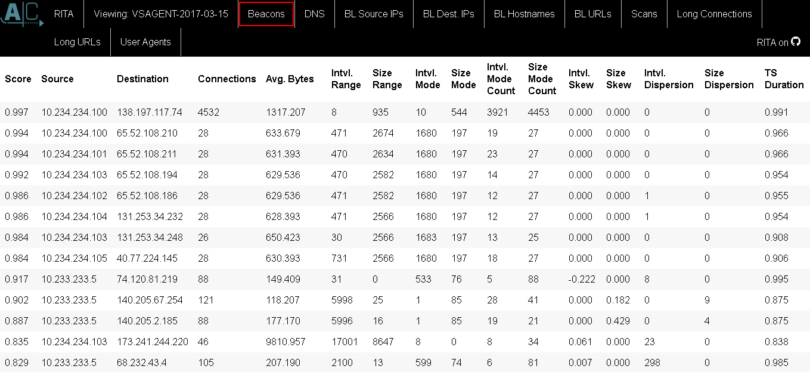
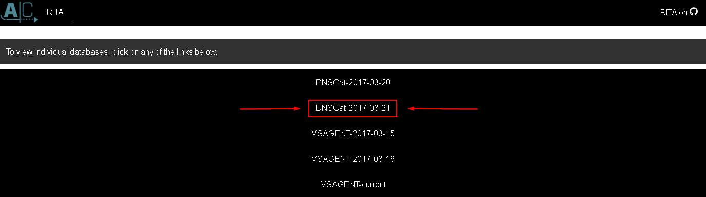
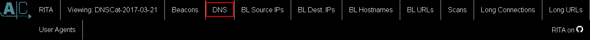
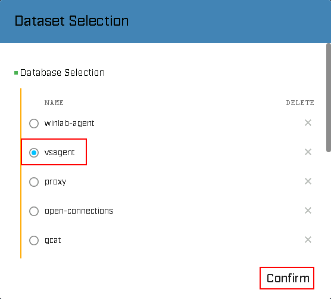
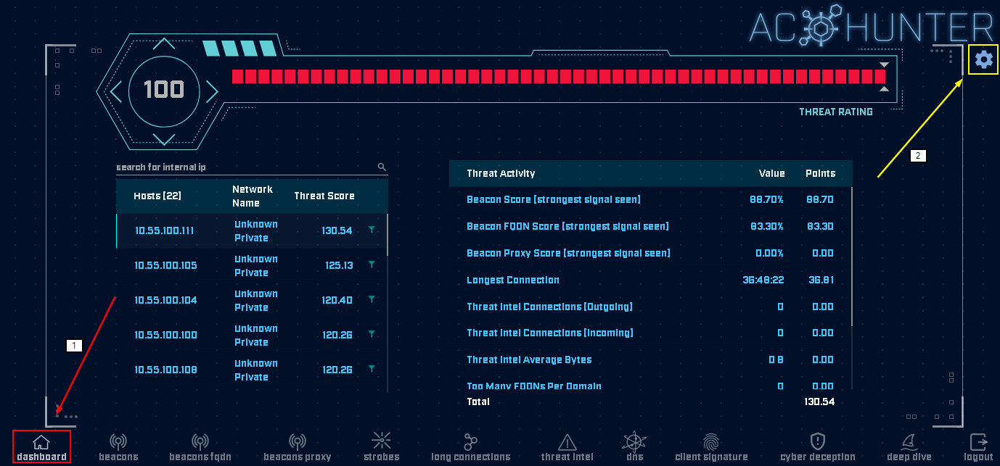
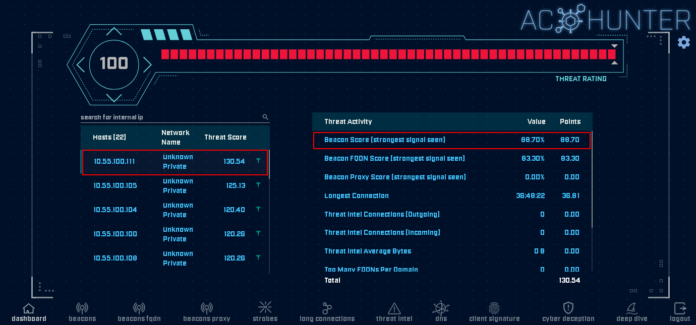

# RITA and AC Hunter

In this lab, we are going to look at detecting command and control traffic on a network.

We will be using **Real Intelligence Threat Analytics** (RITA) for this lab.

To start we first need to open Windows File Explorer and navigate to the tools directory.

First, open File Explorer:

Then, select the IntroLabs directory:

Then, select rita-html-report:

Then, select **index.html**:

Let’s select **VSAGENT-2017-3-15**.

The tabs across the top allow you to review the output for all the different analysis modules of RITA.
For **VSAgent** we will be focusing on **Beacons**, **Blacklisted** and **User Agents**.

Please select the **Beacons** tab.

Some backdoors have a very strong **“heartbeat”**. This is where a backdoor will constantly reconnect to get commands from an attacker at a specific interval. The interval consistency of the **“heartbeat”** is the TS score where a value of **1** is perfect. The top value in this set is the **VSAgent** communication. We will talk about the other connections in a few moments.

We also have the number of connections. While some beacons have a **“strong”** heartbeat, they are very short in nature. Our VSAgent connection had a very large number of connections which had very strong intervals, while some of the others (e.g. the 64.4.54.253 addresses) had a strong **"heartbeat"**, but not as many connections. We will also talk about TS Duration. This is detecting how consistent each connection duration is. For example, if every connection is 2 seconds and there are 8000+ it would have a very strong **TS Duration** score.

The other fields are statistical analysis fields showing things like mode range and skew.

Now, lets navigate back to the first menu by clicking the **RITA** tab. 

Then, select **DNSCat-2017-03-21**. We are going to review a backdoor which does not quite fit the same mold as **VSAgent**.

This does not beacon back to a specific IP address, but rather it beacons through a DNS server. It is very crafty and will highlight how we can review the RAR compressed Bro logs used to generate the RITA data.

We are going to jump right to the DNS tab. It gives us the clearest look at this backdoor.

A couple of things should jump out at an investigator straight away. First, there were over 40K requests for **cat.nanobotninjas.com.** This is an absurd number for a specific domain. Sure, there are lots of requests for com and org and net and uk, but that is to be expected.

Now, let's play with AC Hunter!

Please go to 

<pre>https://training.aihhosted.com/</pre>

You might be prompted by a warning stating that your connection isn't private. This is **Okay**. 

Simply click **Advanced** and then click **Continue to trainin.aihhosted.com**

The creds are:

email = **training@blackhillsinfosec.com**

PW = **gotbeacons?**

When logged in, you will be prompted to select a dataset. 

Select **vsagent** and hit confirm.

>[!NOTE]
>
>If this is not what you see, select the house icon in the bottom left of your screen, followed by the gear in the upper right.

This will open the overall scoring screen, as seen below. This screen allows you to see the systems that have the top scores across all areas from beacons to cyber deception.

Please select **10.55.100.111**, then click on Beacon Score on the right.

This will open the beacon score for this system.

Notice the **histogram** on the bottom and the scoring criteria in the middle. 

Notice how on the bottom you can see multiple aspects of this systems connections.  For example, you can see if there are any connections that had a threat intel hit, or if there are any connections that have beacons to a fully qualified domain.

Now, using **AC Hunter**, answer the following questions:

1. In the winlab-agent dataset, what is the connection interval for 10.10.98.30?

2. In the gcat dataset, what is the historic fqdn for the beacon on 10.55.100.111?

3. For the dnscat2-ja3-strobe-agent dataset, what domain has the highest lookup count?
4. Who is doing the lookups?

***                                                                 
<b><i>Continuing the course?  [Next Lab](/IntroClassFiles/Tools/IntroClass/nessus/Nessus.md)</i></b>

<b><i>Want to go back?  [Previous Lab](/IntroClassFiles/Tools/IntroClass/Wireshark/Wireshark.md)</i></b>

<b><i>Looking for a different lab?  [Lab Directory](/IntroClassFiles/navigation.md)</i></b>

***Finished with the Labs?***

Please be sure to destroy the lab environment!

[Click here for instructions on how to destroy the Lab Environment](/IntroClassFiles/Tools/IntroClass/LabDestruction/labdestruction.md)

---

