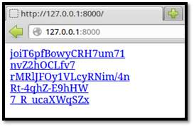
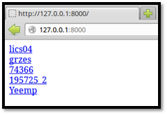
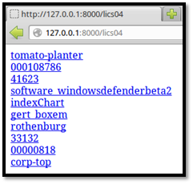

Spidertrap
==========

Website
-------

<https://github.com/adhdproject/spidertrap>

Description
-----------

Trap web crawlers and spiders in an infinite set of dynamically
generated webpages.

Install Location
----------------

`/opt/spidertrap/`

Usage
-----

`/opt/spidertrap$` **`python3 spidertrap.py --help`**

        Usage: spidertrap.py [FILE]

        FILE is file containing a list of webpage names to serve, one per line.
        If no file is provided, random links will be generated.

Example 1: Basic Usage
----------------------

Start Spidertrap by opening a terminal, changing into the Spidertrap
directory, and typing the following:

First, let's get your Linux systems IP address

`ifconfig`

Next, let's cd to the propper directory:

`cd /opt/spidertrap`

Now, lets start it:

`/opt/spidertrap$` **`python3 spidertrap.py`**

        Starting server on port 8000...

        Server started. Use <Ctrl-C> to stop.
        
    

Then visit http://<YOUR_LINUX_IP>:8000 in a web
browser. You should see a page containing randomly generated links. If
you click on a link it will take you to a page with more randomly
generated links.

 

Example 2: Providing a List of Links
------------------------------------

Start Spidertrap. This time give it a file to use to generate its links.

You may need to press ctrl+c to kill your existing spidertrap session.

Now, restart it with the following options:

`/opt/spidertrap$` **`python3 spidertrap.py directory-list-2.3-big.txt`**

        Starting server on port 8000...

        Server started. Use <Ctrl-C> to stop.

Then visit http://<YOUR_LINUX_IP>:8000 in a web
browser. You should see a page containing links taken from the file. If
you click on a link it will take you to a page with more links from the
file.

 

Example 3: Trapping a Wget Spider
---------------------------------

Follow the instructions in [Example 1: Basic Usage] or
[Example 2: Providing a List of Links] to start Spidertrap. Then
open a new terminal and tell wget to mirror the website. Wget will run
until either it or Spidertrap is killed. Type Ctrl-c to kill wget.

`$` **`sudo wget -m http://127.0.0.1:8000`**

        --2013-01-14 12:54:15-- http://127.0.0.1:8000/

        Connecting to 127.0.0.1:8000... connected.

        HTTP request sent, awaiting response... 200 OK

        <<<snip>>>

        HTTP request sent, awaiting response... ^C

