# TCPDump

In this lab, we will be looking at some basic **tcpdump** filters that every SOC and security analyst should know.

Let’s get started by opening a Terminal.

Alternatively, you can click on the Kali logo in the taskbar.

We need to get into the root shell. 

<pre>sudo su -</pre>

Navigate to the appropriate directory. 

<pre>cd /opt/tcpdump</pre>

We are going to start with a very basic filter that simply shows us the data associated with a specific host.

The filter in this case, is host.

<pre>tcpdump -n -r magnitude_1hr.pcap host 192.168.99.52</pre>

For this command, we are telling **tcpdump** to do two things, not resolve hostnames **(-n)** and read in the data from a file **(-r)**.

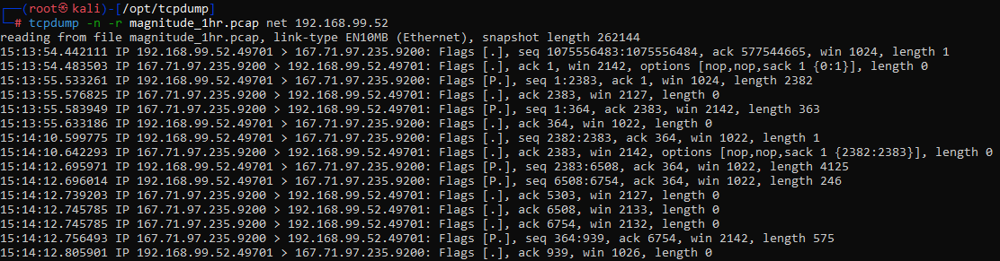

What exactly is this showing us?

Well, it is showing each packet's timestamp:

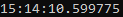

Its protocol:

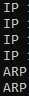

Its **source** IP address + port direction and **destination** IP address + port :

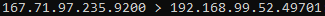

Its control bit flags and sequence numbers:

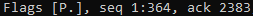

And data size:

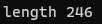

We can get the filter to be a bit more granular.  In fact, you can create filters for literally every part of a packet!

Let's add port number.

<pre>tcpdump -n -r magnitude_1hr.pcap host 192.168.99.52 and port 80</pre>

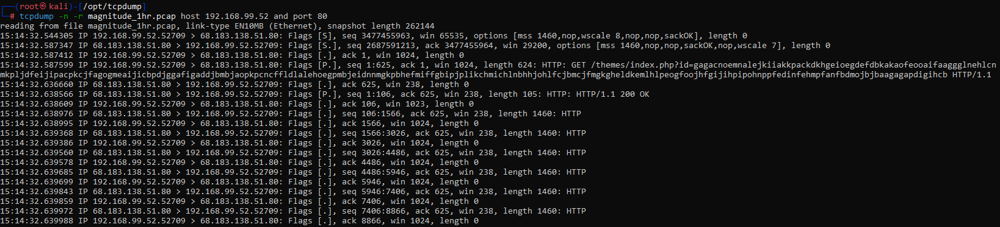

In the screenshot above, you can see we now have all the packets that are either sent or received by port 80 on 192.168.99.52.

While getting the overall metadata from the packets is nice, we can get the full **ASCII** decode of the packet and the payload of the packet.

On one hand, getting the metadata from the packets is nice.  On the other hand, why not get the full ASCII decode and payload of the packet?

<pre>tcpdump -n -r magnitude_1hr.pcap host 192.168.99.52 and port 80 -A</pre>

You can hit **ctrl + c** after a few seconds.

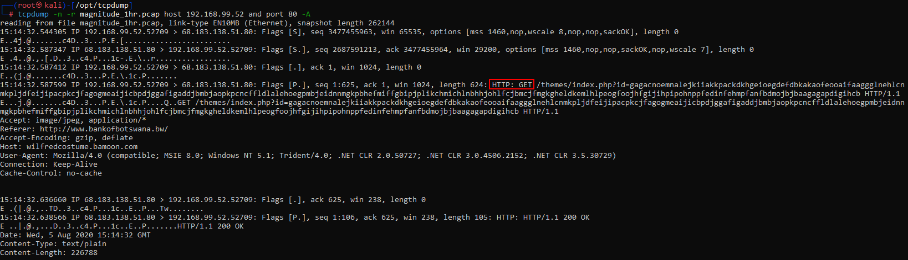

As you can see above, we now can see the actual http GET requests and the responses.  

Lets dig into the packet with the timestamp of 15:14:32.638976

Ouch, it looks like **PowerShell!!!**  A favorite of attackers and pentesters alike.  

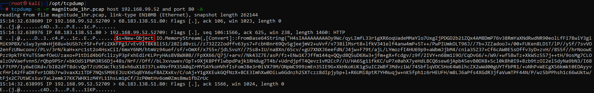

Furthermore, it looks like there is **Base64** data.

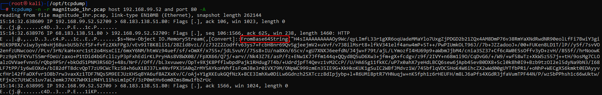

Still not enough?  We can also see the raw **Hex** values with the -X flag:

<pre>tcpdump -n -r magnitude_1hr.pcap host 192.168.99.52 and port 80 -AX</pre>

You can hit **ctrl + c** after a few seconds.

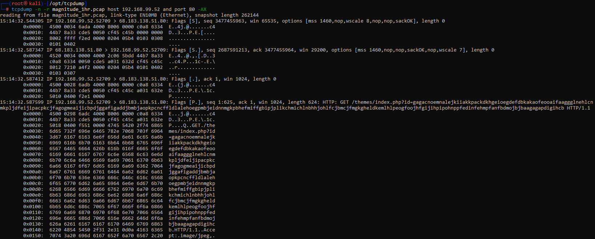

We can also show specific protocols of interest.

For example:

<pre>tcpdump -n -r magnitude_1hr.pcap ip6</pre>

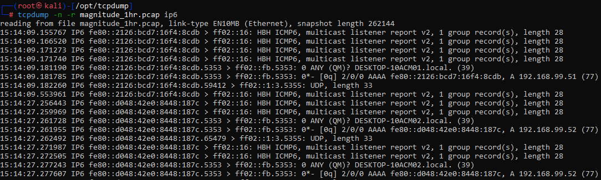

This is showing all the **ipv6** traffic.

We can show network ranges.  This is very useful when you are seeing traffic either to or from a range of IP addresses.  For example, this can help us answer questions like, "Are there any other systems talking to this IP address range?" 

Think of an attacker using multiple systems on a network range to disperse their **C2** traffic.

<pre>tcpdump -n -r magnitude_1hr.pcap net 192.168.99.0/24</pre>

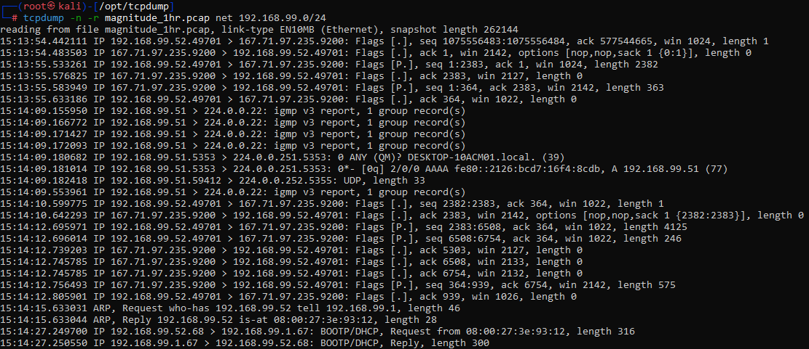

Want to play with some more pcaps?  Cool.

Please check out, "Malware of the Day" from **Active Countermeasures**!

`https://www.activecountermeasures.com/category/malware-of-the-day/`

Below are the commands to download some of the capture files.  Try and run through the basic level analysis we just did with them.

`https://www.dropbox.com/s/zyqn3nn5ygfki59/teamviewer_1hr.pcap`

`https://www.activecountermeasures.com/pcap/apt1virtuallythere_1hr.pcap`

`https://www.dropbox.com/s/51uzphl1f3ca691/lateral_backup_c2_1hr.pcap`

`https://www.dropbox.com/s/bhgvpablx11u8yb/taidoor_1hr.pcap`

Here is a great resource to try some more options in **TCPDump**:

`https://danielmiessler.com/study/tcpdump/`

***
***Continuing on to the next Lab?***

[Click here to get back to the Navigation Menu](/IntroClassFiles/navigation.md)

***Finished with the Labs?***

Please be sure to destroy the lab environment!

[Click here for instructions on how to destroy the Lab Environment](/IntroClassFiles/Tools/IntroClass/LabDestruction/labdestruction.md)

[Return To Lab List](https://github.com/strandjs/IntroLabs/blob/master/IntroClassFiles/navigation.md)

---

