# Velociraptor 

In this lab we will be installing and using Velociraptor to look at the various IR artifacts on your computer.

Check out their website here:

https://www.velocidex.com/

Velociraptor is a fantastic and free EDR that can help us better understand the inner workings of a computer.

Further, it is an excellent example of commercial tools you will encounter in your security career.

Finally, they also have excellent training if you want to dig deeper.

https://www.velocidex.com/training/

Let's get started.

First, we will need to extract the executable from the 7zip archive. 

Within Windows File Explorer navigate to the C:\IntroLabs directory:

`cd \IntroLabs`

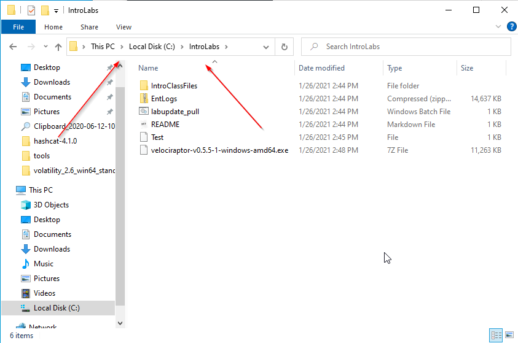

Next, right click on the Velociraptor .7z file and select 7-Zip > Extract Here

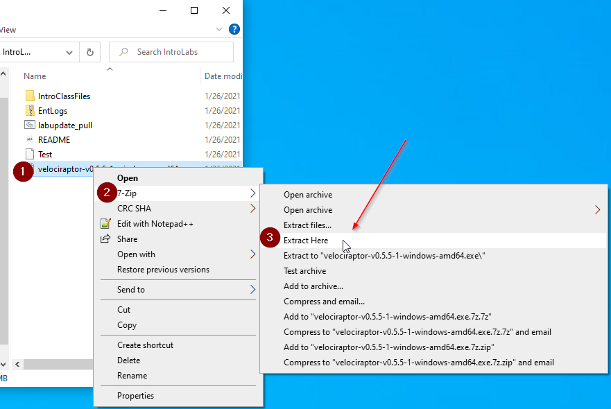

Now we will need to open a command prompt and change directories to the IntroLabs directory.

First, open a Windows Terminal as Administrator:

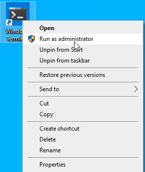

When you get the pop up, select Yes.

Next, let's open a Command Prompt:

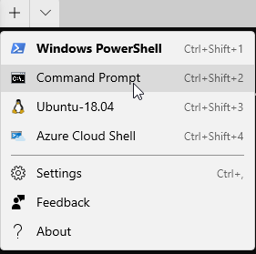

Now, let's navigate to the IntroLabs directory:

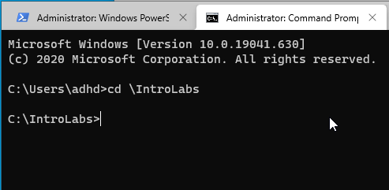

For this installation, we are going to set up Velociraptor as a standalone deployment.  This means the server and the client will be run on the same system.

Let’s get started:

`velociraptor-v0.5.5-1-windows-amd64.exe config generate -i`

When it asks about the OS, please choose windows.  It should be the default.

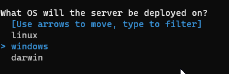

When it asks about the Path to the datastore, just hit enter.  This will keep the default.

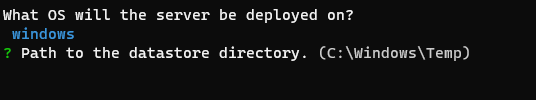

When it asks about the SSL certs, just hit enter.  It will choose the default of Self Signed SSL.

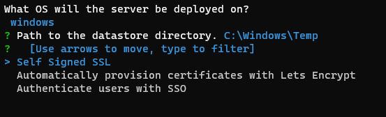

When it asks about the DNS name, just hit enter.  It will set the default to localhost.  This will work fine as we are just running this locally.

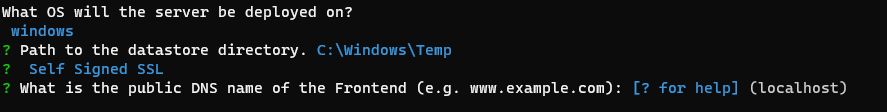

For the default ports, once again, just hit enter to accept 8000 and 8889 as the defaults.

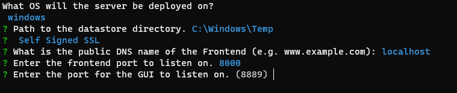

When asked about Google Domains DynDNS, please enter `N`

For the GUI username, please just hit enter to end.

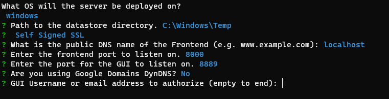

When it asks about the logs directory, just hit enter to accept the default.

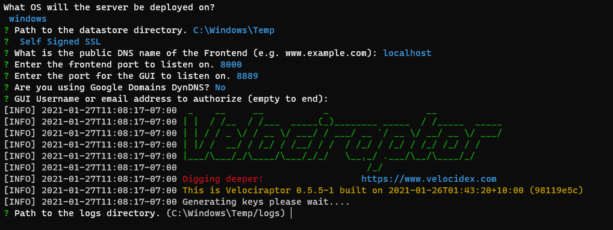

When it asks where to write the server and client configs, just hit enter to accept the defaults.

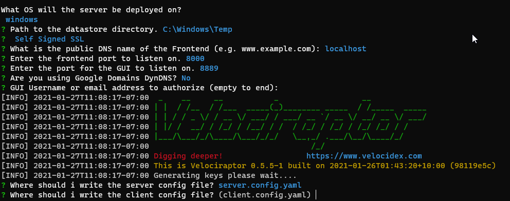

Now, let’s add a GUI user.

`velociraptor-v0.5.5-1-windows-amd64.exe --config server.config.yaml user add root --role administrator`

When it asks for the password, please choose a password you will remember.

When finished, it should look similar to this:

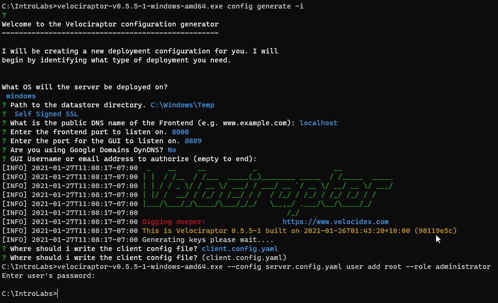

Now, lets run the msi to load the proper files to the proper directories:

`velociraptor-v0.5.5-1-windows-amd64.msi`

Now, let's start the server.

`velociraptor-v0.5.5-1-windows-amd64.exe --config server.config.yaml frontend -v`

There will be some red.  Don’t panic.

Next, let’s surf to the GUI and see if it worked!

`https://127.0.0.1:8889`

When you load the page, there will be an SSL error about the self-signed cert.  That is fine.

select Advanced then proceed to 127.0.0.1

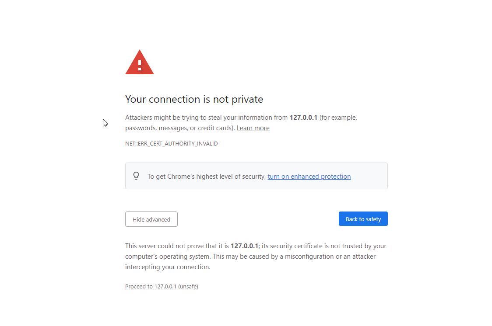

When it asks for the Username and Password, please enter root and the password you chose earlier.

Please select Inspect the server's state.

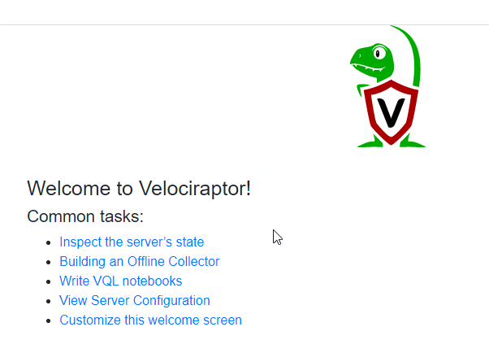

Next, we need to start the client. Lucky for us, it is the same executable.

We will need to open another Windows Command Prompt.

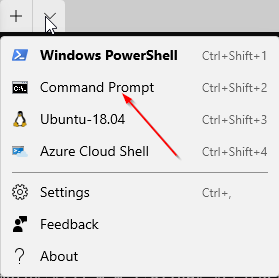

Then Navigate to the IntroLabs directory.

`cd \IntroLabs`

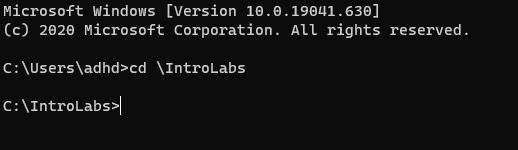

Next, we will need to start the client.  To do this will need to run the MSI first.

`velociraptor-v0.5.5-1-windows-amd64.msi`

When you get the pop up, select Run.  This will install the proper libraries and files.

Next, we will start the client.

`velociraptor-v0.5.5-1-windows-amd64.exe --config client.config.yaml client -v`

Now, let’s go back to the GUI and select the Home button.

You should see one connected client.

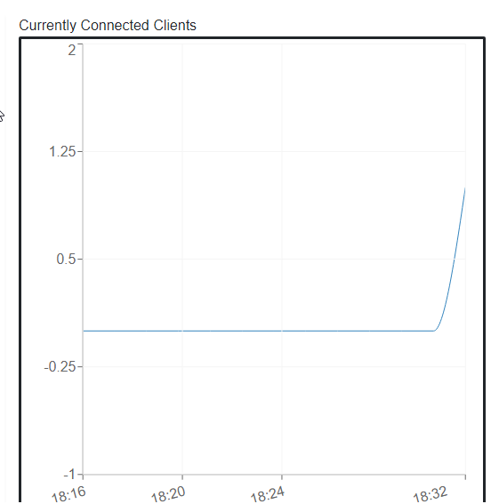

Now let’s look at what we can do with this.

First things first, this is not necessarily a detection platform.  It is designed to allow you to dig when you get an alert on malware signatures or from suspicious traffic. 

So please, keep in mind, it is not a replacement for AV!

So that said, let’s look around.

First, let’s "Show All" Clients.

As you can see below there will only be one client.

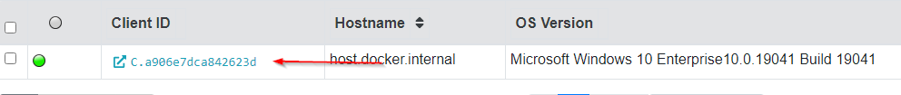

If you select that client, you can get additional information about that system.

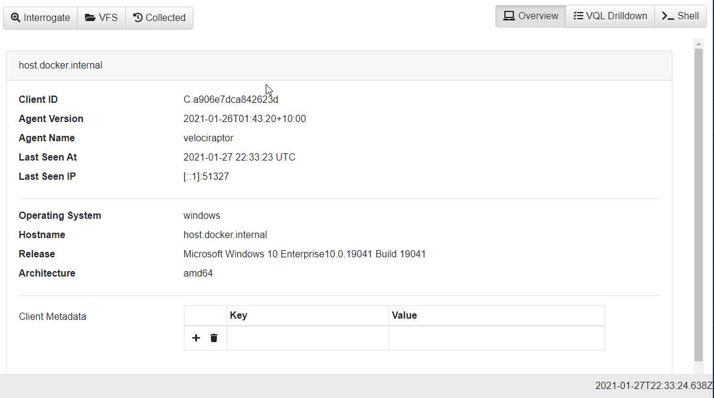

Next, let’s "Show All" Clients again.

Then select our only client.

Now, select Shell.

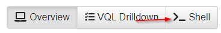

This allows us to run commands on the target system.  Think of the commands that we ran from the Windows CLI, we can run those here too.

Please select the PowerShell box and select Cmd.

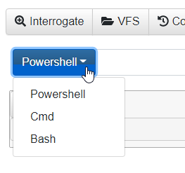

Now, enter netstat -naob in the Cmd box and select Launch.

This will not display the results right away. To see the results, select the Eye icon with your netstat command below:

Now, let’s do a Hunt.   Please select the Hunt icon.

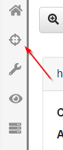

To start a Hunt, please select the + icon.

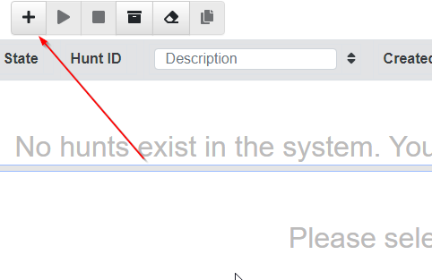

Please name your Hunt, then select "Select Artifacts" on the bottom.

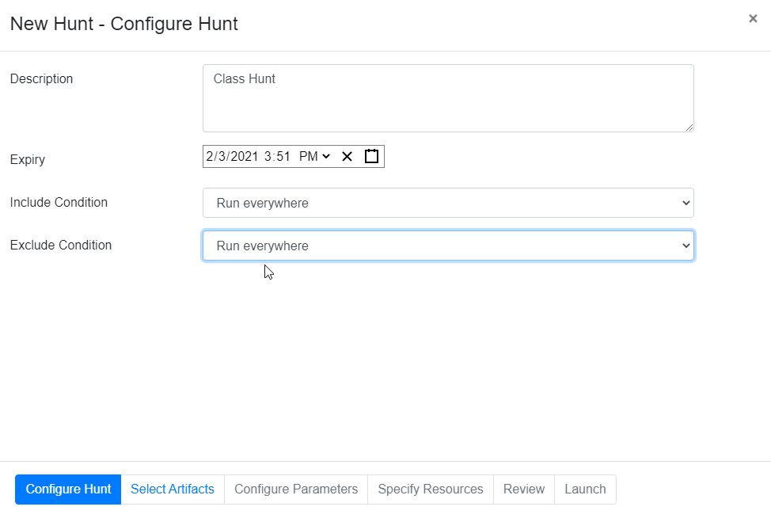

We are going to keep this simple for this lab. Please select Generic.System.Pstree.

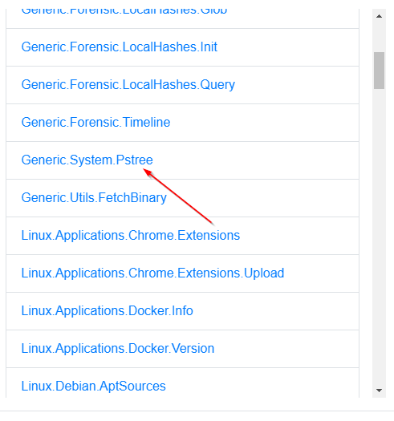

Then, Review on the bottom.

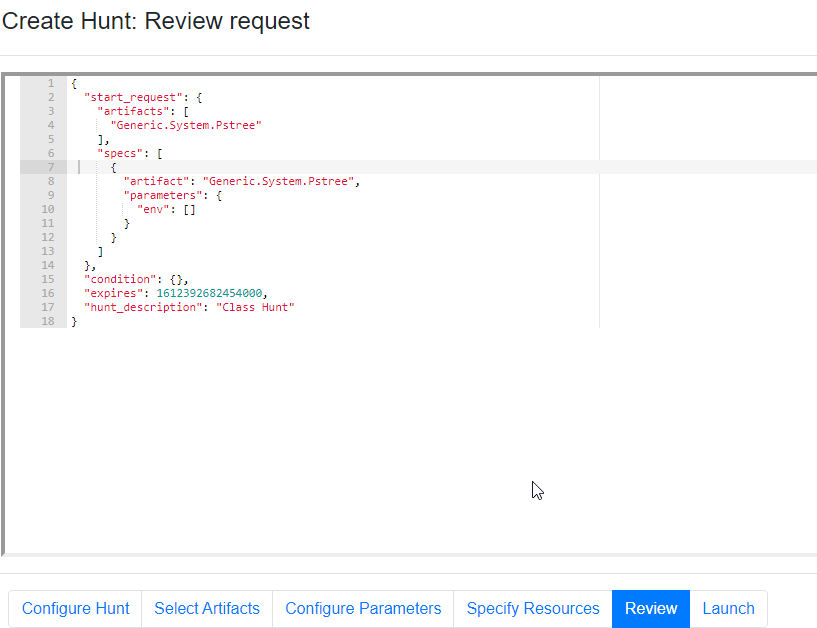

We now have an overview of what is going to be run on all systems...  Which is only one.

Now select Launch.

Once you select Launch, it will start the Hunt and load it in the que.

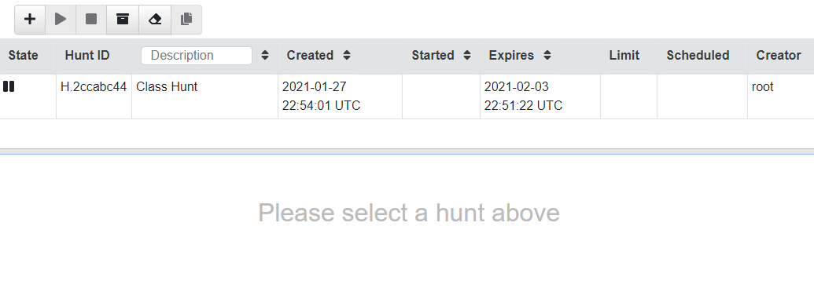

Please select our Hunt.  Now, we can run it.  Please press the Play button above.

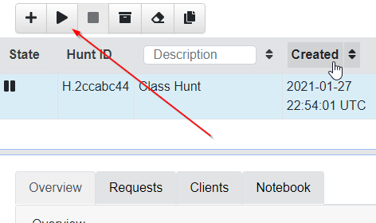

When you get the pop-up, select Run it!

This will take a few moments.

When done, you will see Total scheduled is 1 and Finished Clients is 1.

You can also download the results.

Please select Download Results.

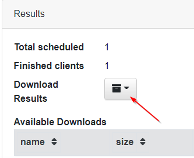

Then, CSV Only.

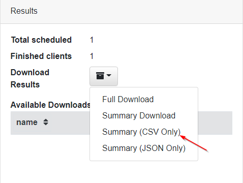

This will create a zip with the output.

Please download that by clicking on the zip file.

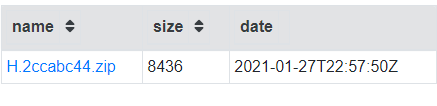

Go ahead and open the zip file.

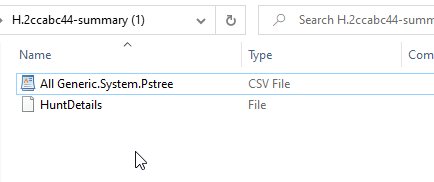

Then, open the csv file with WordPad:

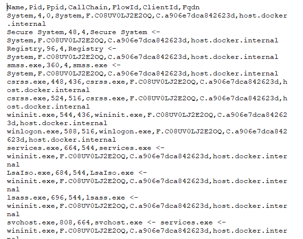

Granted, this is not optimal.  We did not load Excel on this system because of licensing restrictions.  However, you can copy this over to your host system and open it there. 

However, of you want to see a simple HTML report you can click on the turn back time icon on the left side (Right above the binoculars) and then clock Download Results > Prepare Collection Report, then click on the HTML report that appears below it.

We have not even begun to touch what we can do with this awesome tool.

Want to try something cool?  Run a Metrepreter agent on you Windows system.  Then, go through Velociraptor to create a Hunt to find it.  There are many Windows artifacts you can pull.  You do not need to just run one at a time.  You can run multiple.

`

