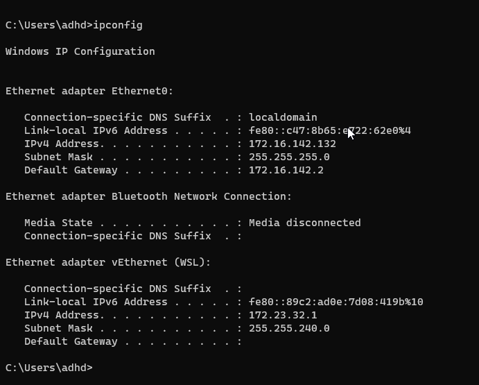
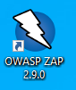
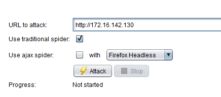
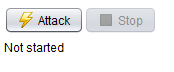
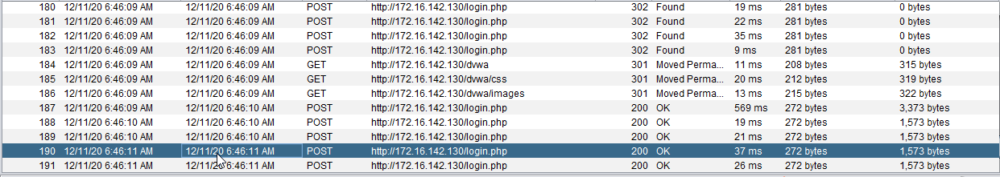
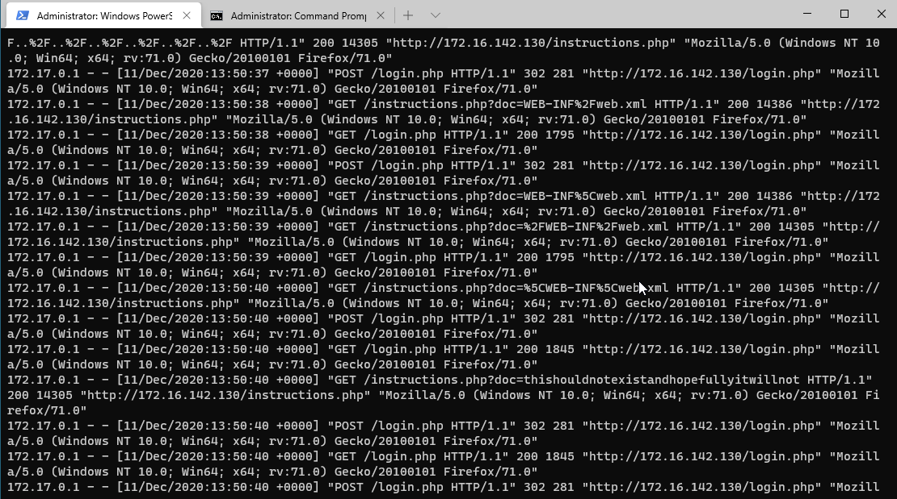
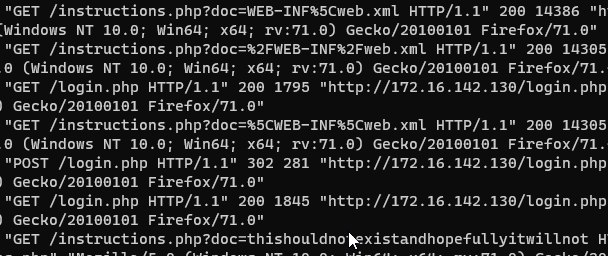

# Web Log Review

In this lab we will be standing up a vulnerable web server called DVWA.  It is designed from the ground up to teach people about a number of web application attacks.

While a full intro to web attacks is out of the scope of this class, it is great to show you how to use tools like ZAP to automatically look for some vulnerabilities, and to show you that automated tools do not always catch everything.

Let’s get started by opening a Terminal as Administrator

When you get the User Account Control Prompt, select Yes.

PS C:\Users\adhd> `docker run --rm -it -p 80:80 vulnerables/web-dvwa`

In another Command Prompt window run ipconfig and record your IP address.  Remember, your IP address may be different from mine.

C:\Users\adhd>`ipconfig`

Now, let's start ZAP.

Now, let's insert your IP address from the ipconfig command above and start the scan.

First, select the Automated Scan button: 

Then enter the URL of your Docker system.  It will be in http://<WINDOWSIP> syntax like below:

Then select the Attack button:

This will start the scan.  You should be able to see the scan activity in the lower part of ZAP.

Now, let's go back to the Powershell window and see the logs:

What are some things to look for?

First, notice the high number of requests from an IP address in a very, very short time.

Also, look for odd things like below:

But what would qualify as odd? Let's think this through. First, look at timing. Notice how fast the connections are comming in from a single IP. Also, notice how many of the same connections are going after the exact same thing again and again. Now, lets look for odd encodings. Looking for characters like %. Finally. spend some time getting to know what attacks look like at OWASP.

The key for any SOC analysts is to first learn what is normal log traffic from the apps we monitor. Then, slowly we start attacking and seeing what the different attack patterns look like. There is no simple signature-based detection approach that works for all applications. The security industry has been trying this for years with various levels of success. 

Start by baselining normal. 

Then attack. 

It is all about knowing our networks ad apps.

# Going further

https://owasp.org/

https://www.zaproxy.org/

https://cirt.net/Nikto2

