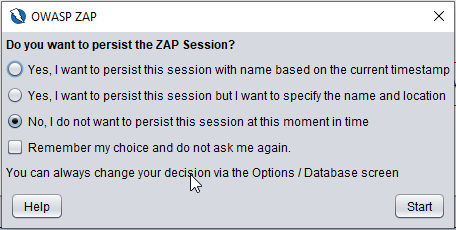
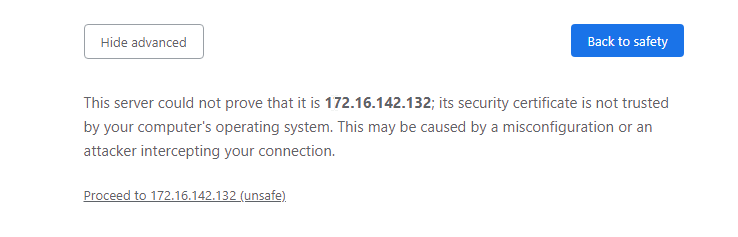
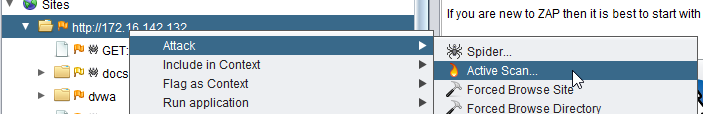
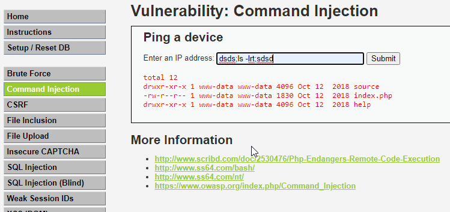

# Web Testing

In this lab we will be standing up a vulnerable web server called DVWA.  It is designed from the ground up to teach people about a number of web application attacks.

While a full intro to web attacks is out of the scope of this class, it is great to show you how to use tools like ZAP to automatically look for some vulnerabilities, and to show you that automated tools do not always catch everything.

Let’s get started by opening a Terminal as Administrator

When you get the User Account Control Prompt, select Yes.

PS C:\Users\adhd> `docker run --rm -it -p 80:80 vulnerables/web-dvwa`

In another Command Prompt window run ipconfig and record your IP address.  Remember, your IP address may be different from mine.

C:\Users\adhd>`ipconfig`

Now, let's start ZAP!

Now, let's start Chrome.

When your browser runs, it usually connects to the Internet directly.  In this lab, however, we need it to connect to a local proxy (ZAP) to intercept and attack the web traffic.  To do this, we need to configure Chrome to use ZAP as the proxy.

Now, lets configure the proxy:

Now, we will need to surf to your IP address.  You recorded it above with the ipconfig command. Simply put http://<YOUR_IP> into the browser.

You will get an error.  This is normal.  This is because the traffic is being intercepted by a proxy.  Normally, this would be very, very bad.   However, in this lab, we are proxying the traffic to test the app.  Go ahead and select Advanced:

Then, select Proceed.

The credentials are admin:password

Please log in.

For the first run, you will need to configure the database. 

Please select Create / Reset Database

Now, log back in

IF you go back to ZAP you will see that it is capturing the site data.  We could do this manually.  Simply clicking every page.  But, that would take a long time.  We can have ZAP do this for us automatically.  This is called crawling or spidering a website.

Now, from ZAP lets spider the app:

When the pop-up hits, select Start Scan

While scanning a site for links is cool.  We want to actively scan the site for vulnerabilities.   ZAP can do this as well.  This is called an active scan.

Now, let's start the active scan:

When prompted, select Start Scan

Scan Running:

When done, select Alerts

Did it find anything interesting?  Here is a problem with simply trusting automated tools. They tend to miss things.  Sure, it is great for finding the “easy” stuff.  But, they don't catch everything.  Not even close. 

What vulnerabilities did your scan find? Share them with others on Discord.  Did they find anything different?

If so, why do you think that is?

I wanted to take a few moments and show you some things the scanner may have missed.

Let’s see if it missed anything..

Here is just one example.

`%' or '0'='0' union select user, password from dvwa.users #`

