# Wireshark

Now that we have spent a little time working with tcpdump, let's take a look at Wireshark.

First, we need to make it clear, that Wireshark is not "better" than tcpdump.  They each have very strong pros and cons.  

Tcpdump is fast and very lightweight.  It is also scriptable.

But, it is CLI and to be honest, having some visualizations is very, very helpful when dealing with large datasets.

But, Wireshark tends to give up and freeze on very large files.  Sometimes, we carve data out with tcpdump and open it in Wireshark.  Basically, it is key to learn and know both.

Let's get started.

First, select the Windows icon and type in wireshark:

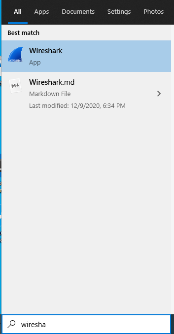

Now select the Wireshark icon:

Now, select File > Open

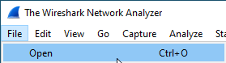

Then, select magnitude_1hr in the Open Capture File box.  You may need to scroll down, it is at the bottom:

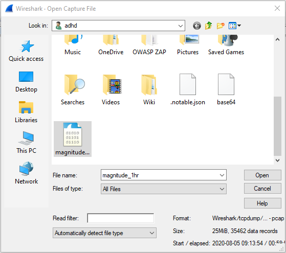

When Wireshark opens, you will see packets represented in three different windows:

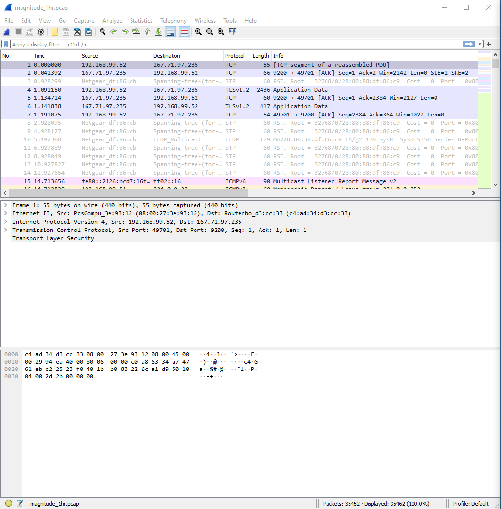

The top window shows each individual packet in order:

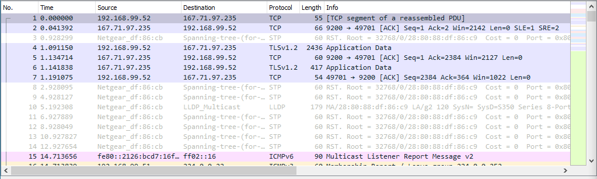

The second window shows a "decode" of any packet that is selected:

Any of the lines with a > can be expanded:

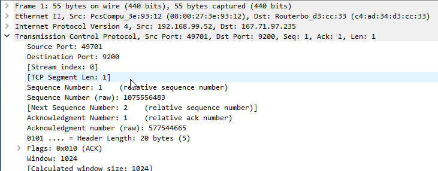

This means you do not have to memorize every possible packet and protocol value in hex...  Unless that is your thing.  If it is....  You must be Judy Novak, Mike Poor or Jonathan Ham. 

The last window is the hex for the packet:

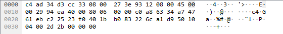

Click some hex in the bottom window:

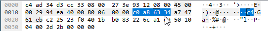

Notice that when you select any of the hex in the bottom window it opens and highlights the corresponding data in the second window.

This is very, very cool.  This means Wireshark can decode the hex on the fly and automatically highlight the relevant data instantly.

Ok, now, lets play with some statistics.

Please select Statistics > HTTP > Requests:

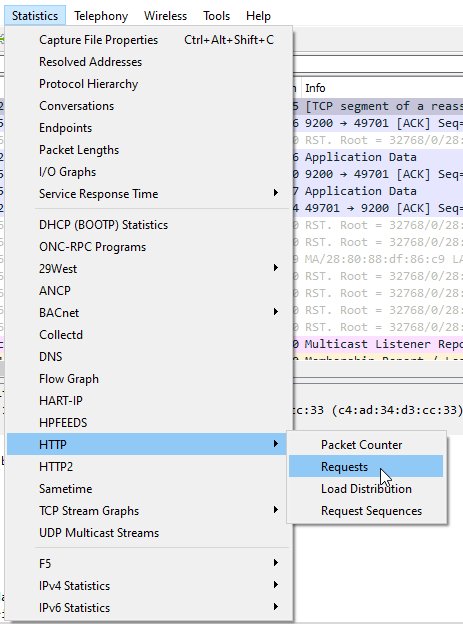

This will show us the various HTTP requests for the capture:

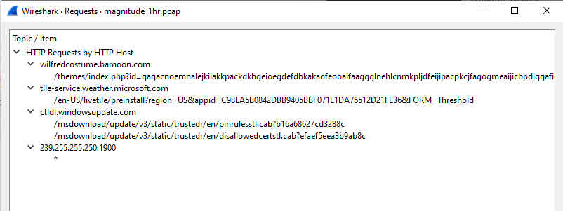

Now, let's look at Statistics > Conversations:

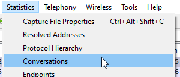

This will give us a breakdown of who was talking to whom:

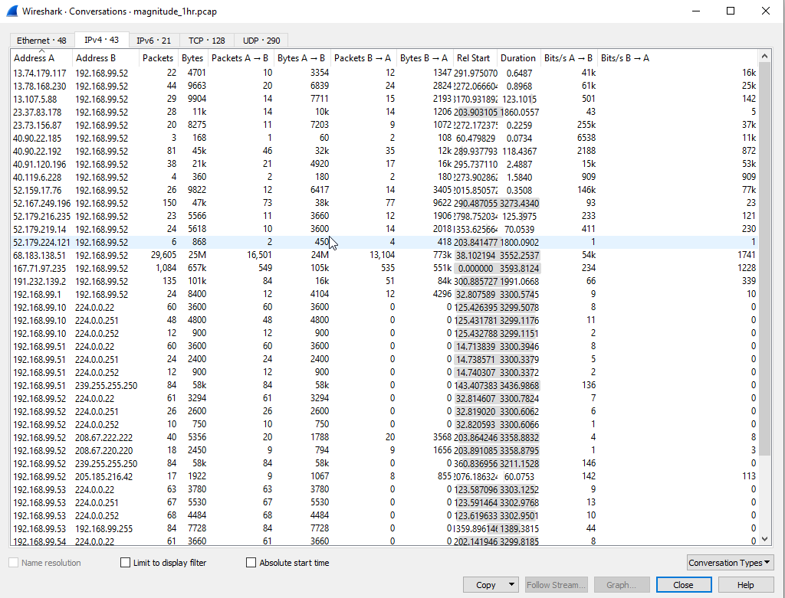

Please select IPv4:

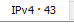

Then click on the top of the packets column twice:

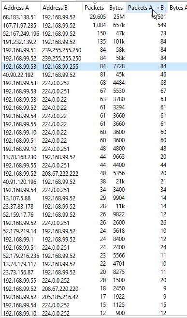

This gives us a breakdown of who was chatting with what system the most.  Click it again and it will sort the opposite direction and show you the least:

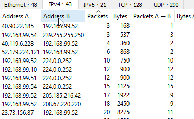

Really want to know what those systems were saying to each other?  Right click on a conversation and select Apply as Filter > Selected > A<->B

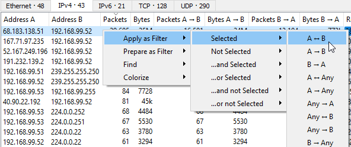

You should see the main Wireshark screen change

Then, close the Conversations window:

Notice the following in the filter bar

`ip.addr==68.183.138.51 && ip.addr==192.168.99.52`

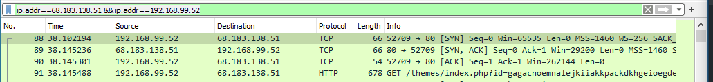

This is saying:

"IP address equals 68.183.138.51 And IP address equals 192.168.99.52"

If a packet meets both of those critiera it is displayed:

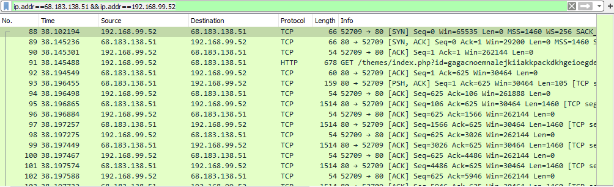

Now, right-click on any of the packets and select Follow > TCP Stream:

This is showing the request (in red) and the response (in blue) between our two systems:

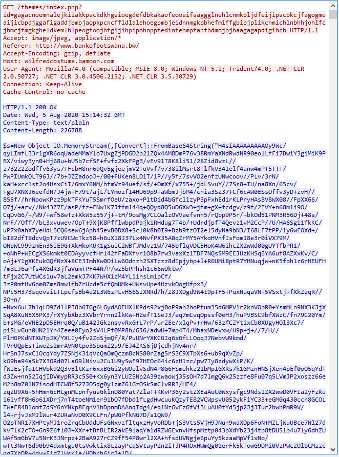

Anything look strange there?  If you look closely, there is a lot of encoded PowerShell.

Now, let's play with some basic filters in the filter bar.  We have already seen how Wireshark can filter on IP addresses.  But we can also filter on protocols.

To start, just type l.

Notice how Wireshark tries to help you with possible completion options as you type.

Now finish typing llmnr.

Then hit enter.

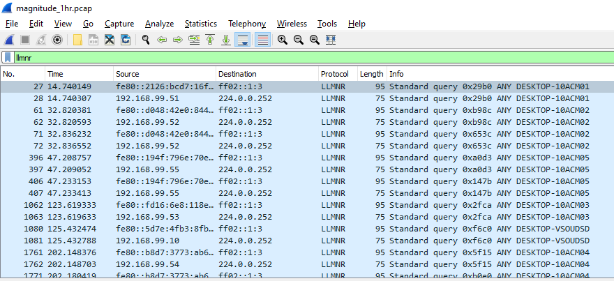

Notice that when you type llmnr and hit enter, Wireshark shows you all packets that are that protocol

Now try ipv6 and hit enter:

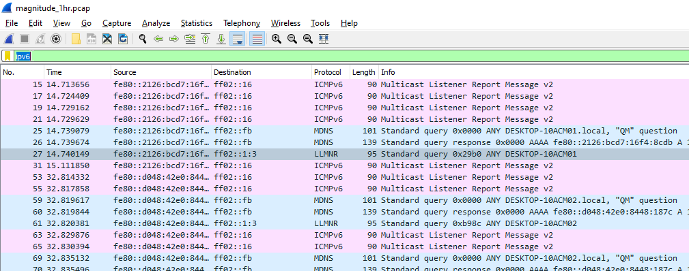

This allows you to very quickly drill in on any specific protocols you are reviewing in a packet capture.

Remember the PowerShell from tcpdump?  It had the string New-Object? Well, we can search though all the http traffic looking for that specific string:

Put the following into the filter bar:

http contains "New-Object"

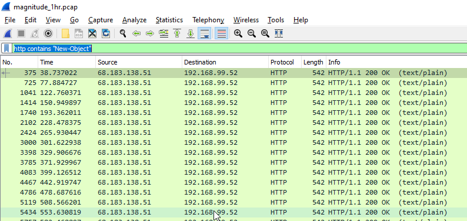

With Wireshark, we can search through all our packets looking for specific strings and data.

