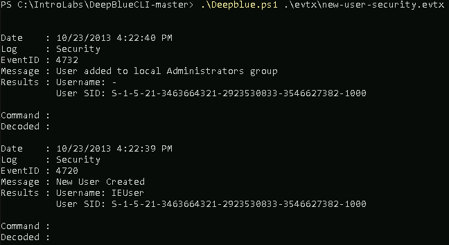
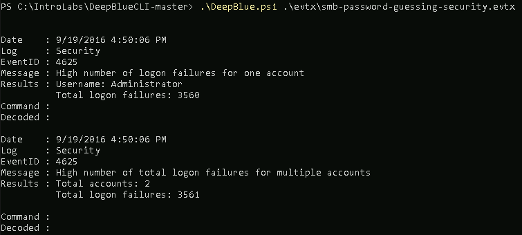

# DeepBlueCLI

DeepBlueCLI is a free tool by Eric Conrad that demonstrates some amazing detection capabilities.  It also has some checks that are effective for showing how UEBA style techniques can be in your environment. 

Let's get started by opening Windows Powershell.

####NOTE##### 

If you are having trouble with Windows Terminal, you can simply start each of the three shells, we use by starting them directly from the Windows Start button. 

 

Simply click the Windows Start button in the lower left of your screen and type: 

 

`Powershell` 

or 

`Ubuntu`

or 

`Command Prompt` 

 

For PowerShell and Command Prompt, please right click on them and select Run As Administrator 

###END NOTE###

Next, we need to navigate to the IntroLabs directory:

<pre>cd .\IntroLabs</pre>

Then, continue into the DeepBlueCLI-master directory:

<pre>cd .\DeepBlueCLI-master</pre>

Next, run the following command:

<pre>Set-ExecutionPolicy unrestricted</pre>

Most likely, you will be prompted to confirm the change.
Please enter Y for Yes.

It is very common for attackers to add additional users on to a system they have compromised.  This gives them a level of persistence that they otherwise would not gain with malware.  Why?  There are lots and lots of tools to detect malware.  By creating an extra user account it allows them to blend in.  

Now, let’s run a check in the .evtx files for adding a new user:

<pre>.\DeepBlue.ps1 .\evtx\new-user-security.evtx</pre>

You should see the following:

Another attack that very few SIEMs detect is password spraying.  This is where an attacker takes a user list from a domain, and sprays it with the same password, think Summer2020.  This is effective because it keeps the lockout threshold below the lockout policy and many times flies under the radar simply because accounts are not getting locked out. 

But, this is the exact behavior that UEBA should be able to detect.

Now, let's look at an event log with a password spray attack.  This is very much part of what a full UEBA solution does:

<pre>.\DeepBlue.ps1 .\evtx\smb-password-guessing-security.evtx</pre>

Same thing with detecting a password spraying attack:

<pre>.\DeepBlue.ps1 .\evtx\password-spray.evtx</pre>

Finally, for fun, let’s look at how DeepBlueCLI detects various encoding tactics that attackers use to obfuscate their attacks.  It is very common for attackers to use a number of encoding techniques to bypass signature detection.  However, it is not something that normally happens with standard scripts.

<pre>.\DeepBlue.ps1 .\evtx\Powershell-Invoke-Obfuscation-encoding-menu.evtx</pre>

