 

# Honey User 

  

In this lab we will be setting up a poor persons SIEM with an "alert" generated whenever the Honey Account Frank is accessed. 

  

Why Frank? 

  

Because. 

  

Let's get started. 

  

First, we will need to create the users and the Frank account. 

  

We will need to start a terminal as Administrator.  To do this, simply right click on the Windows Terminal Icon on your desktop and select Run as Administrator: 

  

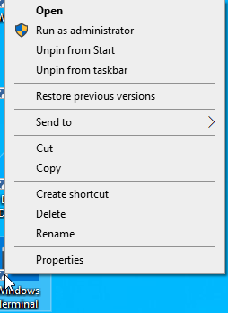 

  

Then, select Command Prompt from the Down Carrot options: 

  

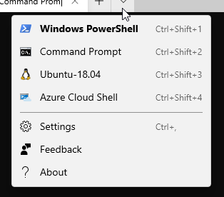 

  

Now, we will need to navigate to the C:\Tool directory and add the example users and Frank. 

  

`cd \tools` 

  

`200-user-gen.bat` 

  

It should look like this: 

  

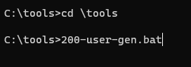 

  

Now, we need to create the Custom View in event viewer to capture anytime someone logs in as Frank. 

  

To do this click the Windows Start button then type Event Viewer. 

  

It should look like this: 

  

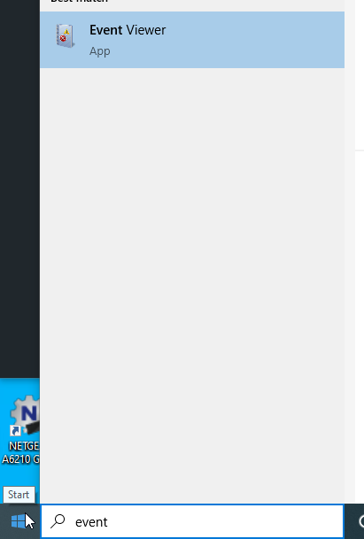 

  

When in the Event Viewer, select Windows Logs > Security then Create Custom View on the far-right hand side. 

  

It should look like this: 

  

 

When Create Custom View opens, please select XML: 

  

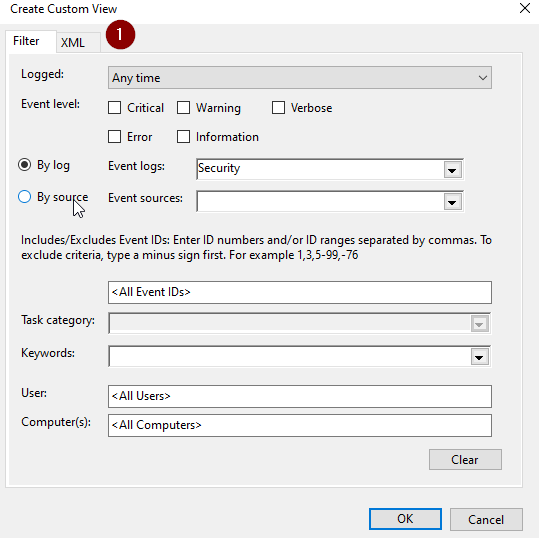 

  

Then, select Edit query Manually, Press Yes on the Alert Box and then replace the text in the query with the text below: 

~~~~~~ 
<QueryList>
  <Query Id="0" Path="Security">
    <Select Path="Security">* [EventData[Data[@Name='TargetUserName']='Frank']]</Select>
  </Query>
</QueryList>

~~~~~~

It should look like this: 

  

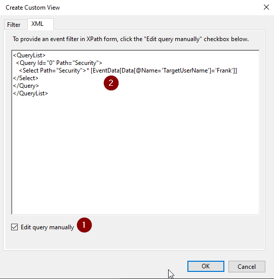 

  

Now, press OK. 

  

When the Save Filter to Custom View box opens, name the filter Frank then press OK. 

When we click on our new View we will see the Events associated with the Frank Account Being Created: 

  

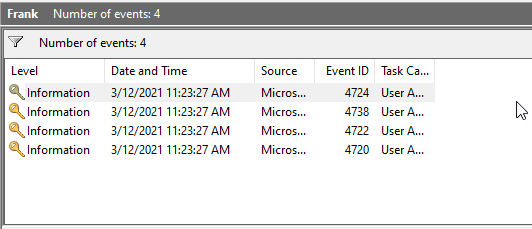 

  

Now, let's trip a few more. 

  

Back at your Windows Command Prompt 

  

  

  

C:\Tools> `powershell` 

  

PS C:\Tools> `Set-ExecutionPolicy Unrestricted` 

  

PS C:\Tools> `Import-Module .\LocalPasswordSpray.ps1` 

  

It should look like this: 

  

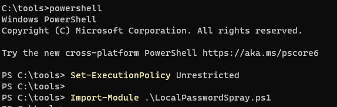 

  

Now, let’s try some password spraying against the local system! 

  

  

PS C:\Tools> `Invoke-LocalPasswordSpray -Password Winter2020` 

  

It should look like this: 

  

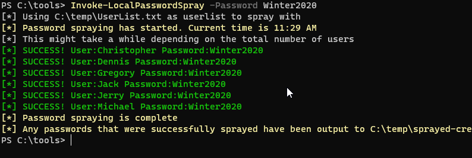 

  

Now we need to clean up and make sure the system is ready for the rest of the labs: 

  

PS C:\Tools> `exit` 

  

C:\Tools> `user-remove.bat` 

  

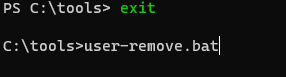 

  

Now, let's see if any alerts were generated. 

  

Go back to your Event Viewer and refresh (Action > Refresh). 

  

You should see the "Alerts"! 

  

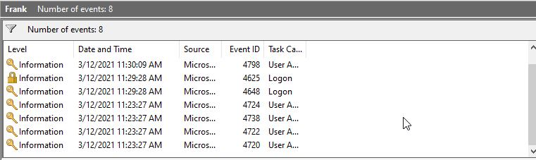 

  

Just for a bit of reference.  We did this locally as an example of setting this up on a full SIEM.  We did it in less than 20 min.  Your SIEM team working with your AD Ops team should be able to pull this off. 

  

 

 
