# LimaCharlie Lab

---

Part 1 of 2

---

In this lab we will be using **LimaCharlie** to investigate endpoint monitoring and threat detection.

What is Lima Charlie? Lima Charlie is a lightweight browser based tool, it helps keep an eye on systems, detect threats, and responds quickly to any suspicious activity.  This walktrhough will be using the chrome browser, however any browser can be used.

Lets open a browser window. 

Once the window is up, navigate to the following URL:

https://app.limacharlie.io/login

When the webpage loads, Click **"Create an account"**

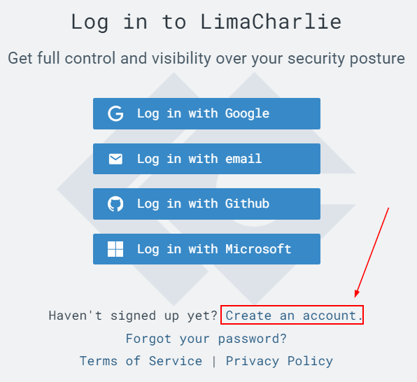

The screen will change slightly as it asks you which method you would like to use to sign-up with. 

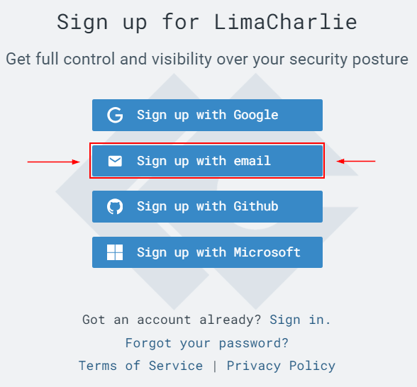

We selected "Sign up with email"

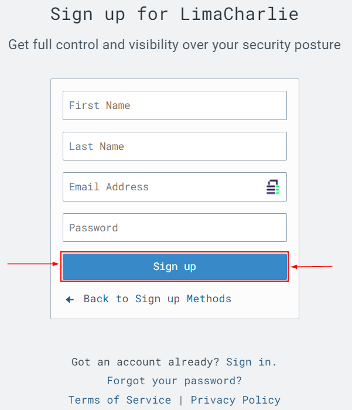

Fill out the fields click the "Sign Up" button to continue

Go to your email and you should receive a link to verify your account. Click the link and then go back to your browser and refresh the page.

Once you return to your page you should see Lima Charlie asking you some questions about your company, you can create any fake company you wish.

Enter the following answers into there respective fields ->

* What best describes your team/company? -> Security Operations Center
* What best describes your role? -> Security Engineer
* What use cases are you exploring? -> Endpoint detection & Response
* How did you hear about us? -> Black Hills Info Sec

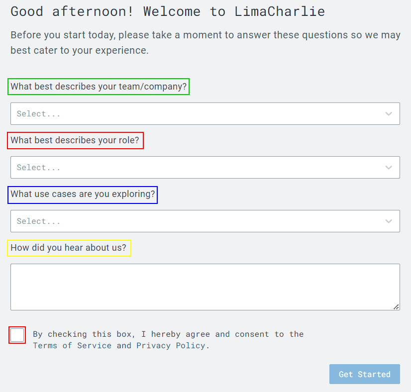

Check the box that says **"By checking this box, I hereby agree and consent to the Terms of Service and Privacy Policy."**

Click **"Get Started"**

Then click **"Create Organization"** 

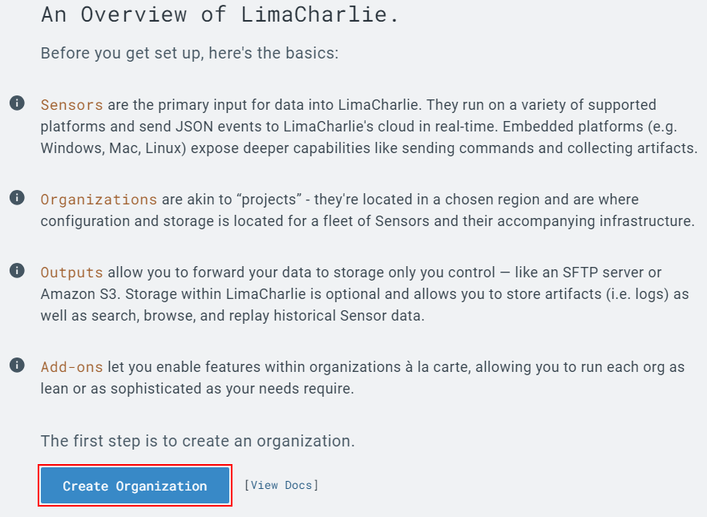

Enter the following information into the fields, you create your fictional organization.

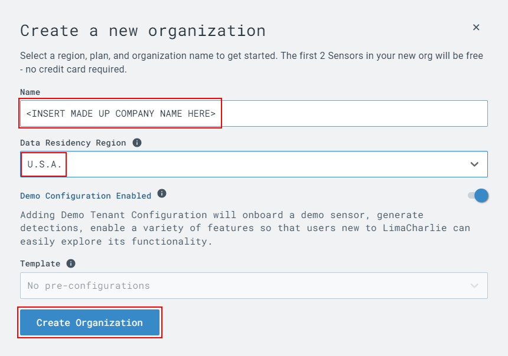

Click Create Organization.

There may be be a small delay while Lima Charlie creates the new company.

It is possible to use this tool to manage more than one company or organization at a time.

Once the page finishes loading you will see a menu like the one below. 

Please select your company. 

Once you have selected your ficticious company, you can look around and see all the options that this tool has too offer.

For this demonstration we will be creating a sensor for our windows machine and then setting off **"atomic red"** to test if our filter catches it.

On the left side under sensors, please select **"Installation Keys"**

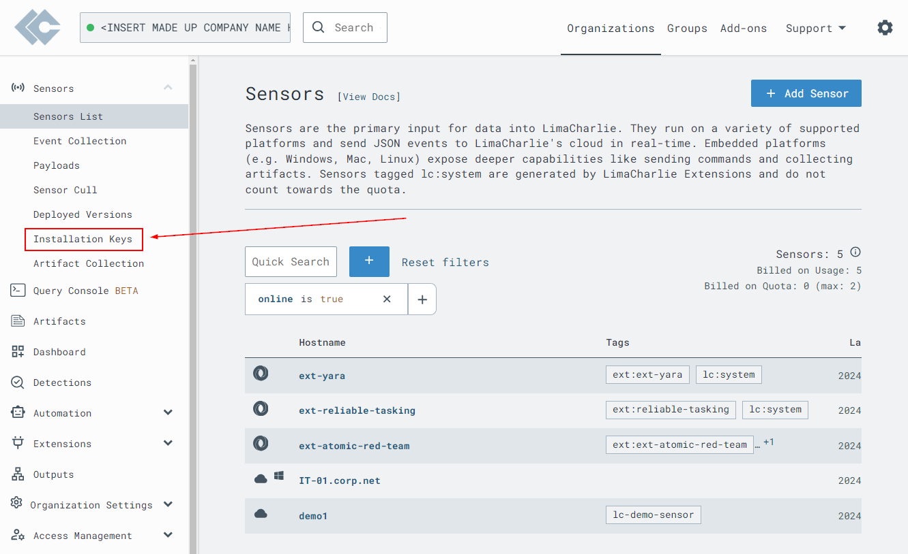

You should then see an option in the center **"Create Installation key"**, select it. 

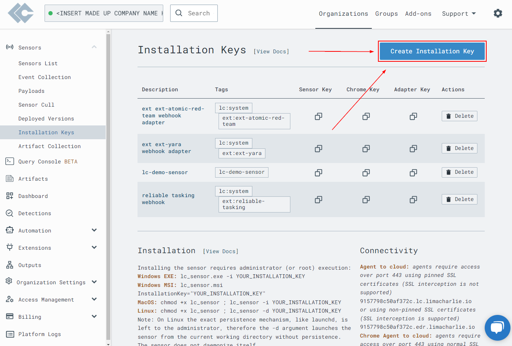

You will see a few empty fields.  You can add any description you like and any relevant tags.

Once you have done that select **"Create"**.

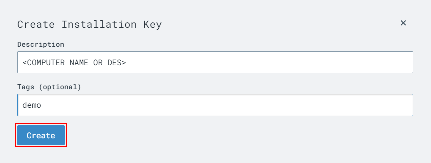

Once you have created your new installation key, you can navigate too **"Sensors List"**.  

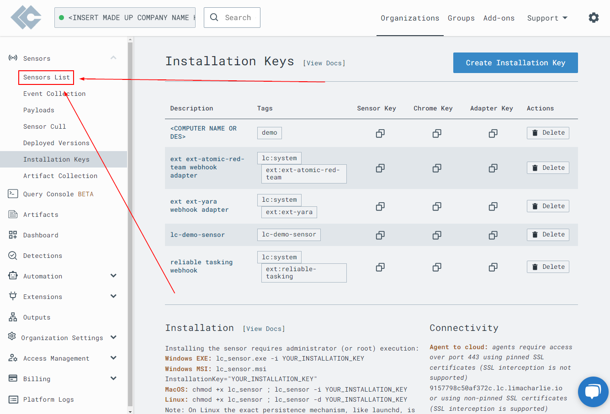

Click **"Add Sensor"**.

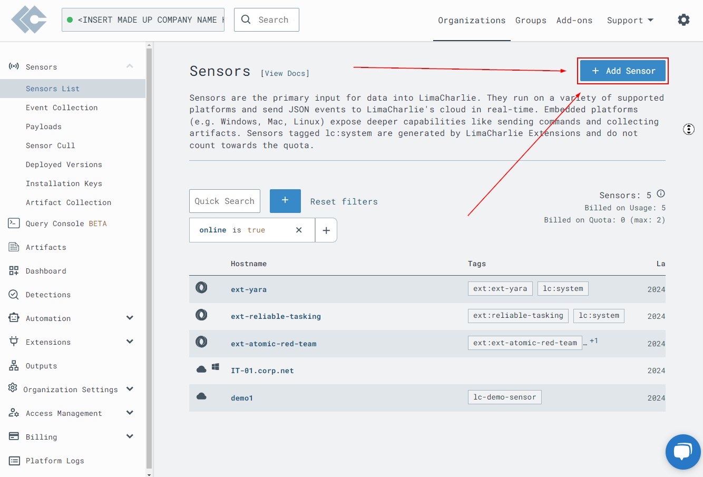

Scroll down and select the **"Windows"** sensor.

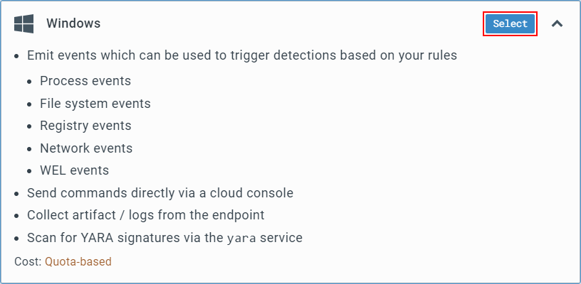

You will be greeted with an installation key menu. Select from the drop down menu the description you created earlier for your installation key. Click **"Select"**

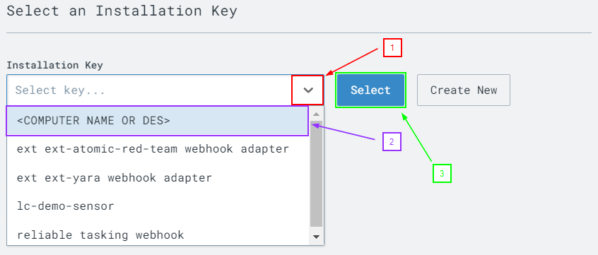

You will be prompted with the question of what architecture to download.  Every windows machine may be different but in our case, **"86-64 exe"** should be right.

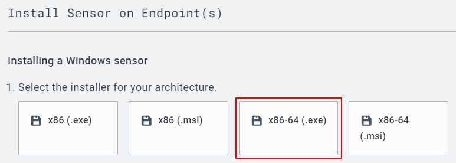

You will be greeted with a few more steps to creating your endpoint. 
Click **"Download the selected installer"**.
Once thats finished downloading **copy the string in step 4**.  

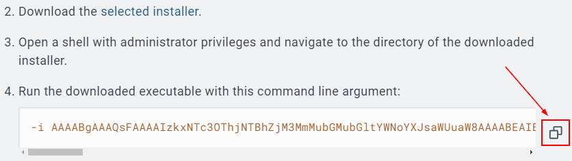

Go to your desktop, right click **"Windows Terminal"** and select **"run as administrator"**.

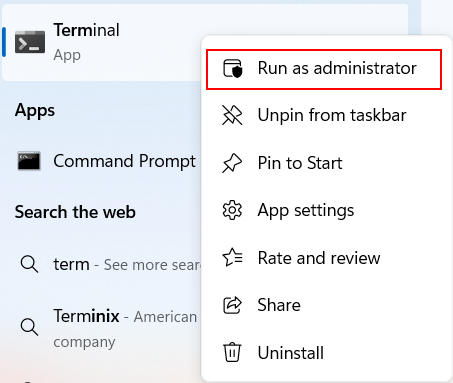

Run the following command to get into the downloads directory:

<pre>cd .\Downloads</pre>

We are going to enter the beginning of our next command.

Tab completion is your friend!

<pre>.\hcp_win_x64_release_4.29.2.exe</pre>

**[RIGHT CLICK OR CTL+V TO PASTE]**

After starting the command, we will paste the string we copied.   

Go ahead and hit enter to run it. 

If done correctly, your output should look like this:

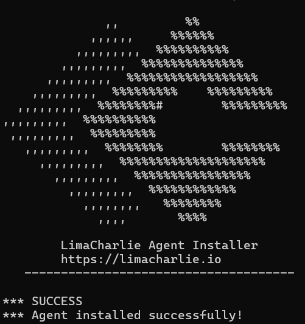

Return to the browser window. You should see this message:

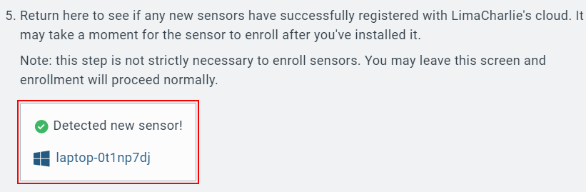

Please note that the name of your computer will be different!

<a href="https://github.com/strandjs/IntroLabs/blob/master/IntroClassFiles/Tools/IntroClass/LCmeetsAtomicRed/LCAR.md">Part 2</a>

***
[Back to Navigation Menu](/IntroClassFiles/navigation.md)
