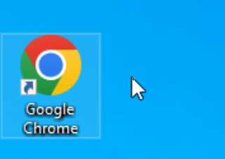
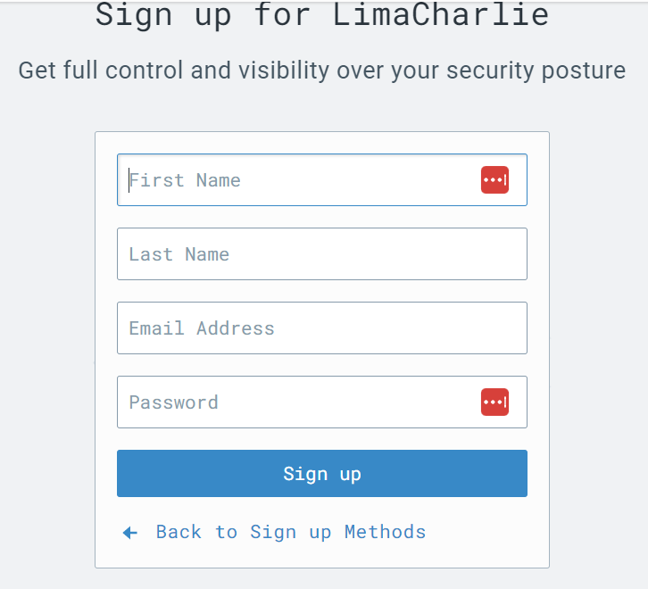
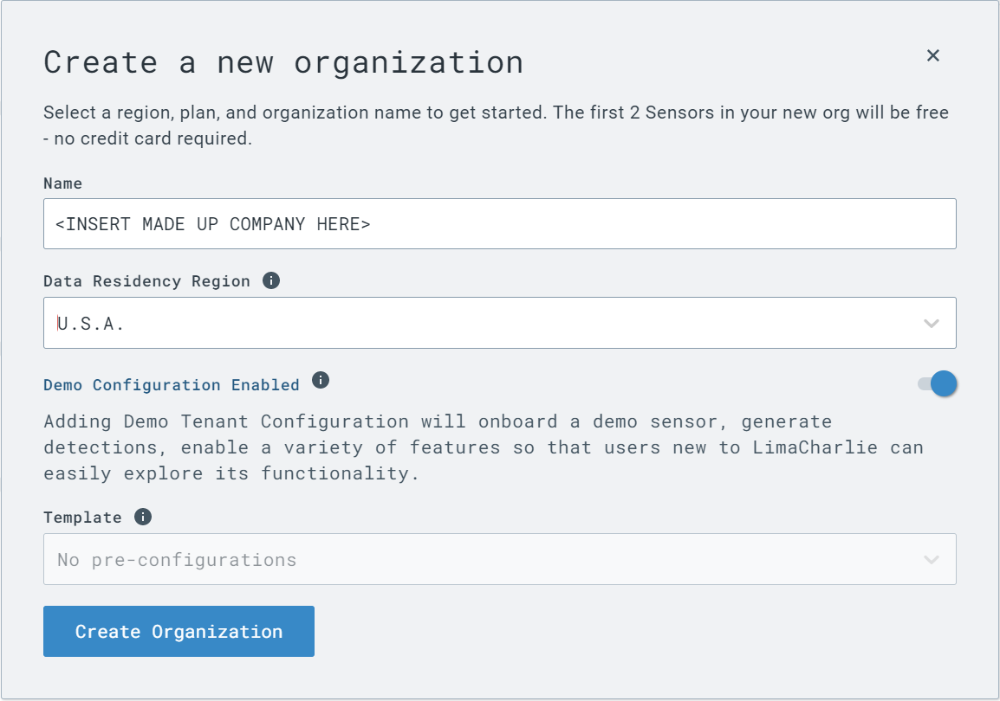

# LimaCharlie Lab

In this lab we will be looking into endpoint monitoring and threat detection. We will be using LimaCharlie to do this.

What is Lima Charlie? It is a lightweight browser based tool, that is great for big and small organizations, It helps keep an eye on systems, detect threats, and responds quickly to any suspicious activity.

To start, we will be working in the chrome browser. This is on your desktop and can be opened by double clicking.

When the browser opens, enter this URL into the search bar and hit enter.

`https://app.limacharlie.io/login`

Once the browser load, you will see a link at the bottom that says "Create an account"

Click that link

Once that loads you will see a field to setup an account

Once you fill out the fields click the "Sign Up" button to continue

Then go to your email and you should recieve a link to verify the account click the link and then go back to your browser and refresh the page.

Once you return to your page you should see Lima Charlie asking you some questions about your company, you can create any fake company you wish.

Enter the following answers into there respective fields ->

* What best describes your team/company? -> Security Operations Center
* What best describes your role? -> Security Engineer
* What use cases are you exploring? -> Endpoint detection & Response
* How did you hear about us? -> Black Hills Info Sec

Once those fields are filled, check the box that says "By checking this box, I hereby agree and consent to the Terms of Service and Privacy Policy."

Now click "Get Started"

Then click "Create Organization" 

Then you can enter the following information into there respective fields to create your fiction organization

Then Click Create Organization.

There may be be a small delay here while Lima Charlie creates the new company.

As you may notice it is possible to use this tool to manage more than one company or organization with this tool.

Once the page finishes loading you will see a menu appear and your fake company. Please select your ficticious company.

Once you have selected your ficticious company, you can look around and see all the options that this tool has too offer!

For this demonstration we will be creating a sensor for our windows machine and then setting off a suspicious file to test if our filter catches it.

On the left side under sensors, please select "Installation Keys"

You should then see an option in the center "Create Installation key", Select it

Then you will see a few empty fields, You can add any description you like and any relevant tags.

Once you have done that you can select "Create"

Once you have created your new installation key you can navigate too "Sensors List" and click "Add Sensor"

Then selected the "Windows" sensor

Once you select windows you will be greeted with an installation key menu, once here select from the drop down menu the description you created earlier for your installation key. And then click "Select"

You will then be prompted with what architecture to download, every windows machine may be different but in our case, "86-64 exe"should be right.

Once you do that you will be greeted with a few more steps to creating your endpoint. First Click "Download the selected installer", once thats finished downloading copy the string in step 4 to your clipboard.

Then you need to go to your desktop, right click "Windows Terminal" and select run as "administrator"

Type `cd Downloads` and hit enter

Then paste the string you downloaded in step 4 into your command prompt. Make sure once youve pasted your command into the command prompt you will need go back to the start of the command and replace "lc_sensor.exe" with the name of the newly downloaded file. It will be something to the effect of "hcp_win_x64_release_x.x.x.exe".

Once you have the command changed, then hit enter to run the command.

Once you run the command if you return to the browser you should see this message.

Please note that the name of your computer will be different!
