#### Elastic Agents

---

*This is part two of a three-part series.*
	[Part One](./elk_in_the_cloud.md "Elk in the Cloud")
	[Part Three](./sysmon_logs.md "Configuring Sysmon")

---

In part one, we started an ELK instance in the Elastic Cloud.

The Elastic Agent software enables users to easily send logs to our ELK instance, a process typically called "ingesting."

**1. Download the Elastic Agent.**

The download can be found here:
[Download Elastic Agent](https://www.elastic.co/downloads/elastic-agent "https://www.elastic.co/downloads/elastic-agent")

Elastic Agent is available for several operating systems. We will be using Windows 10 for this example.
For most Windows users, download the 64-bit Windows Zip.


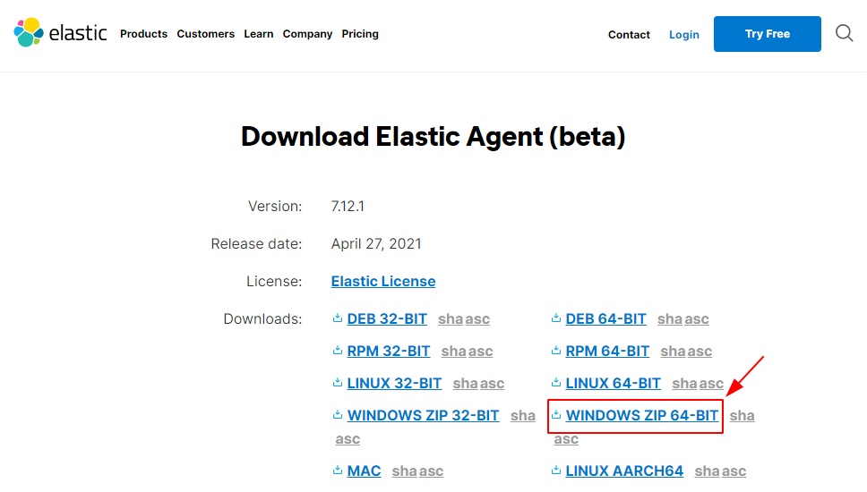


Each browser will be a little different, but most will offer a quick way to open the recent download.


---

**Microsoft Edge**
For some browsers, like this Microsoft Edge example, the download will show in the upper right corner.

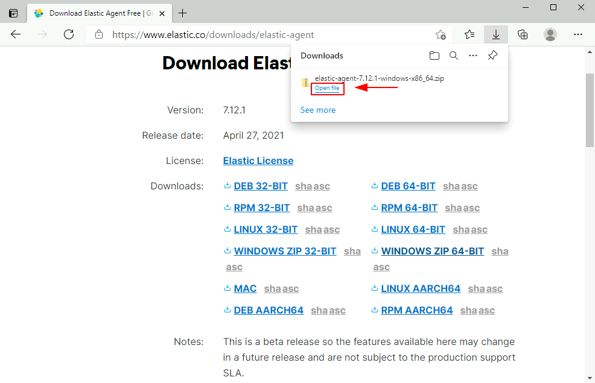

You can also find this in your Downloads folder.

---

**Google Chrome**
In other browsers, like this Google Chrome example, the download will show in the bottom left corner.

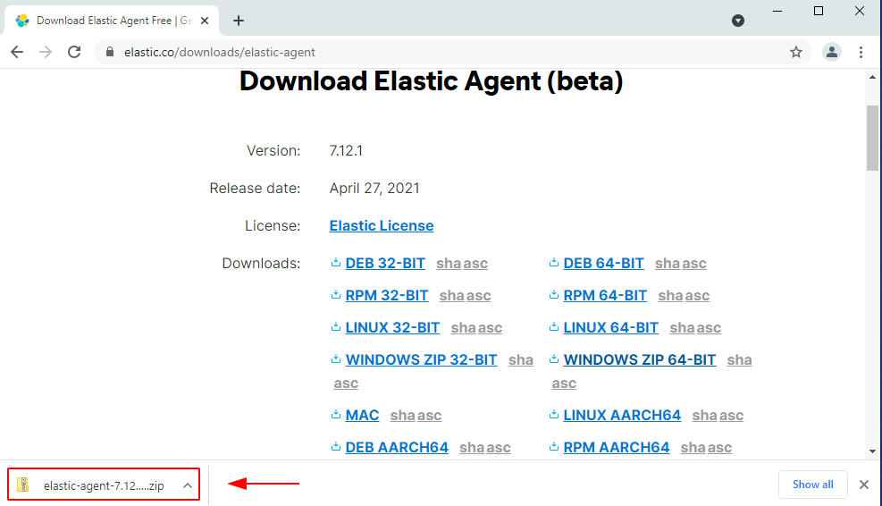

You can also find this in your Downloads folder.

---

**Mozilla Firefox**
Some browsers will open their own download window, similar to this Mozilla Firefox example.  Select to open with Windows Explorer, and click OK.

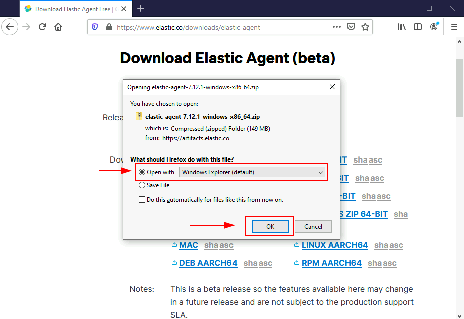

Firefox will open the download in a temp directory instead of Downloads.

To locate this file easier in the future, it is recommended to click on the file and drag it into the Downloads folder.

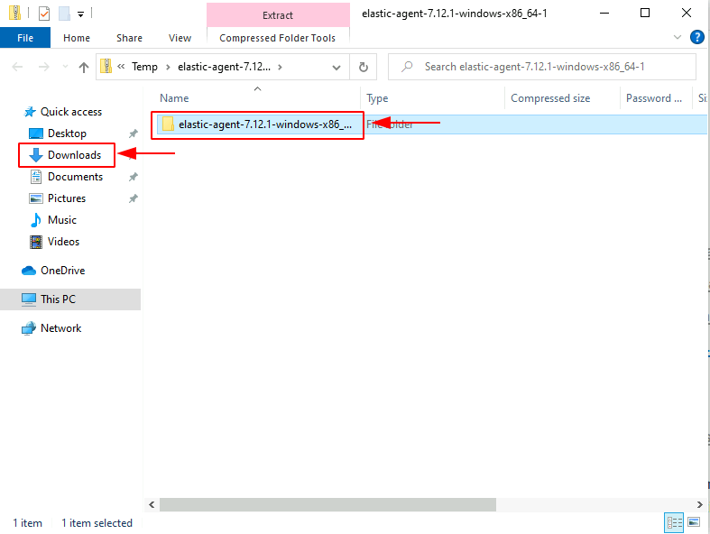

---


**2. Extract the Elastic Agent.**

Ensure that you have your elastic agent files selected.
It is okay if your files do not share the exact name as this example.  The Elastic Agent version might have been updated.


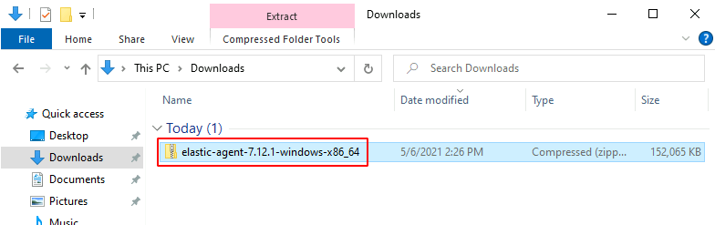


The selection will be highlighted blue.
While the .zip is selected, an "Extract" tab will appear in the top bar our window.


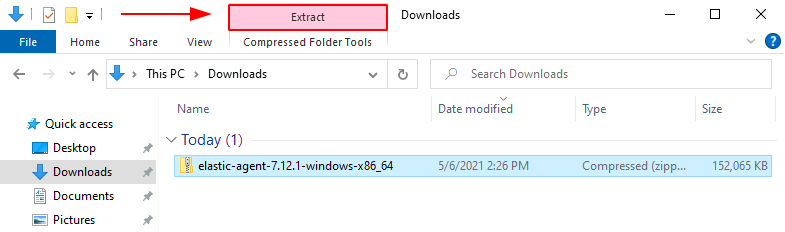

Select the "Extract" tab, and an option to "Extract All" will appear.
"Extract All" will open a new window titled "Extract Compressed (Zipped) Folders."
Select "Extract."


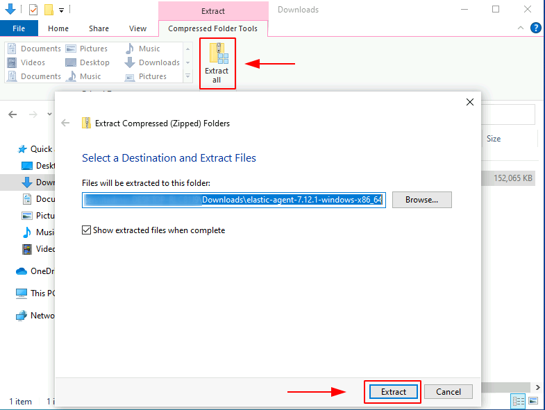

In your search bar, type "PowerShell."
The following options will be presented.  Click "Run as Administrator."


In your PowerShell window, enter the following command. You will need to substitute [USER] for the user you are using on your local system.

```powershell
cd C:\Users\[USER]\Downloads\
```

Follow this command with the following.

```powershell
ls
```

This command will show the files we have in our Downloads directory.  Yours will maybe have more files, but it should look something like this.


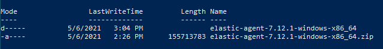


We will now use an auto-complete function to navigate into our Elastic Agent folder.  The following command should populate your command to match the folder we extracted. If yours does not auto-complete, double-check you are in the Downloads folder for your current user.

```
cd .\elastic[tab]
```

This is what it looks like when I use the auto-complete.  Ensure your auto-complete does not have the ".zip" on the end.


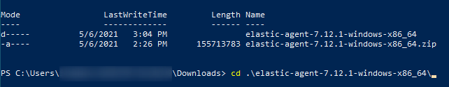

Check what is in your current folder.

```
ls
```

If the result looks similar to this, repeat the `cd ./elastic[tab]` command and `ls` once more.


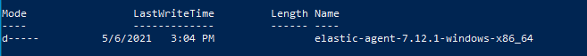


If your result looks similar to this, you are in the correct folder.


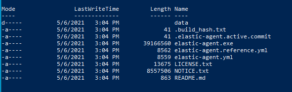

Find the command we saved from our Agents menu.  I previously saved mine in an "agent.txt" file.

The command will take this format:

```powershell
./elastic-agent.exe install -f --kibana-url=[URL here] --enrollment-token=[Token here]
```

After you copy the command, right-click in your PowerShell window and it will paste in the command. *Note: Don't forget the "." at the very beginning of the command.* Press Enter.

The process is started and is occurring in the background.  You don't need to do anything. Watch for the following notification.


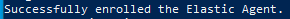


If you have got this notification, navigate to your agents menu. You will now see your newly enrolled Elastic Agent.


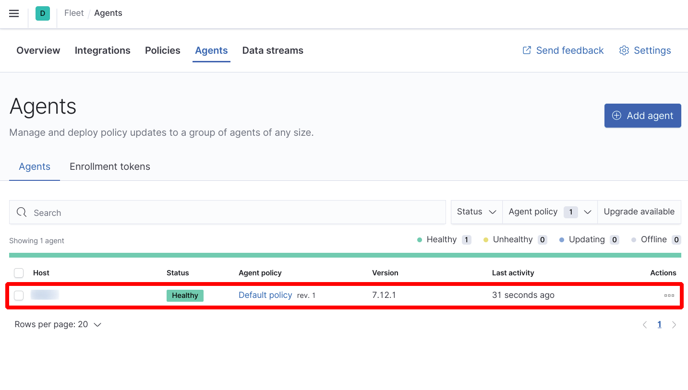


Our Elastic Agent is installed and configured to be connected to our ELK instance in the cloud.  Part three will cover how to configure Sysmon to submit logs to this Elastic Agent, which will ingest the logs to appear in Kibana.

[Part Three](./sysmon_logs.md "Configuring Sysmon")