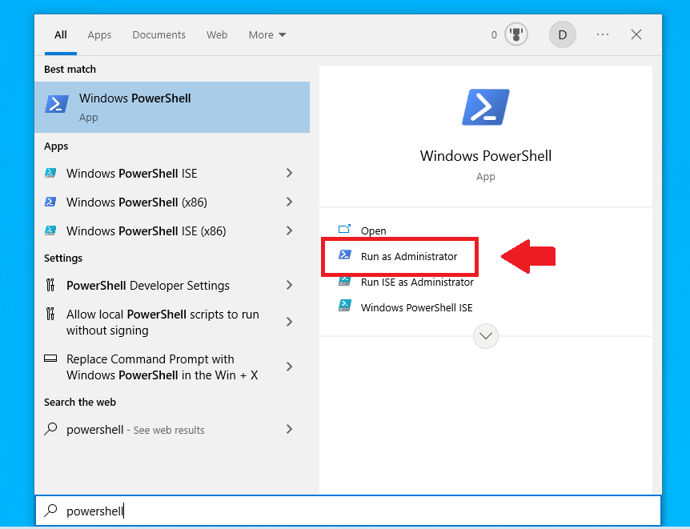
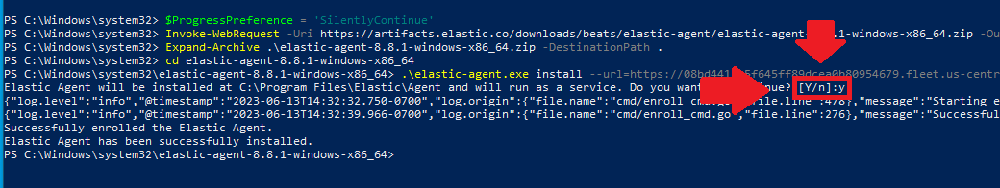
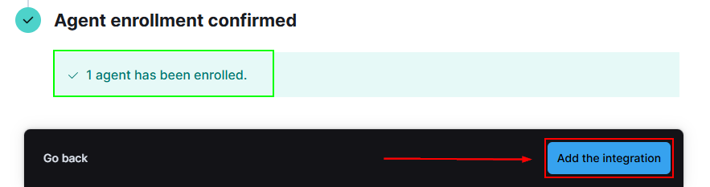
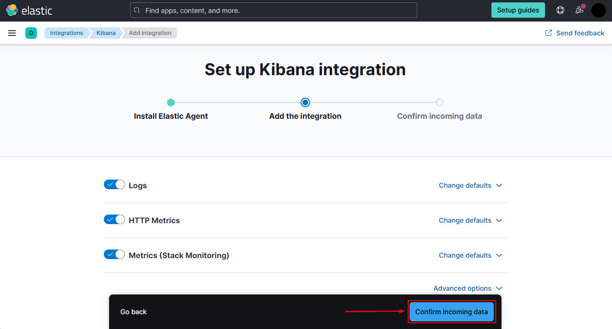
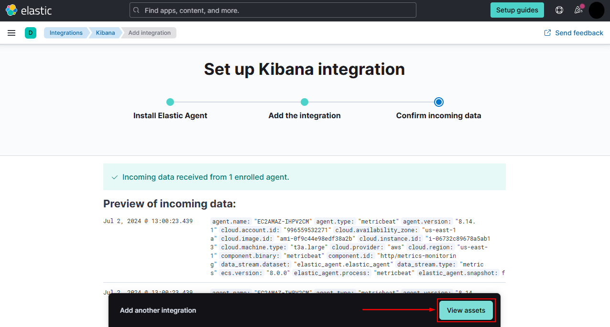
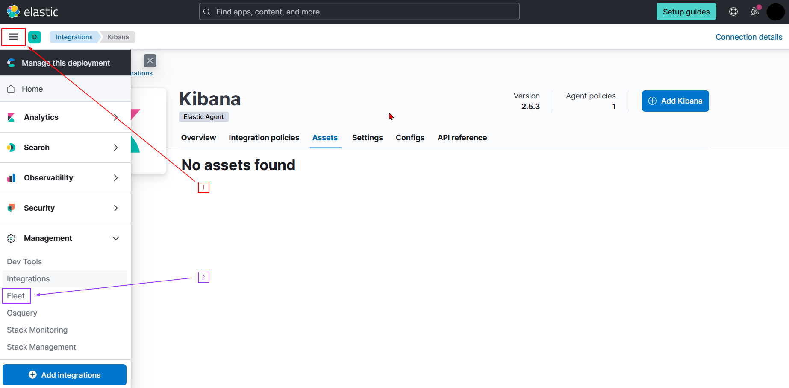
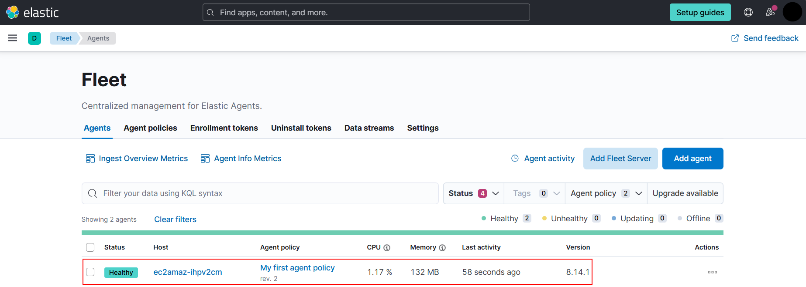

#### Elastic Agents

---

*This is part two of a three-part series.*
	[Part One](./elk_in_the_cloud.md "Elk in the Cloud")
	[Part Three](./sysmon_logs.md "Configuring Sysmon")

---

In part one, we started an ELK instance in the Elastic Cloud.

The Elastic Agent software enables users to easily send logs to our ELK instance, a process typically called "ingesting."

---

**1. Download the Elastic Agent.**

Press the windows button and type powershell, make sure to click "Run as Admin"

Once the powershell instance opens, copy what you kept in the file in my case it was "Agent.txt" and paste it into the powershell and hit enter.

Make sure you type `y` and hit enter when prompted by powershell.

---

Switch back over to your browser and you should see "1 Agent has been enrolled".

Then Click "Add to Integration".

---

On the next page leave everything default and click "Confirm Incoming Data".

The browser will take a few seconds to confirm the machine is connected, once thats finished click "View Assets"

---

**2. Check The Fleet.**

Once thats done we should be connected and ready for part 3, But first lets make sure the device has successfully connected.

click the hamburger at the top left of the window and scroll down almost all the way to the bottom. You should see the option "Fleet", select fleet.

Our Elastic Agent is installed and configured to be connected to our ELK instance in the cloud.  Part three will cover how to configure Sysmon to submit logs to this Elastic Agent, which will ingest the logs to appear in Kibana.

[Part Three](./sysmon_logs.md "Configuring Sysmon")
