#### ELK in the Cloud
---

*This is part one of a three-part series.*
	[Part Two](./elastic_agent.md "Elastic Agents")
	[Part Three](./sysmon_logs.md "Configuring Sysmon")

---

ELK combines three technologies and provides a powerful solution when working with large data sets.  In addition, we are able to setup SIEM rules to alert us as defenders to attacks on our organization.

* E - Elasticsearch
* L - Logstash
* K - Kibana

ELK enables defenders to detect attacks and conduct threat hunting.

To learn ELK, we don't need several servers or to spend large sums of money.  We can get into the driver's seat and experiment with ELK by using the Elastic Cloud 14-day trial.  The trial does not require a credit card to get started. You only need an email and a password.

**1. Set up an account.**

[Start your free Elastic Cloud Trial](https://cloud.elastic.co/registration?downloads=true&baymax=rtp&storm=nav-btn "https://cloud.elastic.co/registration?downloads=true&baymax=rtp&storm=nav-btn")

This link is for the trial sign up page. Start a trial by signing up.

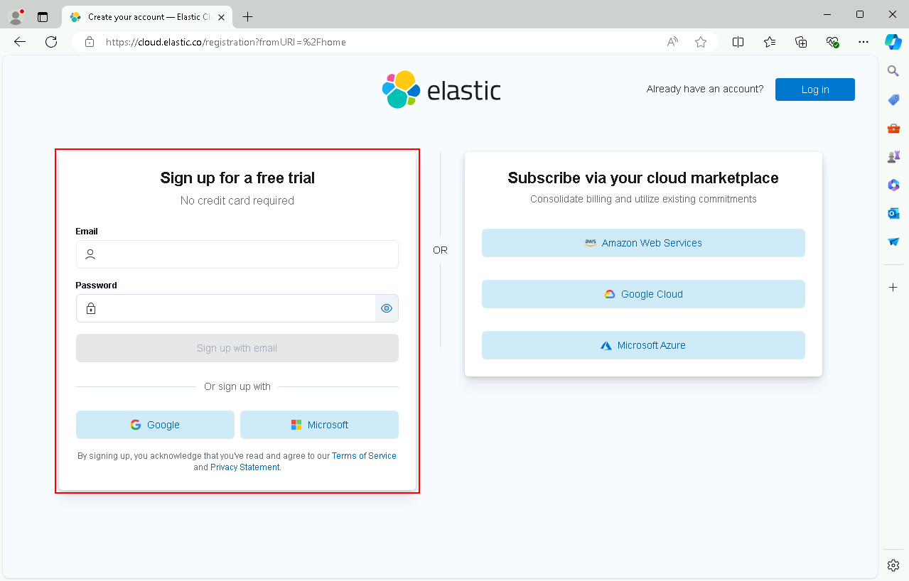

Watch your email for a confirmation. The email will look something similar to this.

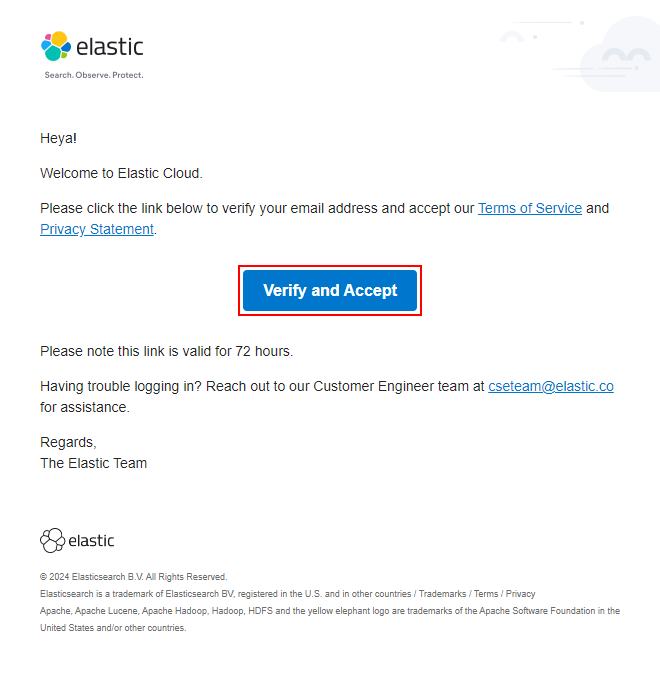

Click "Verify and Accept."  You should be redirected to the cloud login page.  If you're not redirected, you can find it here.

[Elastic Cloud Log In](https://cloud.elastic.co/login "https://cloud.elastic.co/login")

After logging in, the page will look like this.

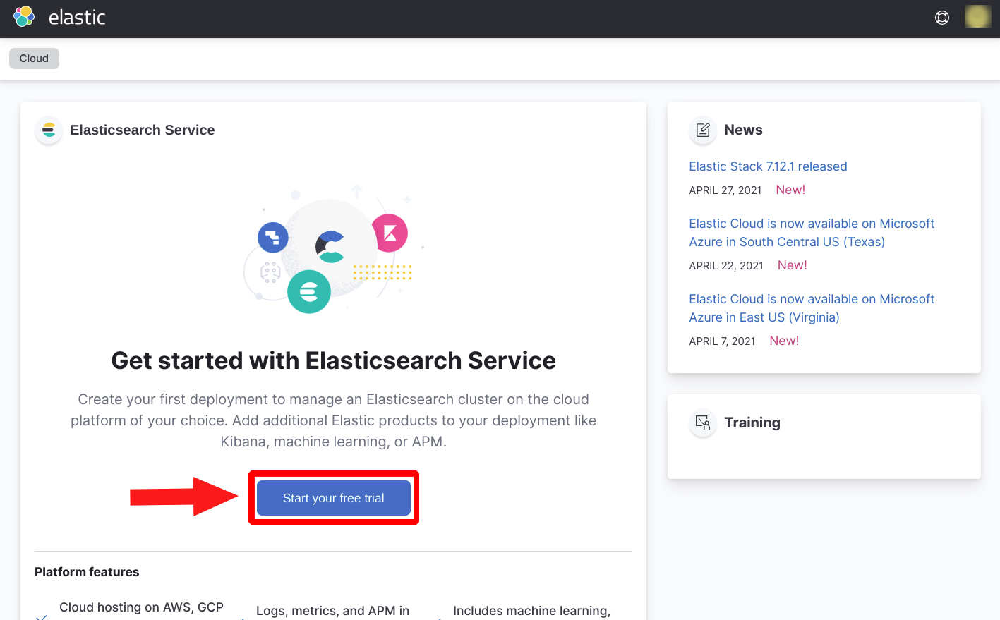

**2. Start an ELK instance.**

Start by clicking "Start your free trial."

For our purposes, we want to start an Elastic Security instance.

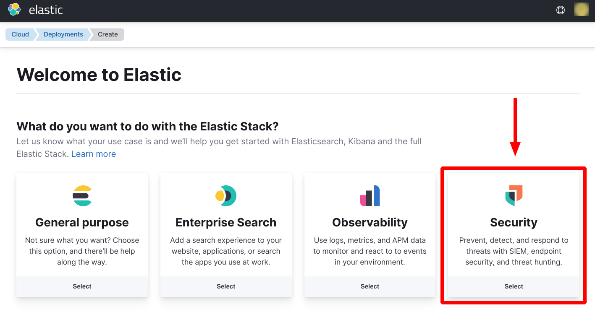

After selecting Security, scroll down. There are options to select custom settings and to name the deployment.  For this example, I will use the defaults. Click "Create deployment."

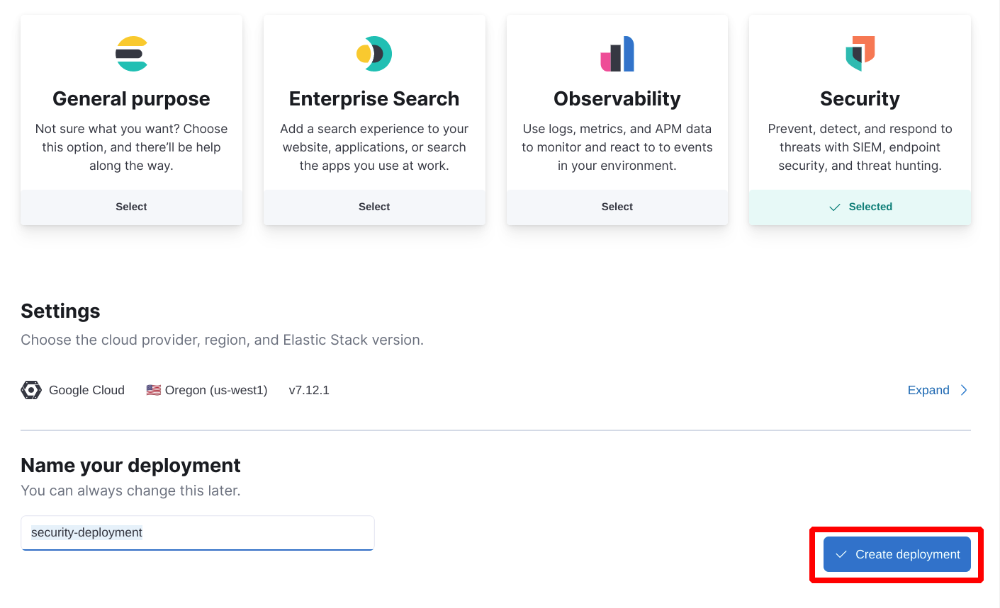

Elastic will present the credentials for this ELK stack.  There is the option to download a CSV of the credentials. However you decide to hold onto these credentials, don't lose them.

Now we have a complete and working instance of an ELK stack in which we can learn and experiment.

**3. Set up Fleet**

Kibana has a convenient feature called "Fleet." This feature enables users to easily add data to the ELK stack.

At the time of setting up the ELK instance, the "Open Kibana" option can be found here.

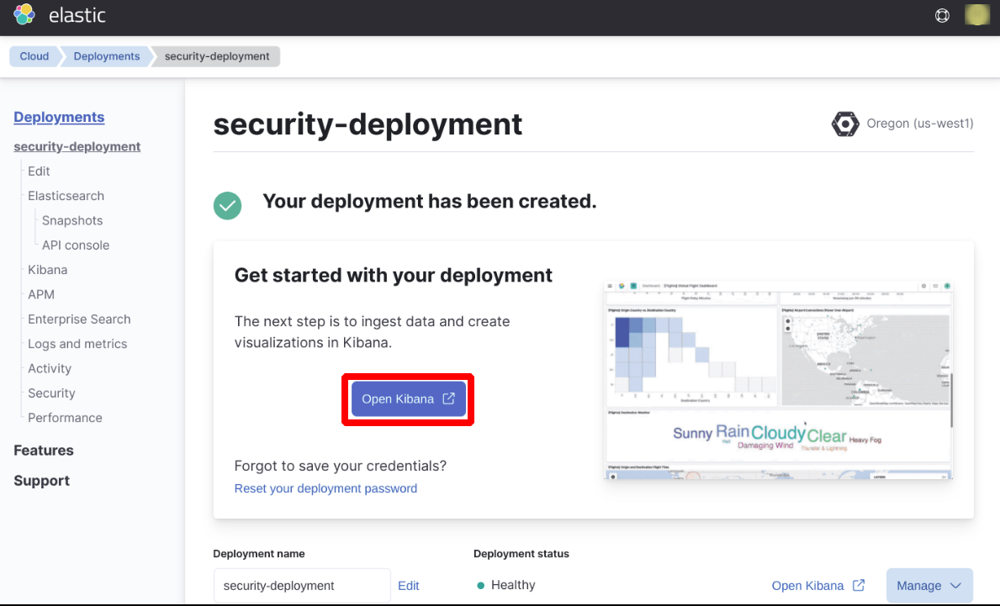

For future logins, access Kibana by using either of these links.

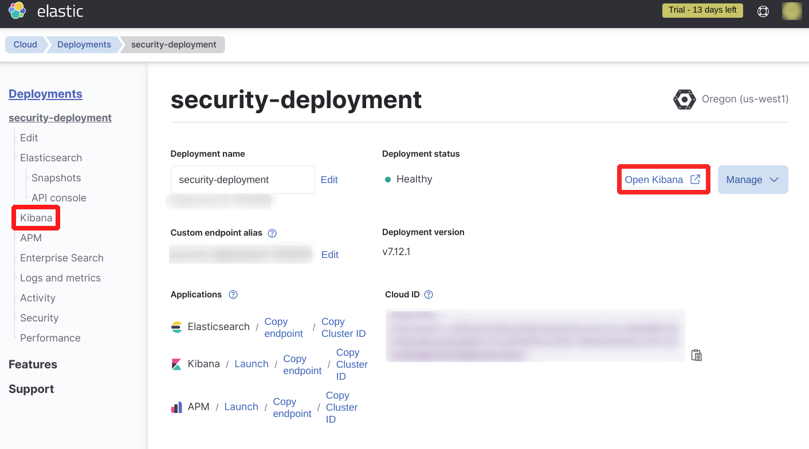

In the Kibana landing page, find the navigation menu.

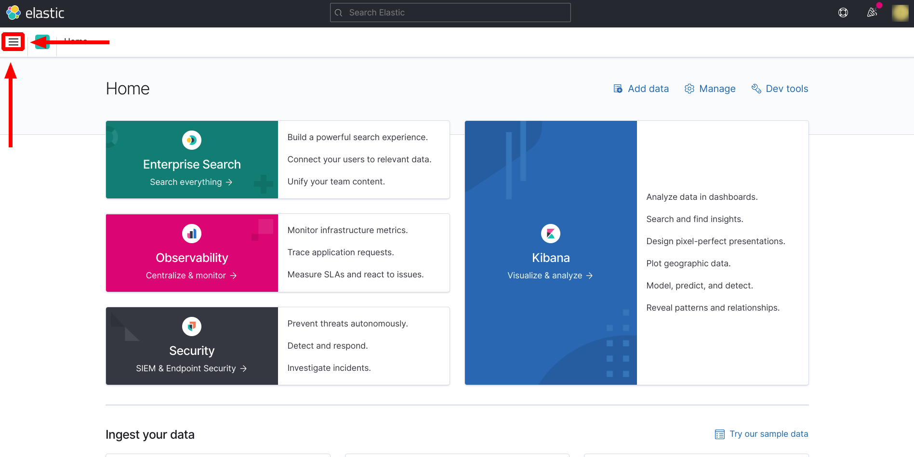

Scroll to the bottom of the navigation menu and find "Fleet."

In the Fleet menu, find the "Agents" tab.

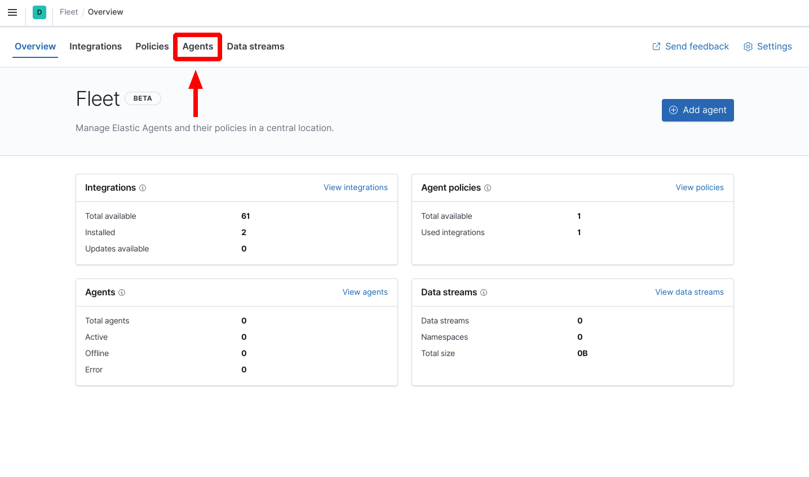

To activate Fleet, a central user needs to be enabled. Click "Create user and enable central management."

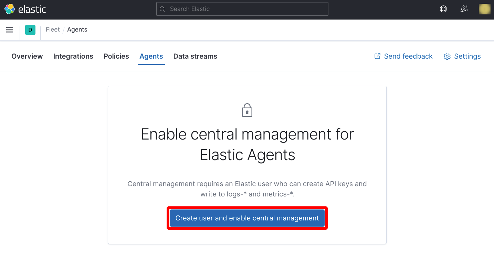

Once a central user is enabled, the agents menu will look like this.

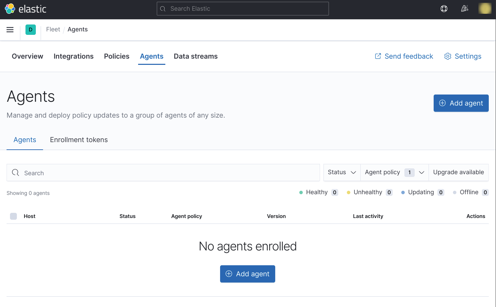

Select "Add agent."

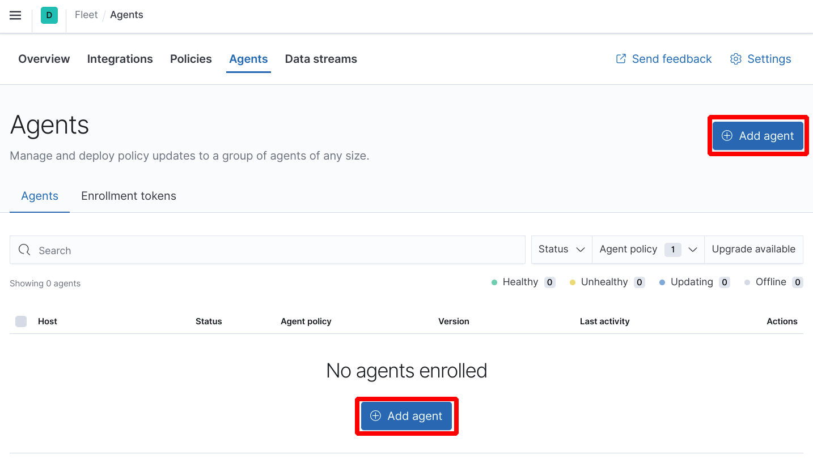

A panel window will open.

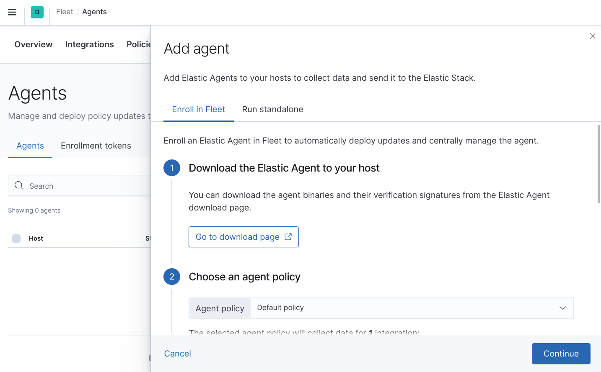

Scroll to the bottom of the panel. At the bottom of the panel, there is a command that can be copied to the clipboard by clicking the button presented.

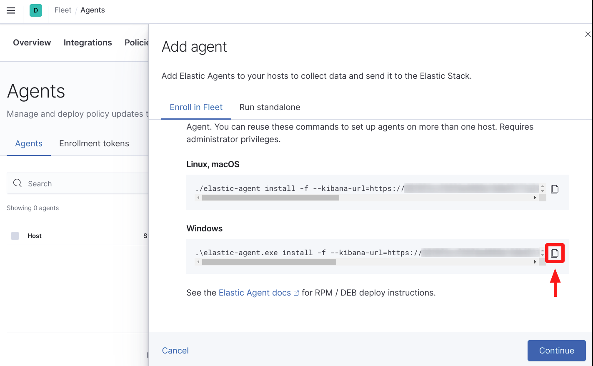

Hold onto this command.  It is recommended to paste this command into some file where you won't lose it. In this example, I saved it to a file I called "agent.txt."  We will use this command later.

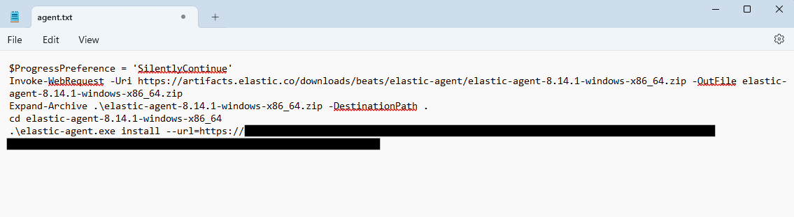

The ELK stack is now configured and we have our connection information saved.
Part two will cover how to install and configure an Elastic Agent.

[Part Two](./elastic_agent.md "Elastic Agents")