#### Sysmon Logs and Elastic Security

---

!!! - This is part three of a three-part series.
	[Part One](./elk_in_the_cloud.md "Elk in the Cloud")
	[Part Two](./elastic_agent.md "Elastic Agents")

---

By default, **Windows logs** are not ideal.  To get logs that are more readable and useful, we can use **Sysmon**. 

**1. Download Sysmon**

Follow this link to download Sysmon.

[Download Sysmon](https://docs.microsoft.com/en-us/sysinternals/downloads/sysmon "https://docs.microsoft.com/en-us/sysinternals/downloads/sysmon")

Find the **"Download Sysmon"** link.

We need to extract the **.zip** archive that we just downloaded. To do so, start by opening your **file explorer**.

Then navigate to **Downloads** in the side panel, and click on the Sysmon **".zip"** archive.

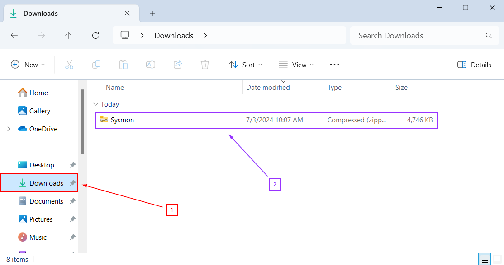

Now we can perform **"Extract All"** on the Sysmon Folder. 

Ensure the Sysmon **".zip"** archive is selected.  It will be highlighted in **blue**.

**"Extract"** to the Downloads folder.  Windows should auto-populate the Downloads path.

Once you are finished, you should see something like this:

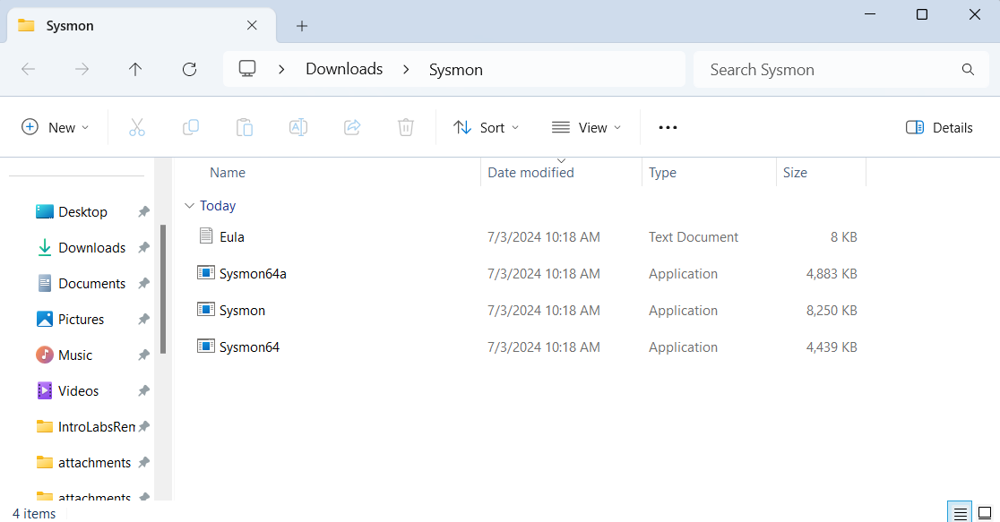

For the next step, we need to open **Windows PowerShell**. This can be done by clicking on the **PowerShell** icon in the taskbar.

Enter the following command. You will need to substitute **[USER]** for the user you are using on your local system.

<pre>cd C:\Users\[USER]\Downloads\Sysmon\</pre>

Run the following command to install and start **Sysmon** as a service.

<pre>.\Sysmon.exe -i -n -accepteula</pre>

The output should look similar to this.

Now that Sysmon is running on our system, we need to configure our **Elastic agent** to gather these logs.

Sign into your **Elastic Cloud account** using the following link:

[Elastic Cloud Login](https://cloud.elastic.co/login "https://cloud.elastic.co/login")

Once logged in, navigate to **"Integrations"** through the navigation menu.

Note:
	When you log in to Elastic, you might see the following screen first. If so, go ahead and click on our deployment that we created in [Part One](./elk_in_the_cloud.md "Elk in the Cloud") (ELK in the Cloud)
	
	
	Once you do this, you can access the navigation bar by clicking the three lines in the upper left and then navigate to Integrations. 

	You may have to scroll to the bottom to find the **"Management"** section. 

	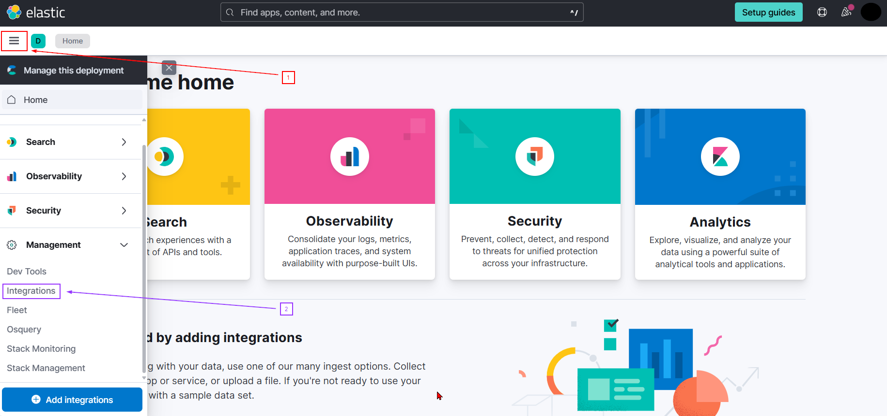

	At the top of the page enter **"windows"** into the search bar.  Select the **Windows** option outlined with the red square below.

	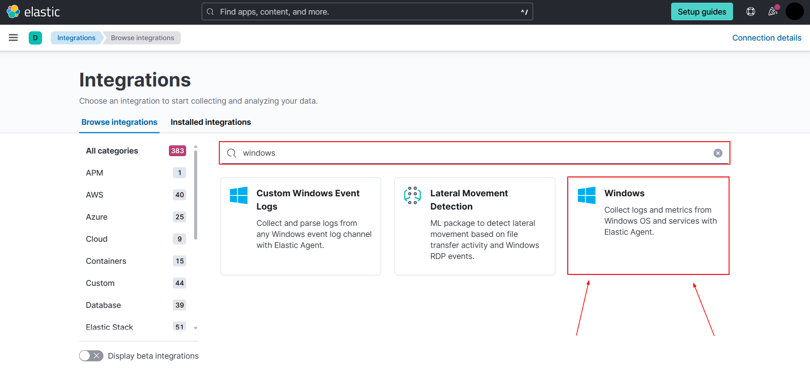

	Add this integration.

	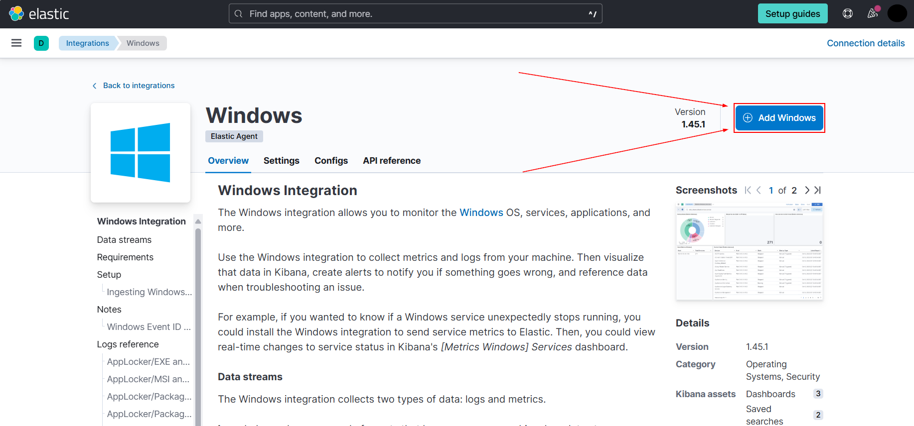

The next screen you see will have a lot of options on it. Luckily, we only care that one is selected: **Sysmon Operational**

By default, this option should be active, but please double check to be sure. 

Note:
	You will have to scroll down the page for a bit in order to find it. 
	
	

Now save the Integration by clicking **Save and Continue** in the bottom right.

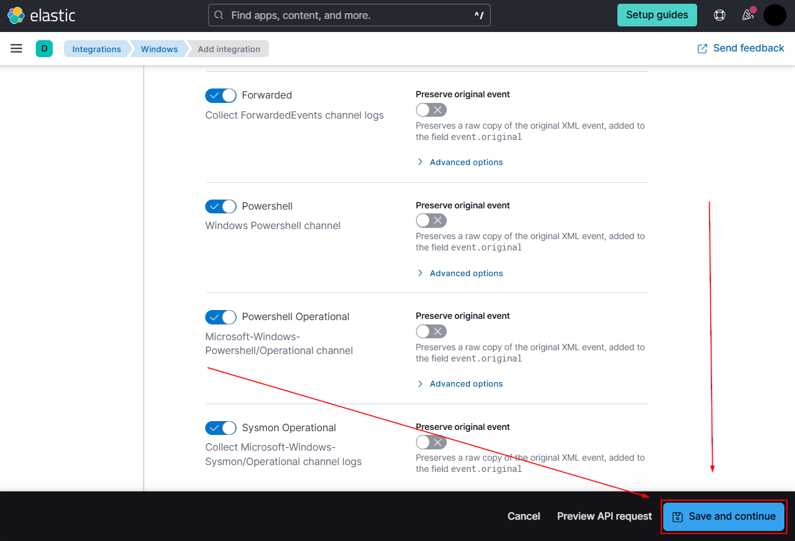

You will then see the following pop-up prompt. Please click **"Add elastic agent to your hosts".**

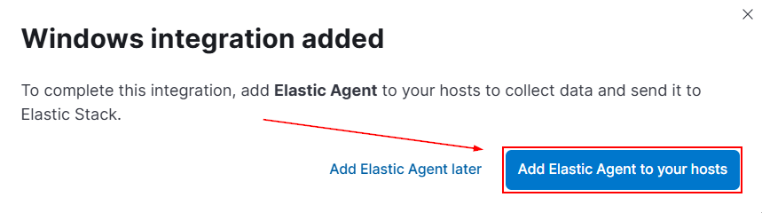

Navigate back to the Integrations menu, find the **"Installed integrations"** tab.

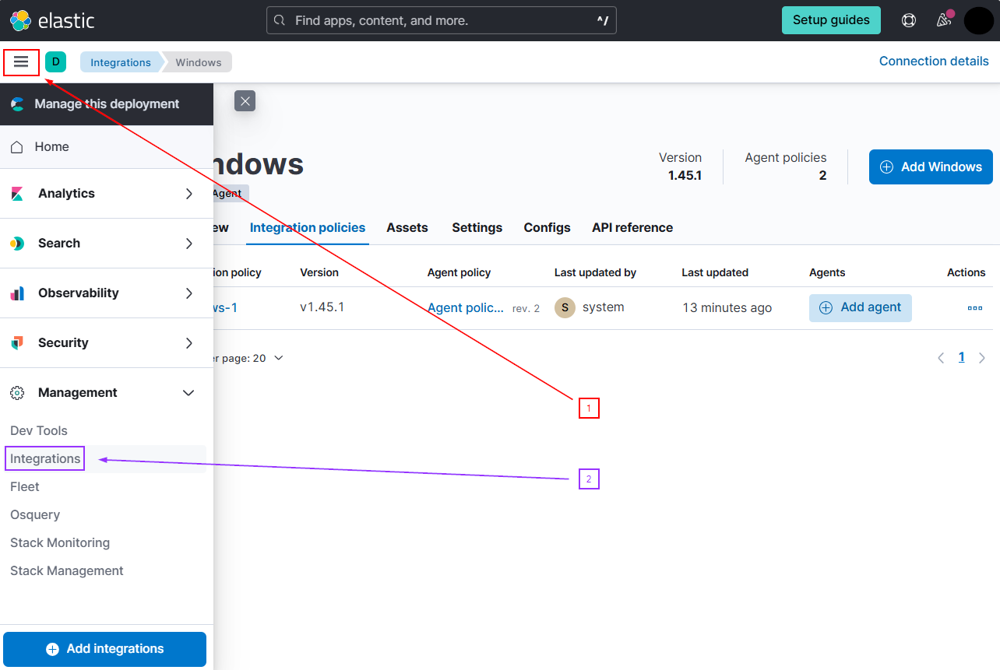

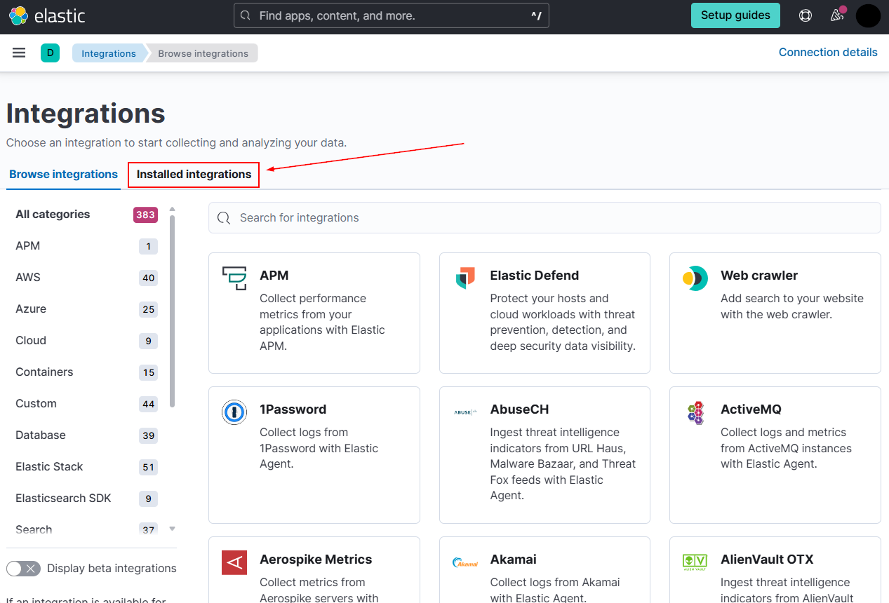

In [part one](./elk_in_the_cloud.md "Elk in the Cloud"), we selected an Elastic Security configuration. In doing so, **"Endpoint Security"** and **"System"** are automatically installed in our **Integrations**.

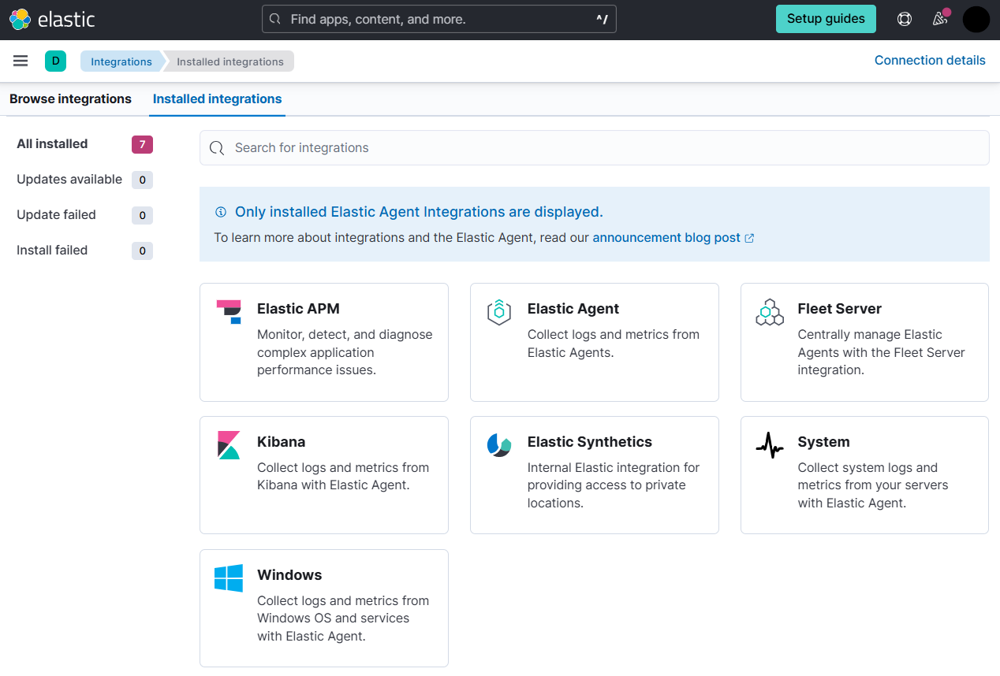

At this point, play around on the computer that has **Elastic Agent **installed.  Move files around, create files, start programs, make a few Google searches.  This will generate some logs to ensure that we have Sysmon logs reaching our cloud.

After you have created some log activity, navigate to **"Discover"** by accessing the hamburger menu on the top left.

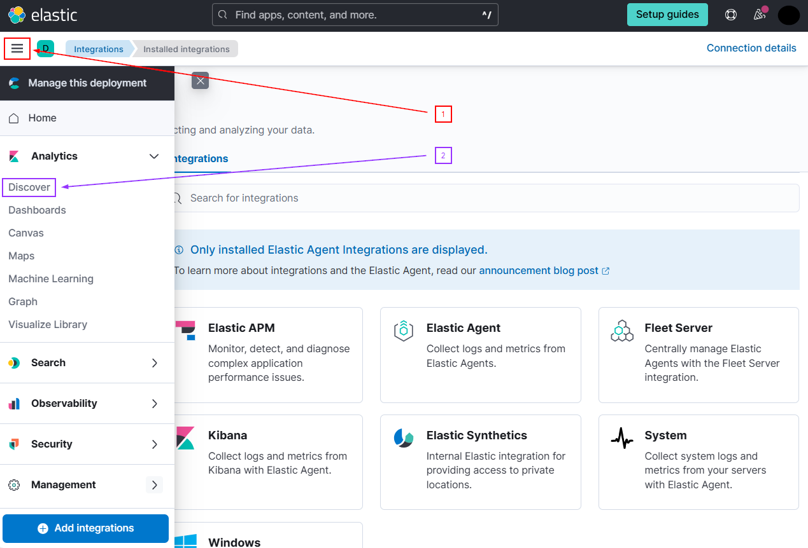

We will then create a filter:

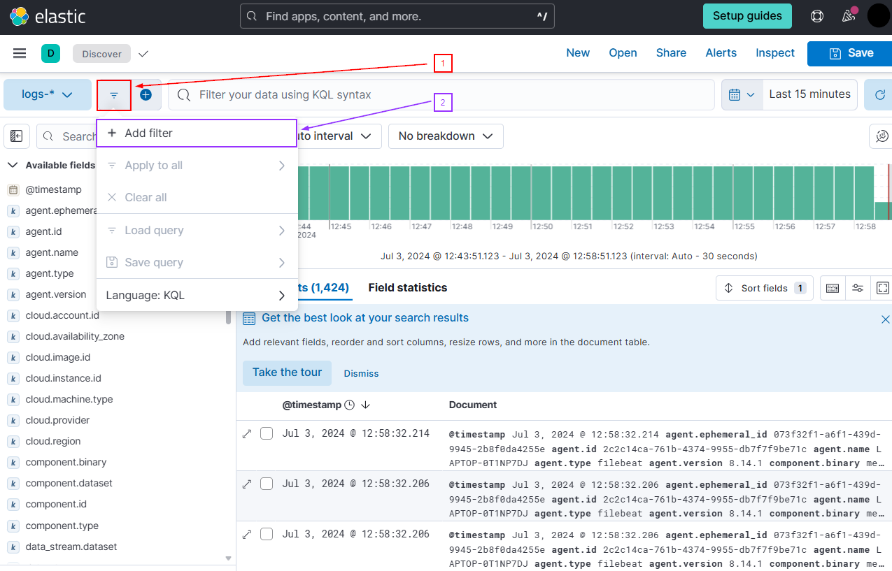

Set a filter on your data to limit your results to sysmon data.  This can be done by searching the **"data_stream.dataset"** field for **"windows.sysmon_operational"** data. We add a custom label of **"All Done!"**. 

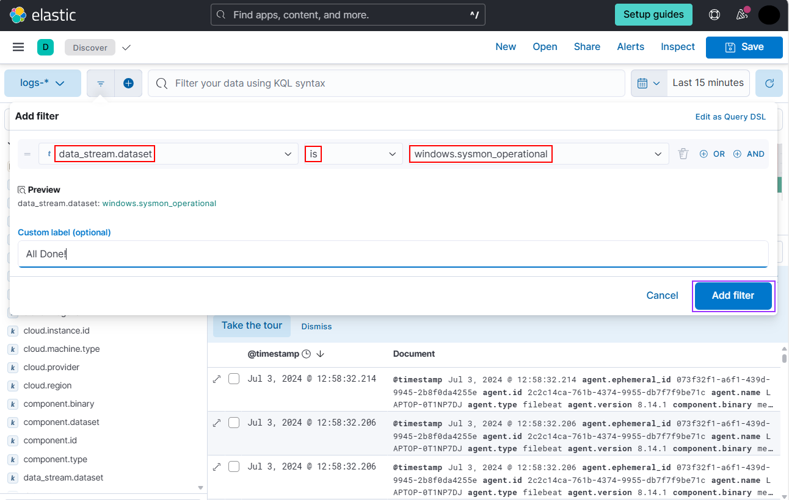

Now click **"add filter"**. Your filter should now be set.

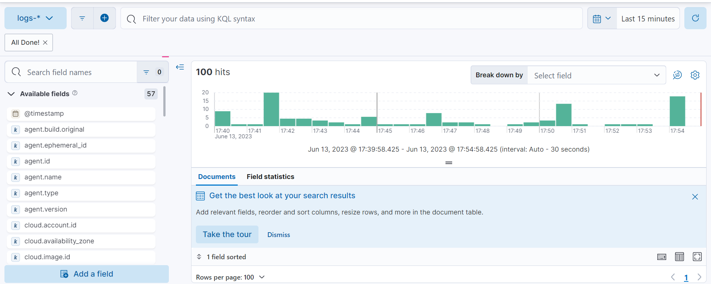

If you have a result, and not an error, your Sysmon data is being collected and sent to **Elastic**.

***

[Back to Navigation Menu](/IntroClassFiles/navigation.md)