#### Sysmon Logs and Elastic Security

---

*This is part three of a three-part series.*
	[Part One](./elk_in_the_cloud.md "Elk in the Cloud")
	[Part Three](./elastic_agent.md "Elastic Agents")

---

By default, Windows logs are not ideal.  To get logs that are more readable and useful, we can use Sysmon. 

**1. Download Sysmon**

Follow this link to download Sysmon.

[Download Sysmon](https://docs.microsoft.com/en-us/sysinternals/downloads/sysmon "https://docs.microsoft.com/en-us/sysinternals/downloads/sysmon")

Find the "Download Sysmon" link.


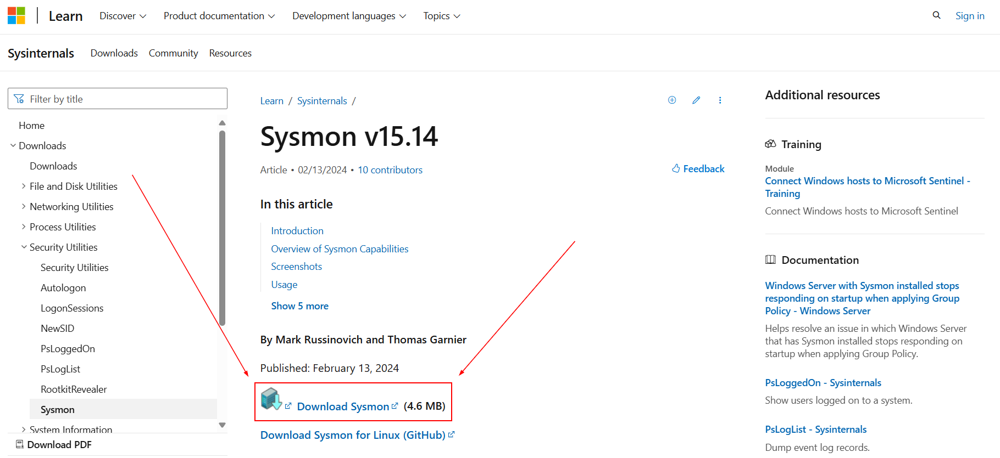


In [part one](./elk_in_the_cloud.md "Elk in the Cloud"), we reviewed several ways to find our download.  Repeat these steps to find find the Sysmon download in the Downloads folder.


Perform "Extract All" on the Sysmon Folder. Ensure the Sysmon folder is selected -- It will be highlighted blue.

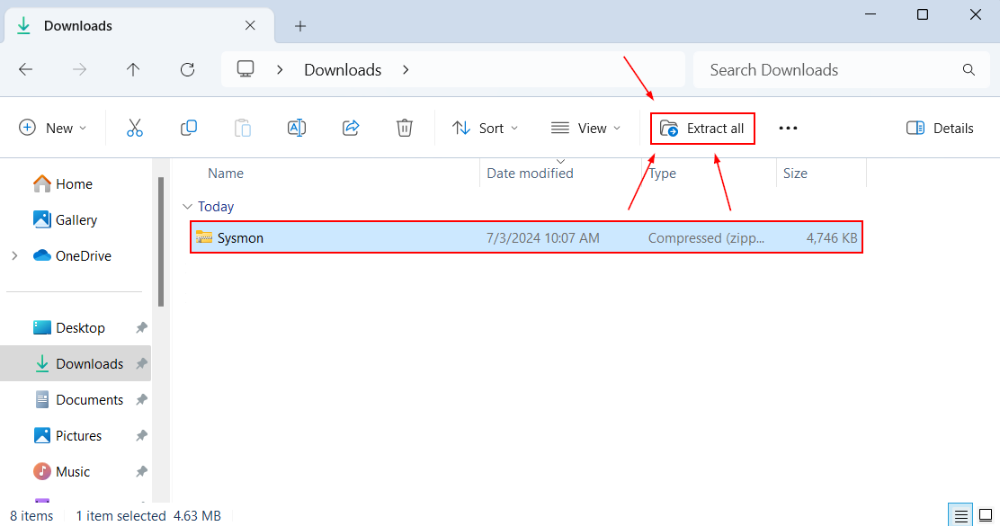

"Extract" to the Downloads folder.  Windows should auto-populate the Downloads path.

In your search bar, type "PowerShell."
The following options will be presented.  Click "Run as Administrator."

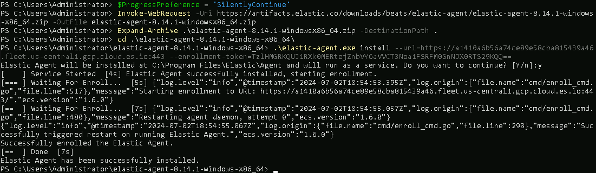

In your PowerShell window, enter the following command. You will need to substitute [USER] for the user you are using on your local system.

```powershell
cd C:\Users\[USER]\Downloads\Sysmon\
```


The following command will install and start Sysmon as a service.

```powershell
sysmon -i -n -accepteula
```


Your following output should look similar to this.


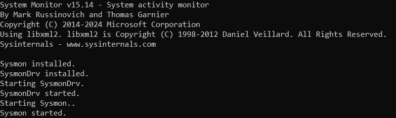


Now that Sysmon is running on our system, we need to configure our Elastic agent to gather these logs.  Sign into your cloud account.


[Elastic Cloud Login](https://cloud.elastic.co/login "https://cloud.elastic.co/login")


Navigate to Kibana.


Navigate to fleet through the navigation menu.


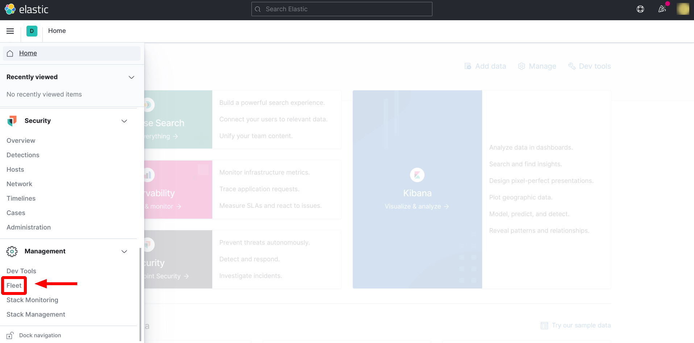


Select the "Integrations" tab.


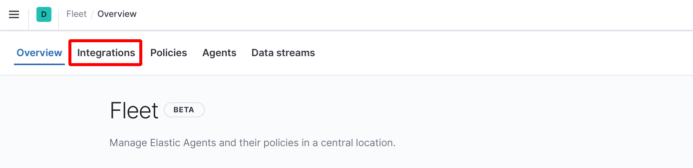


Scroll to the bottom of the Integrations page.  Select the Windows option.


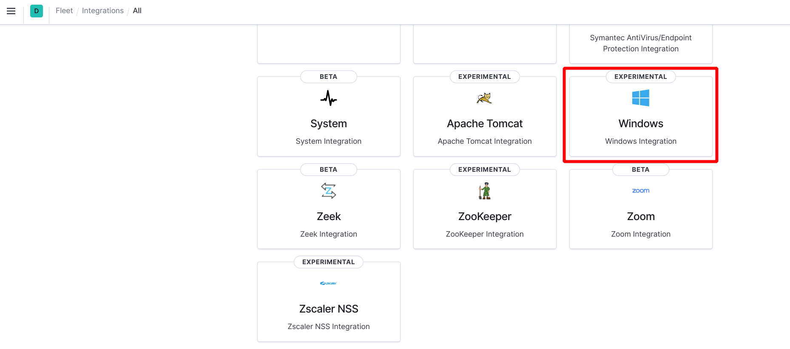


Add this integration.


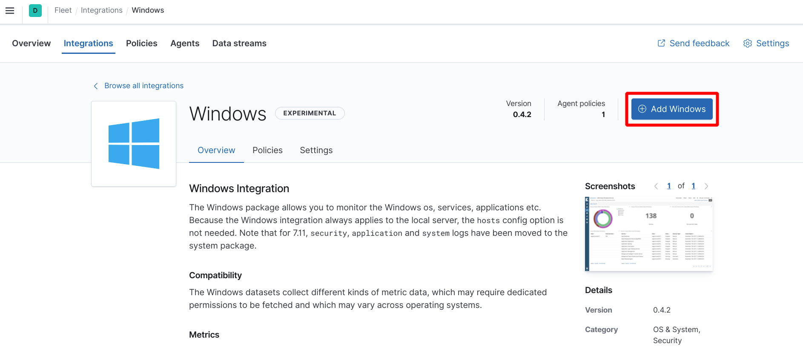


By default, the Sysmon logs channel should be active.  This can be checked under the "Collect events from the following Windows event log channels:" section of the "Add integration" page.


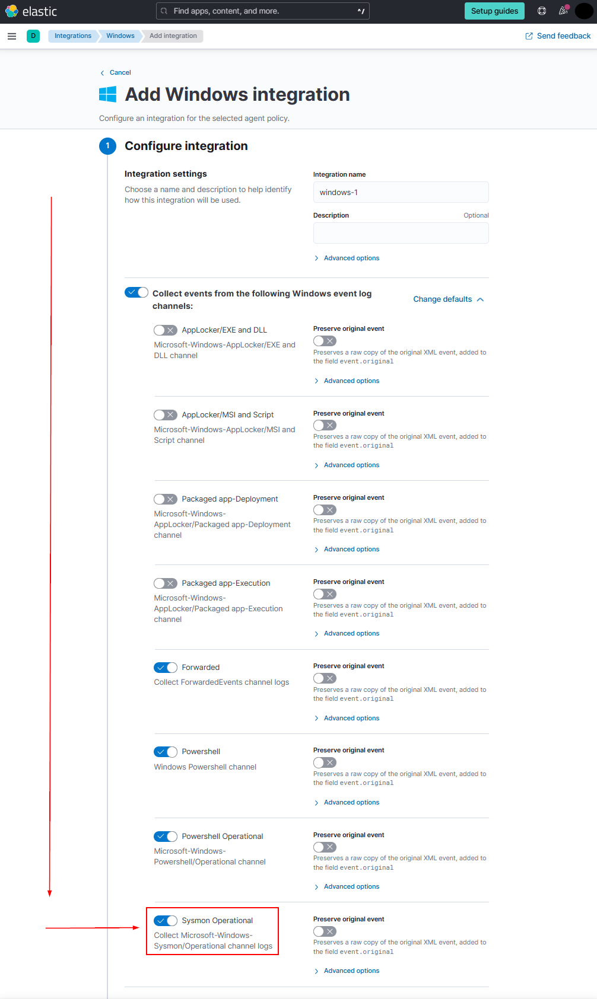


Save the Integration.


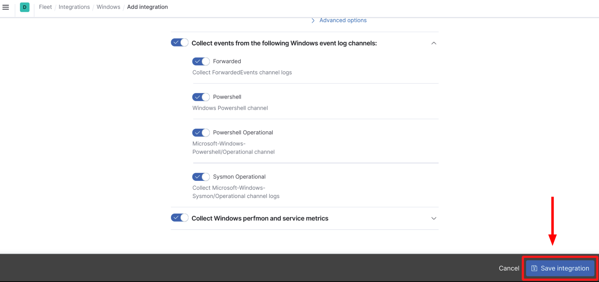


If prompted, save and deploy changes.


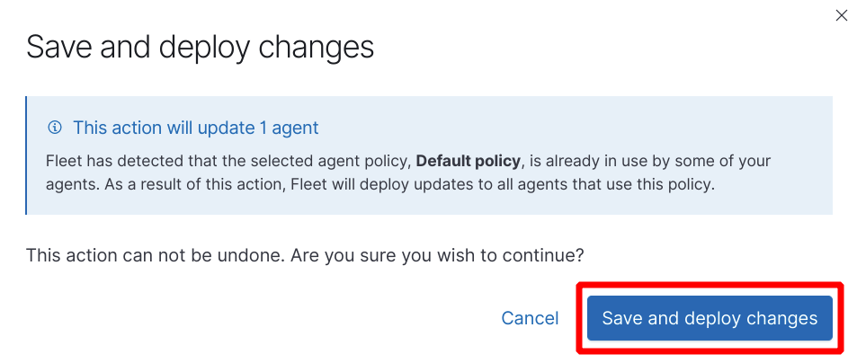


In the Integrations menu, find the "Installed integrations" tab.

In [part one](./elk_in_the_cloud.md "Elk in the Cloud"), we selected an Elastic Security configuration. In doing so, "Endpoint Security" and "System" are automatically installed in our Integrations.


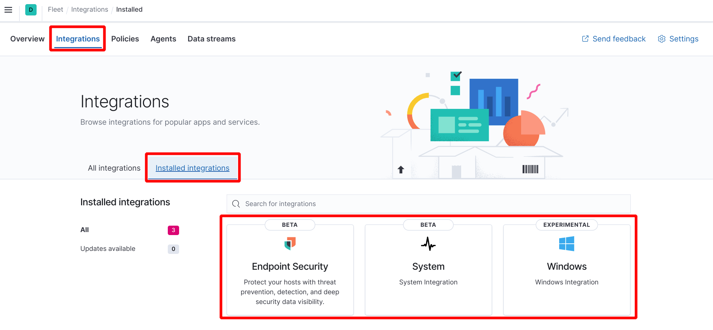


At this point, play around on the computer that has Elastic Agent installed.  Move files around, create files, start programs, make a few Google searches.  This will generate some logs to ensure that we have Sysmon logs reaching our cloud.

After you have created some log activity, navigate to "Kibana Discover."


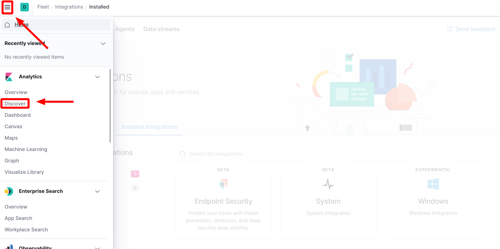


Set your data source to "logs-\*." Set a time constraint to focus your results.


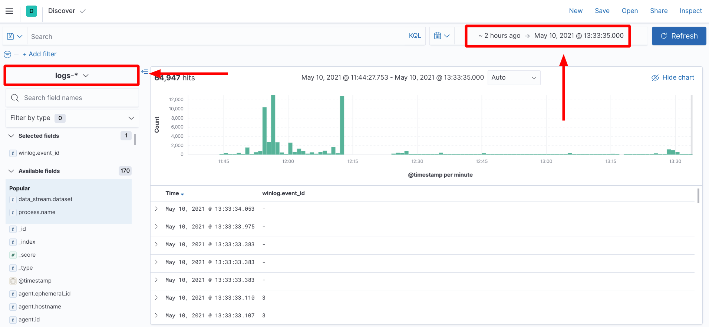


Set a filter on your data to limit your results to sysmon data.  This can be done by searching the "data_stream.dataset" field for "windows.sysmon_operational" data.


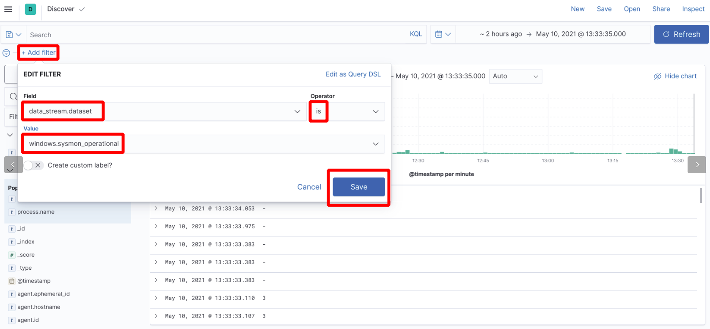

If you have a result, and not an error, your Sysmon data is being collected and sent to Elastic.


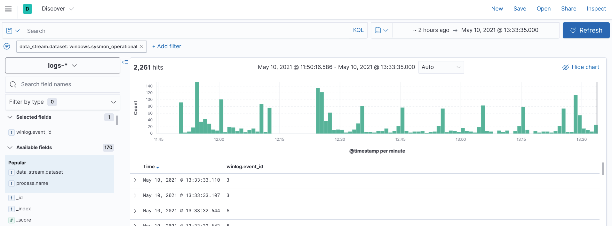