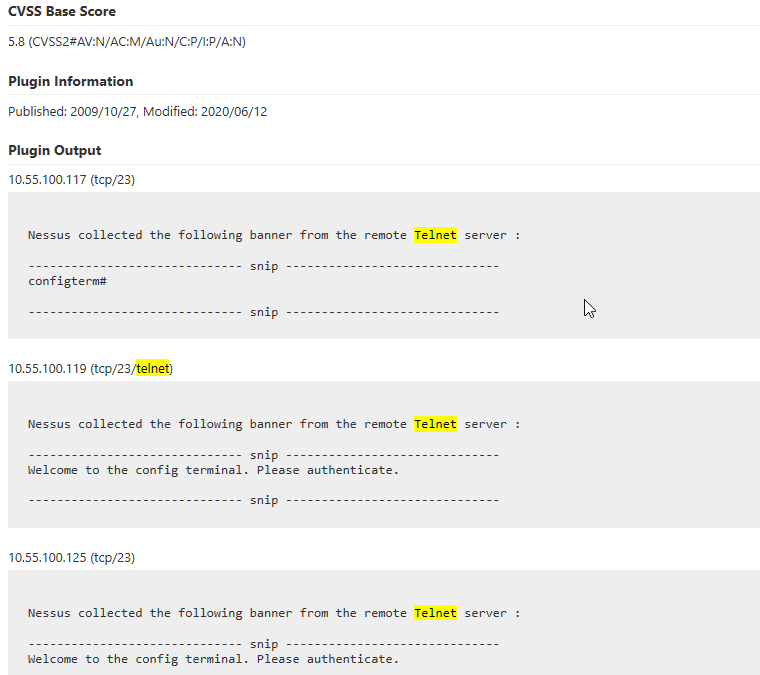
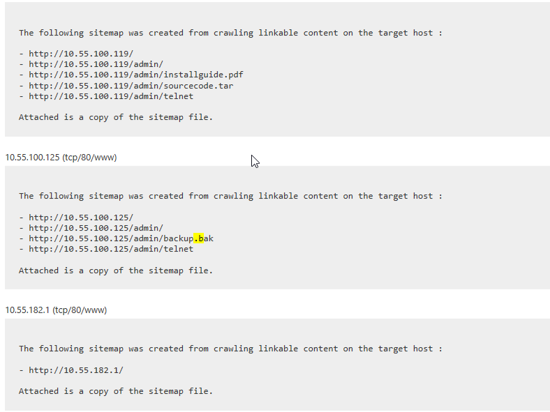

# Nessus Lab

In this lab we will be looking at a vulnerability report.

However, we will be looking at it in a different way.  We will not be looking at the Highs and Criticals.  Instead, we want to focus on the Lows and Mediums.  We are doing this because these are often the vulnerabilities we exploit and are often missed by the organizations we test.

Specifically, look at service headers and files.

To open this lab, start file explorer:

Then, navigate to the tools folder and open the NessusLab file:

When the file opens, please focus on service banners and files.

Now, we are going to have you hunt for Low and Medium Vulnerabilities that needed to be addressed.

No cheating...

Seriously...

Ok.

Below is the Telnet server that has issues.

Notice that it is a prompt.  This means there is no authentication to access this server. 

Also note that two of the servers require authentication and one does not.

Also, check out the office files shown with the web server sitemap:

