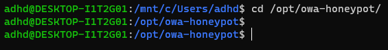
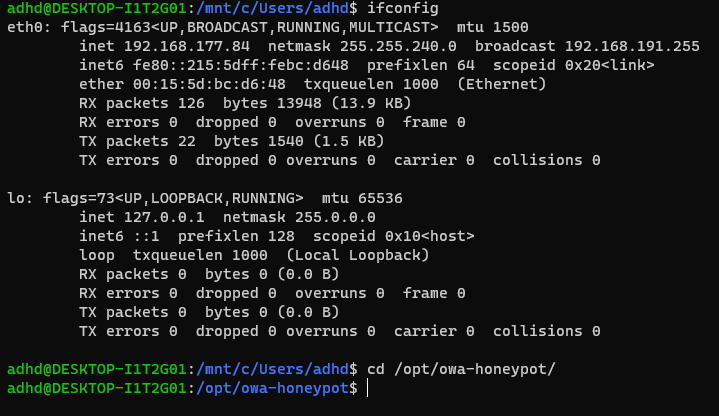
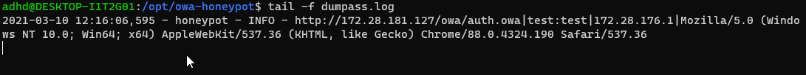
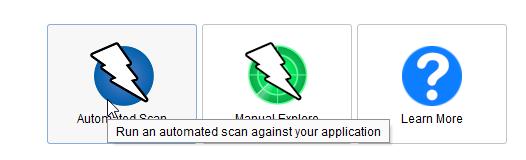

 

# Web Honeypot 

  

In this lab we will be running a very simple web honeypot.  Basically, it runs a fake Outlook Web Access page and logs the attacks.  

  

This is a good approach as attackers constantly go after anything that looks like an authentication portal. 

  

Let's get started. 

  

First, we will need to start a Terminal as administrator 

  

Simply right click on Windows Terminal on the Desktop and select Run as Administrator. 

  

Then, select the down carrot and choose Ubuntu. 

  

 

 ####NOTE##### 

If you are having trouble with Windows Terminal, you can simply start each of the three shells, we use by starting them directly from the Windows Start button. 

 

Simply click the Windows Start button in the lower left of your screen and type: 

 

`Powershell` 

or 

`Ubuntu`

or 

`Command Prompt` 

 

For PowerShell and Command Prompt, please right click on them and select Run As Administrator 

###END NOTE###

Next, change directories to the /opt/owa-honeyport directory: 

  

`cd /opt/owa-honeypot/` 

  

 

  

Now, let's start the honeypot: 

  

`sudo python3 owa_pot.py` 

  

It should look like this: 

  

 

  

Now, let's start another Ubuntu Terminal. 

  

Select the down carrot and choose Ubuntu. 

  

 

  

Let's get your Ubuntu IP address. 

  

`ifconfig` 

  

Then, navigate to the owa-honeypot directory. 

  

`cd /opt/owa-honeypot/` 

  

 

  

Now, lets tail the dumppass log. 

  

`tail -f dumpass.log` 

  

 

  

Now, let's open a browser window and surf to the honeypot: 

  

`http://YOURLINUXIP` 

  

Now, try a bunch of User IDs and passwords. 

  

Now, go back to the Ubuntu Terminal with the log and you should see the IP address and USerID/Password of the attempts. 

  

 

  

Now, let's attack it. 

  

Select OWASP ZAP on your desktop. 

  

 

  

Once ZAP! opens, select Automated Scan: 

  

 

  

When Automated Scan opens, please put you Linux IP in the URL to attack box and select Attack. 

  

It should look like this: 

  

 

  

After a while, you should see some attack strings in your Logs. 

  

 

  

Yes...  Some attack tools are as obvious as ZAP:ZAP. 

  

  

  

  

  

  

  

  

  

  

  

  

 

 
